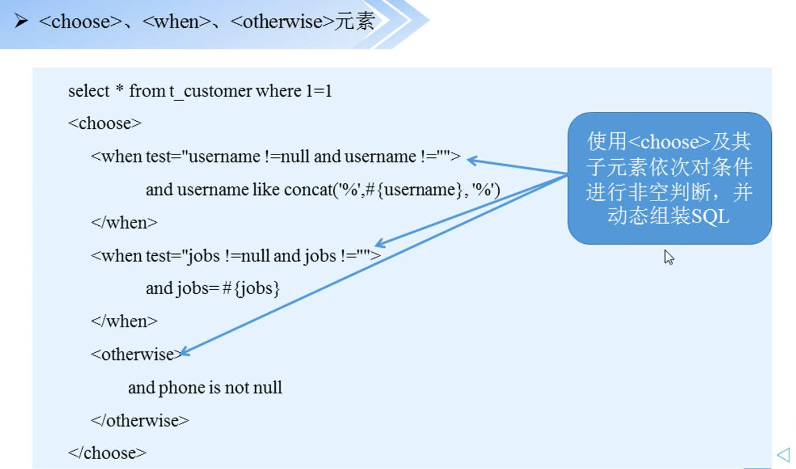
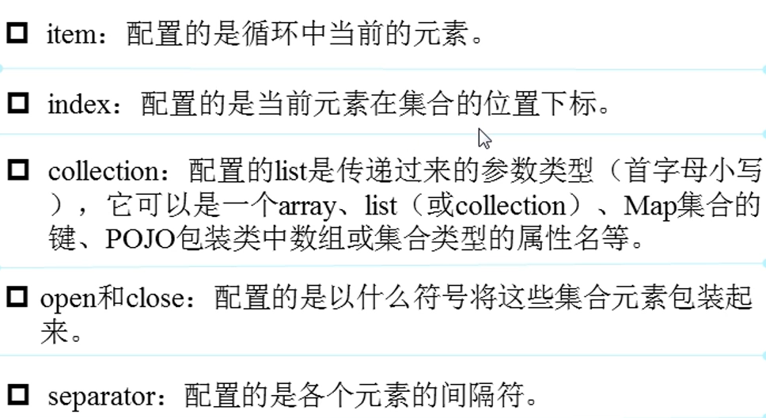
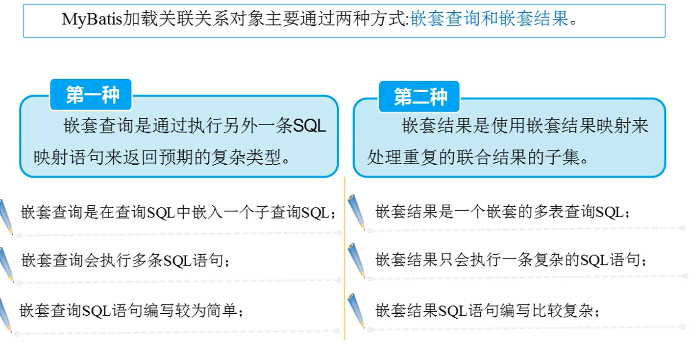
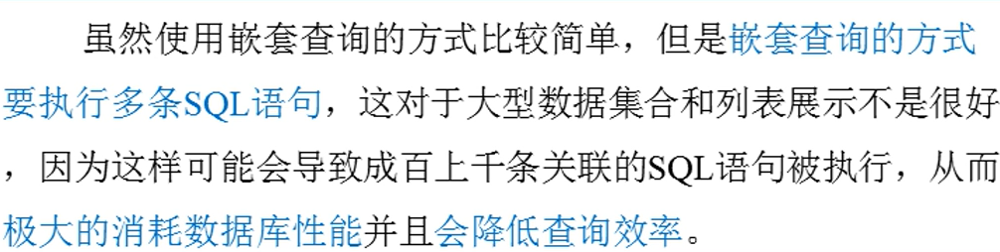

<!-- @import "[TOC]" {cmd="toc" depthFrom=1 depthTo=6 orderedList=false} -->

<!-- code_chunk_output -->

- [导包](#导包)
- [mybatis配置文件](#mybatis配置文件)
  - [mybatis-config.xml](#mybatis-configxml)
- [映射文件(Mapper)](#映射文件mapper)
  - [xxxMapper.xml](#xxxmapperxml)
    - [<select\>元素](#select元素)
    - [<insert\>元素](#insert元素)
    - [<update\>和<delete\>元素](#update和delete元素)
    - [<sql\>元素](#sql元素)
    - [<resultMap\>元素](#resultmap元素)
- [动态SQL](#动态sql)
  - [简介](#简介)
  - [元素](#元素)
    - [<if\>元素](#if元素)
    - [<choose\>及其子元素](#choose及其子元素)
    - [<set\>元素](#set元素)
    - [<foreach\>元素](#foreach元素)
    - [<bind\>元素](#bind元素)
- [Mybatis关联映射](#mybatis关联映射)
  - [一对一](#一对一)
  - [一堆多](#一堆多)
  - [多对多](#多对多)
- [LOG4J输出SQL语句](#log4j输出sql语句)
- [SqlSessionFactory](#sqlsessionfactory)
  - [说明](#说明)
- [SqlSession](#sqlsession)
  - [说明](#说明-1)
  - [常见方法](#常见方法)
- [MybatisUtils.java](#mybatisutilsjava)
  - [说明](#说明-2)
- [例子](#例子)
  - [案例1](#案例1)
  - [案例2 (手动映射bean属性和字段名)](#案例2-手动映射bean属性和字段名span-id-example2span)
  - [案例3 (动态sql)](#案例3-动态sqlspan-id-example3span)
  - [案例4(一对一关联)](#案例4一对一关联span-id-example4span)
- [IDEA下Maven无法读取src的XML文件](#idea下maven无法读取src的xml文件)

<!-- /code_chunk_output -->

# 导包
```xml
    <!--  mybatis核心包  -->
    <dependency>
      <groupId>org.mybatis</groupId>
      <artifactId>mybatis</artifactId>
      <version>3.4.4</version>
    </dependency>

    <!--  mybatis/spring整合包  -->
    <dependency>
      <groupId>org.mybatis</groupId>
      <artifactId>mybatis-spring</artifactId>
      <version>1.3.1</version>
    </dependency>

    <!--  mysql驱动包  -->
    <dependency>
      <groupId>mysql</groupId>
      <artifactId>mysql-connector-java</artifactId>
      <version>5.1.41</version>
      <scope>runtime</scope>
    </dependency>
```
# mybatis配置文件
## mybatis-config.xml
```xml
<?xml version="1.0" encoding="UTF-8"?>
<!DOCTYPE configuration PUBLIC "-//mybatis.org//DTD Mapper 3.0//EN"
        "http://mybatis.org/dtd/mybatis-3-config.dtd">

<configuration>
    <!--引入数据库配置文件-->
    <properties resource="jdbc.properties" />
    <!--  配置默认环境id为 mysql   -->
    <environments default="mysql">
        <!--mysql环境的详细配置-->
        <environment id="mysql">
            <!--   使用JDBC的事务管理器。 如果有spring则不需要在Mybatis配置事务管理器
                    使用spring自带的事务管理器来实现事务管理。-->
            <transactionManager type="JDBC" />
            <dataSource type="POOLED">
                <property name="driver" value="${jdbc.driverClass}"/>
                <property name="url" value="jdbc:mysql://127.0.0.1:3306/mybatis" />
                <property name="username" value="${jdbc.username}"/>
                <property name="password" value="${jdbc.password}"/>
            </dataSource>
        </environment>
    </environments>

    <!--配置Mapper的位置-->
    <mappers>
        <mapper resource="mybatisDemo1/CustomerMapper.xml" />
    </mappers>
</configuration>
```
# 映射文件(Mapper)
## xxxMapper.xml
```xml
<?xml version="1.0" encoding="UTF-8"?>
<!DOCTYPE mapper PUBLIC "-//mybatis.org//DTD Mapper 3.0//EN"
        "http://mybatis.org/dtd/mybatis-3-mapper.dtd">

<!--namespace表示命名空间(最好唯一)-->
<mapper namespace="">

</mapper>
```
<br>
### <select\>元素
<br>
### <insert\>元素
<br>
### <update\>和<delete\>元素
<br>
### <sql\>元素
基础操作
<br>
骚操作
<br>
### <resultMap\>元素
<br>
<br>
[resultMap案例](#example2)
# 动态SQL
## 简介
开发人员在使用JDBC或其他类似的框架进行数据库开发时，通常都要根据需求去手动拼装SQL，这是一个非常麻烦且痛苦的工作，而MyBatis 提供的对SQL语句动态组装的功能，恰能很好的解决这一麻烦工作。
## 元素
<br>
### <if\>元素
<br>
可用于分页+模糊查询
### <choose\>及其子元素
<br>
### <set\>元素
- 更新数据的时候使用，可以实现部分字段更新。
- 还可以去掉拼接sql语句中多余的逗号
### <foreach\>元素
<br>
### <bind\>元素
防止sql注入
# Mybatis关联映射
## 一对一
[案例](#example4)
<br>
<br>
<br>
## 一对多
## 多对多
# LOG4J输出SQL语句
导包
```xml
    <dependency>
      <groupId>log4j</groupId>
      <artifactId>log4j</artifactId>
      <version>1.2.17</version>
    </dependency>
    <dependency>
      <groupId>org.slf4j</groupId>
      <artifactId>slf4j-log4j12</artifactId>
      <version>1.7.25</version>
    </dependency>
    <dependency>
      <groupId>org.bgee.log4jdbc-log4j2</groupId>
      <artifactId>log4jdbc-log4j2-jdbc4.1</artifactId>
      <version>1.16</version>
    </dependency>
```
LOG4J配置文件log4j.properties
```properties
# 全局日志配置
log4j.rootLogger=ERROR, stdout
# MyBatis 日志配置
log4j.logger.XXXX=DEBUG
# 控制台输出
log4j.appender.stdout=org.apache.log4j.ConsoleAppender
log4j.appender.stdout.layout=org.apache.log4j.PatternLayout
log4j.appender.stdout.layout.ConversionPattern=%5p [%t] - %m%n
```
# SqlSessionFactory
## 说明
<br>
<br>
# SqlSession
## 说明
<br>
## 常见方法
<br>
<br>
<br>
# MybatisUtils.java
## 说明
为了简化开发，通常在实际项目中会使用工具类来创建SqlSession
```java
package mybatisDemo1;

import org.apache.ibatis.io.Resources;
import org.apache.ibatis.session.SqlSession;
import org.apache.ibatis.session.SqlSessionFactory;
import org.apache.ibatis.session.SqlSessionFactoryBuilder;
import java.io.IOException;
import java.io.InputStream;


public class MybatisUtils {
    private static SqlSessionFactory sqlSessionFactory = null;

    //初始化SqlSessionFactory对象
    static {
        try {
            //使用Mybatis提供的Resources类加载Mybatis的配置文件
            InputStream is = Resources.getResourceAsStream("mybatis-config.xml");
            sqlSessionFactory = new SqlSessionFactoryBuilder().build(is);
        } catch (IOException e) {
            e.printStackTrace();
        }
    }
    //禁止外部new该对象
    private MybatisUtils(){}

    //获取SqlSessison对象的静态方法
    public static SqlSession getSqlSession(){
        return sqlSessionFactory.openSession();
    }
}

```
# 例子
## 案例1 
Customer.java
```java
package mybatisDemo1;

import lombok.Data;

@Data
public class Customer {
    private Integer id;
    private String username;
    private String jobs;
    private String phone;
}

```
CustomerMapper.xml
```xml
<?xml version="1.0" encoding="UTF-8"?>
<!DOCTYPE mapper PUBLIC "-//mybatis.org//DTD Mapper 3.0//EN"
        "http://mybatis.org/dtd/mybatis-3-mapper.dtd">

<!--namespace表示命名空间(最好唯一)-->
<mapper namespace="mybatisDemo1.Customer">

    <!--开启二级缓存（注意被查询的对象需要实现序列化接口，否则无法缓存） -->
    <!--<cache />-->
    
    <!--根据id查客户-->
    <select id="findCustomerById" parameterType="Integer" resultType="customer">
        select * from t_customer where id = #{id}
    </select>

    <!--自定义sql语句 可以将sql语句共同的部分抽取出来-->
    <sql id="customerColumn" >id,username,jobs,phone</sql>
    <!--根据id查客户2-->
    <select id="findCustomerById2" parameterType="Integer" resultType="customer">
        select <include refid="customerColumn" /> from t_customer where id = #{id}
        --相当于select id,username,jobs,phone from t_customer where id = #{id}
    </select>

    <!--姓名模糊查询-->
    <select id="findCustomerByName" parameterType="String" resultType="customer">
        select * from t_customer where username like '%${value}%'
    </select>

    <!--添加客户信息 参数类型为对应的java bean -->
    <insert id="addCustomer" parameterType="mybatisDemo1.Customer" useGeneratedKeys="true" keyProperty="id">
        insert into t_customer(username,jobs,phone) values (#{username},#{jobs},#{phone})
    </insert>

    <!--更新客户信息-->
    <update id="updateCustomer" parameterType="mybatisDemo1.Customer" >
        update  t_customer set username=#{username},jobs=#{jobs},phone=#{phone} where id=#{id}
    </update>

    <!--删除客户-->
    <delete id="delCustomer" parameterType="Integer">
        delete from t_customer where id=#{id}
    </delete>
</mapper>
```
mybatis-config.xml添加CustomerMapper.xml
```xml
    <!--配置Mapper的位置-->
    <mappers>
        <mapper resource="mybatisDemo1/CustomerMapper.xml" />
    </mappers>
```
测试类
```java
package mybatisDemo1;

import org.apache.ibatis.session.SqlSession;
import org.junit.After;
import org.junit.Before;
import org.junit.Test;

import java.util.ArrayList;
import java.util.List;

public class MybatisTest {

    SqlSession sqlSession;

    @Before
    public void init() throws Exception {
        //1 读取配置文件
        //InputStream inputStream = Resources.getResourceAsStream("mybatis-config.xml");
        //2 根据配置文件构建SqlSessionFactory
        //SqlSessionFactory sqlSessionFactory = new SqlSessionFactoryBuilder().build(inputStream);
        //3 通过根据配置文件构建SqlSessionFactory创建SqlSession
        //sqlSession = sqlSessionFactory.openSession();

        //利用工具类生成sqlSession;
        sqlSession = MybatisUtils.getSqlSession();
    }

    @After
    public void closeSqlSession(){
        //最后关闭sqlSession
        sqlSession.close();
    }

    @Test
    public void findCustomerById() {

        //4 sqlSession执行映射文件中的sql语句，并返回映射结果
        //第一个参数是mapper的namespace（命名空间）+id(需要执行的sql操作的id) 。第二个参数是占位符数据
        Customer customer = sqlSession.selectOne("mybatisDemo1.Customer.findCustomerById",2);

        System.out.println(customer.toString());

    }

    @Test
    public void findCustomerByName(){
        //4 sqlSession执行映射文件中的sql语句，并返回映射结果
        //第一个参数是mapper的namespace（命名空间）+id(需要执行的sql操作的id) 。第二个参数是占位符数据
        List<Customer> list = sqlSession.selectList("mybatisDemo1.Customer.findCustomerByName","o");

        for(Customer customer : list){
            System.out.println(customer.toString());
        }

    }

    @Test
    public void addCustomer(){
        //4 创建客户对象
        Customer customer = new Customer();
        customer.setJobs("driver");
        customer.setUsername("toony");
        customer.setPhone("12306");

        //5 sqlSession执行映射文件中的插入语句，返回影响条数
        int rows = sqlSession.insert("mybatisDemo1.Customer.addCustomer",customer);
        if (rows > 0) {
            System.out.println("成功插入"+rows+"条数据");
            System.out.println("主键是:"+customer.getId());
        }else {
            System.out.println("插入失败!");
        }

        //6 事务提交
        sqlSession.commit();
    }

    @Test
    public void updateCustomer(){
        //先获取对象
        Customer customer = sqlSession.selectOne("mybatisDemo1.Customer.findCustomerById",2);
        customer.setUsername("alibaba");
        int rows = sqlSession.update("mybatisDemo1.Customer.updateCustomer",customer);
        if(rows > 0){
            System.out.println("您修改了"+rows+"行数据");
        }else {
            System.out.println("更新失败");
        }
        sqlSession.commit();
    }

    @Test
    public void delCustomer(){
        int rows = sqlSession.delete("mybatisDemo1.Customer.delCustomer",4);
        if(rows > 0){
            System.out.println("删除了"+rows+"条数据");
        }else{
            System.out.println("删除失败");
        }
        sqlSession.commit();
    }

    @Test
    public void findCustomerByIds() {
        List<Integer> ids = new ArrayList<>();
        ids.add(1);
        ids.add(2);

        List<Customer> customers = sqlSession.selectList("mybatisDemo1.Customer.findCustomerByIds",ids);

        for (Customer customer : customers){
            System.out.println(customer.toString());
        }
    }

}
```
## 案例2 (手动映射bean属性和字段名)<span id = "example2"></span>
User.java
```java
package mybatisDemo1;

import lombok.Data;

@Data
public class User {
    private Integer id;
    private String name;
    private Integer age;
}
```
UserMapper.xml
```xml
<?xml version="1.0" encoding="UTF-8"?>
<!DOCTYPE mapper PUBLIC "-//mybatis.org//DTD Mapper 3.0//EN"
        "http://mybatis.org/dtd/mybatis-3-mapper.dtd">

<mapper namespace="mybatisDemo1.UserMapper">

    <!-- property对应bean的属性名  column对应表的字段名-->
    <resultMap type="mybatisDemo1.User" id="resultMap" >
        <id property="id" column="t_id" />
        <result property="name" column="t_name" />
        <result property="age" column="t_age" />
    </resultMap>

    <select id="findAllUser" resultMap="resultMap">
        select * from t_user ;
    </select>
    
</mapper>
```
mybatis-config.xml添加UserMapper.xml
```xml
    <!--配置Mapper的位置-->
    <mappers>
        <mapper resource="mybatisDemo1/UserMapper.xml" />
    </mappers>
```
测试类
```java
public class MybatisTest2 {

    SqlSession sqlSession;

    @Before
    public void init() throws Exception {
        //利用工具类生成sqlSession;
        sqlSession = MybatisUtils.getSqlSession();
    }

    @After
    public void closeSqlSession(){
        //最后关闭sqlSession
        sqlSession.close();
    }

    @Test
    public void getAllUser() {
        //SqlSession执行映射文件
        List<User> list = sqlSession.selectList("mybatisDemo1.UserMapper.findAllUser");

        for(User user : list){
            System.out.println(user.toString());
        }
    }

}
```
控制台输出
```
DEBUG [main] - ==>  Preparing: select * from t_user ; 
DEBUG [main] - ==> Parameters: 
DEBUG [main] - <==      Total: 3
User(id=1, name=lucy, age=25)
User(id=2, name=Lili, age=20)
User(id=3, name=Jim, age=20)
```

## 案例3 (动态sql)<span id = "example3"></span>
CustomerMapper2.xml
```xml
<?xml version="1.0" encoding="UTF-8"?>
<!DOCTYPE mapper PUBLIC "-//mybatis.org//DTD Mapper 3.0//EN"
        "http://mybatis.org/dtd/mybatis-3-mapper.dtd">

<!--namespace表示命名空间(最好唯一)-->
<mapper namespace="mybatisDemo1.mapper.Customer2">

    <!--if元素的使用 只要满足if 就会拼接sql-->
    <select id="findCustomerByNameAndJobs" parameterType="mybatisDemo1.Customer" resultType="mybatisDemo1.Customer" >
        select * from t_customer where 1=1
        <if test="username !=null and username!=''">
            and username like concat('%',#{username},'%')
        </if>
        <if test="jobs != null and jobs!=''">
            and jobs=#{jobs}
        </if>
    </select>

    <!--choose,when,otherwise元素的使用-->
    <!--哪个when满足就只拼接那一个sql语句相当于switch,case,break,default-->
    <select id="findCustomerByNameOrJobs" parameterType="mybatisDemo1.Customer" resultType="mybatisDemo1.Customer" >
        select  * from t_customer where 1=1
        <choose>
            <when test="username !=null and username!='' ">
                and username like concat('%',#{username},'%')
            </when>
            <when test="jobs != null and jobs!=''">
                and jobs=#{jobs}
            </when>
            <otherwise>
                and phone is not null
            </otherwise>
        </choose>
    </select>

    <!--set元素-->
    <update id="updateCustomer" parameterType="mybatisDemo1.Customer">
        update t_customer
        <set>
            <if test="username!=null and username!='' ">
                username=#{username}
            </if>
            <if test="jobs!=null and jobs!='' ">
                jobs=#{jobs}
            </if>
            <if test="phone!=null and phone!='' ">
                phone=#{phone}
            </if>
        </set>
        where id=#{id}
    </update>

    <!--foreach元素-->
    <select id="findCustomerByIds" parameterType="List" resultType="mybatisDemo1.Customer">
        select * from t_customer where id in
        <foreach collection="list" item="id" index="index" open="(" separator="," close=")">
            #{id}
        </foreach>
    </select>

    <!--bind元素防止SQL注入，客户名模糊查询-->
    <select id="findCustomerByName" parameterType="List" resultType="mybatisDemo1.Customer">
        <!--_parameter.getUsername()也可以写成传入字段的属性名，即username -->
        <bind name="pattern_username" value="'%' + _parameter.getUsername() + '%'"/>
        select * from t_customer where username like #{pattern_username}
    </select>
</mapper>
```
测试类
MybatisTest2.java
```java
package mybatisDemo1;

import org.apache.ibatis.session.SqlSession;
import org.junit.After;
import org.junit.Before;
import org.junit.Test;
import java.util.ArrayList;
import java.util.List;

public class MybatisTest2 {

    SqlSession sqlSession;

    @Before
    public void init() throws Exception {
        //利用工具类生成sqlSession;
        sqlSession = MybatisUtils.getSqlSession();
    }

    @After
    public void closeSqlSession(){
        //最后关闭sqlSession
        sqlSession.close();
    }

    @Test
    public void findCustomerByNameAndJobs(){
        Customer customer = new Customer();
        customer.setUsername("toony");
        customer.setJobs("driver");
        //SqlSession执行映射文件
        List<Customer> list = sqlSession.selectList("mybatisDemo1.mapper.Customer2.findCustomerByNameAndJobs",customer);

        for (Customer item : list){
            System.out.println(item.toString());
        }
    }

    @Test
    public void findCustomerByNameOrJobs(){
        Customer customer = new Customer();
        customer.setUsername("toony");
        customer.setJobs("driver");
        //SqlSession执行映射文件
        List<Customer> list = sqlSession.selectList("mybatisDemo1.mapper.Customer2.findCustomerByNameOrJobs",customer);

        for (Customer item : list){
            System.out.println(item.toString());
        }
    }

    @Test
    public void updateCustomer(){
        Customer customer = new Customer();
        customer.setId(5);
        customer.setUsername("pony");

        int i = sqlSession.update("mybatisDemo1.mapper.Customer2.updateCustomer",customer);

        if(i>0){
            System.out.println("影响行数:"+i);
        }else{
            System.out.println("更新失败");
        }

        sqlSession.commit();
    }

    @Test
    public void getCustomerByIds(){
        List<Integer> list = new ArrayList<>();
        list.add(1);
        list.add(5);

        List<Customer> customers = sqlSession.selectList("mybatisDemo1.mapper.Customer2.findCustomerByIds",list);

        for (Customer customer : customers){
            System.out.println(customer.toString());
        }
    }

    @Test
    public void findCustomerByName(){
        Customer customer = new Customer();
        customer.setUsername("o");

        List<Customer> customers = sqlSession.selectList("mybatisDemo1.mapper.Customer2.findCustomerByName",customer);

        for (Customer item : customers){
            System.out.println(item.toString());
        }
    }
}
```
## 案例4(一对一关联)<span id = "example4"></span>
**一个人对应一张身份证。**
IdCard.java 身份证。
```java
package mybatisDemo2.po;

import lombok.Data;

@Data
public class IdCard {
    private Integer id;
    private String code;
}
```
Person.java 人
```java
package mybatisDemo2.po;

import lombok.Data;

@Data
public class Person {
    private Integer id;
    private String name;
    private Integer age;
    private String sex;
    private IdCard idCard;
}
```
IdCardMapper.xml
```xml
<?xml version="1.0" encoding="UTF-8"?>
<!DOCTYPE mapper PUBLIC "-//mybatis.org//DTD Mapper 3.0//EN"
        "http://mybatis.org/dtd/mybatis-3-mapper.dtd">

<!--namespace表示命名空间(唯一)-->
<mapper namespace="mybatisDemo2.mapper.IdCardMapper">
    <!--根据ID查身份证信息-->
    <select id="findIdCardById" parameterType="Integer" resultType="mybatisDemo2.po.IdCard">
        select * from tb_idcard where id=#{id}
    </select>
</mapper>
```
PersonMapper.xml
```xml
<?xml version="1.0" encoding="UTF-8"?>
<!DOCTYPE mapper PUBLIC "-//mybatis.org//DTD Mapper 3.0//EN"
        "http://mybatis.org/dtd/mybatis-3-mapper.dtd">

<!--namespace表示命名空间(唯一)-->
<mapper namespace="mybatisDemo2.mapper.Person">
    <!--嵌套查询，通过执行另一条SQL映射语句来返回预期的特殊类型-->
    <select id="findPersonById" parameterType="Integer" resultMap="IdCardWithPersonResult">
        select * from tb_person where id=#{id}
    </select>
    <resultMap id="IdCardWithPersonResult" type="mybatisDemo2.po.Person" >
        <id property="id" column="id"/>
        <result property="name" column="name"/>
        <result property="age" column="age"/>
        <result property="sex" column="sex"/>
        <!--  一对一:association使用select属性引用另一条SQL语句 -->
        <association property="idCard" column="card_id" javaType="mybatisDemo2.po.IdCard"
        select="mybatisDemo2.mapper.IdCardMapper.findIdCardById"></association>
    </resultMap>
</mapper>
```
测试类
```java
package mybatisDemo2;

import mybatisDemo2.po.IdCard;
import mybatisDemo2.po.Person;
import mybatisDemo2.utils.MybatisUtils;
import org.apache.ibatis.session.SqlSession;
import org.junit.After;
import org.junit.Before;
import org.junit.Test;

public class Demo1 {

    SqlSession sqlSession;

    @Before
    public void init(){
        sqlSession = MybatisUtils.getSqlSession();
    }

    @After
    public void end(){
        sqlSession.close();
    }

    /**
     * 嵌套查询
     */
    @Test
    public void findPersonById(){
        Person person = sqlSession.selectOne("mybatisDemo2.mapper.Person.findPersonById",1);
        System.out.println(person.toString());
    }
}
```
控制台
```
DEBUG [main] - ==>  Preparing: select * from tb_person where id=? 
DEBUG [main] - ==> Parameters: 1(Integer)
DEBUG [main] - ====>  Preparing: select * from tb_idcard where id=? 
DEBUG [main] - ====> Parameters: 1(Integer)
DEBUG [main] - <====      Total: 1
DEBUG [main] - <==      Total: 1
Person(id=1, name=Rose, age=29, sex=女, idCard=IdCard(id=1, code=440301199612298610))

```
# IDEA下Maven无法读取src的XML文件
我们需要在pom.xml文件里面去配置一下，让项目启动的时候能够去读取到src/main/java下面的配置文件，如下，在pom.xml里面加入下面代码：
```xml
<build>  
    <resources>  
        <resource>  
            <directory>src/main/java</directory>  
            <includes>  
                <include>**/*.xml</include>  
            </includes>  
        </resource>  
    </resources>  
</build>
```