<!-- @import "[TOC]" {cmd="toc" depthFrom=1 depthTo=6 orderedList=false} -->

<!-- code_chunk_output -->

- [spring整合mybatis](#spring整合mybatis)
  - [导包](#导包)
  - [配置文件](#配置文件)
    - [mybatis-config.xml](#mybatis-configxml)
    - [applicationContext.xml](#applicationcontextxml)
  - [具体实现](#具体实现)
    - [传统dao方式开发](#传统dao方式开发)
    - [基于MapperFactoryBean](#基于mapperfactorybean)
    - [基于MapperScannerConfigurer](#基于mapperscannerconfigurer)

<!-- /code_chunk_output -->

# spring整合mybatis
## 导包
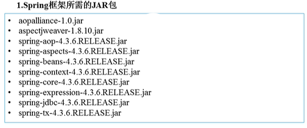<br>
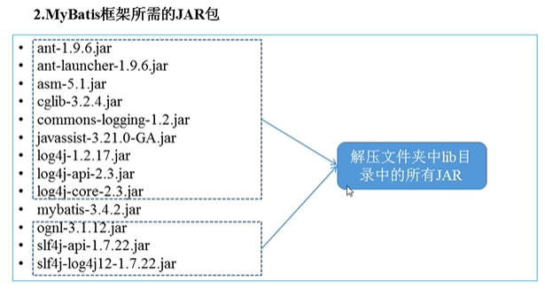<br>
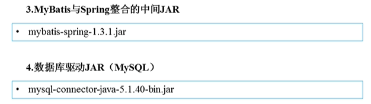<br>
## 配置文件
### mybatis-config.xml
```xml
<?xml version="1.0" encoding="UTF-8"?>
        <!DOCTYPE configuration PUBLIC "-//mybatis.org//DTD Config 3.0//EN"
                "http://mybatis.org/dtd/mybatis-3-config.dtd">
<configuration>
    <settings>
        <!--开启二级缓存，默认是false （Mapper的xml也要开启）-->
        <setting name="cacheEnabled" value="true"/>
        <!--打开延迟加载的开关-->
        <setting name="lazyLoadingEnabled" value="true"/>
        <!--配置侵入式延迟加载   默认为false（深度加载）
        侵入式：默认只会执行主加载SQL，那么当访问主加载对象的详细信息时才会执行关联对象的SQL查询
        深度延迟：默认只执行主加载SQL，那么当调用到主加载对象中关联对象的信息时才会执行关联对象的SQL查询
        -->
        <setting name="aggressiveLazyLoading" value="false"/>
    </settings>

    <!-- 配置需要映射的对象的别名 -->
    <typeAliases>
        <!--配置扫描包名形式 别名就是类名不区分大小写但一般用全小写-->
        <package name="springWithMybatis.po"/>
    </typeAliases>

    <!--配置Mapper的位置-->
    <mappers>
        <mapper resource="springWithMybatis/mapper/CustomerMapper.xml" />
    </mappers>
</configuration>
```
### applicationContext.xml
```xml
<?xml version="1.0" encoding="UTF-8"?>
<beans xmlns="http://www.springframework.org/schema/beans"
       xmlns:aop="http://www.springframework.org/schema/aop"
       xmlns:tx="http://www.springframework.org/schema/tx"
       xmlns:xsi="http://www.w3.org/2001/XMLSchema-instance"
       xmlns:context="http://www.springframework.org/schema/context"
       xsi:schemaLocation="http://www.springframework.org/schema/beans
        http://www.springframework.org/schema/beans/spring-beans-4.3.xsd
        http://www.springframework.org/schema/context
        http://www.springframework.org/schema/context/spring-context-4.3.xsd
        http://www.springframework.org/schema/tx
        http://www.springframework.org/schema/tx/spring-tx-4.3.xsd
        http://www.springframework.org/schema/aop
        http://www.springframework.org/schema/aop/spring-aop-4.3.xsd">

    <context:property-placeholder location="classpath:/jdbc.properties"/>

    <!--  配置数据源   -->
    <bean id="dataSource" class="org.springframework.jdbc.datasource.DriverManagerDataSource">
        <!-- 数据库驱动  -->
        <property name="driverClassName" value="${jdbc.driverClass}"/>
        <!-- 链接数据库的URL  -->
        <property name="url" value="${jdbc.url}"/>
        <!-- 账号  -->
        <property name="username" value="${jdbc.username}"/>
        <!-- 密码  -->
        <property name="password" value="${jdbc.password}" />
    </bean>

    <!--  事务管理  -->
    <bean id="transactionManager" class="org.springframework.jdbc.datasource.DataSourceTransactionManager">
        <property name="dataSource" ref="dataSource" />
    </bean>

    <!--  开启事务注解，注册事务管理器驱动  -->
    <tx:annotation-driven transaction-manager="transactionManager" />

    <!--mybatis与spring整合-->
    <!--配置myabtis工厂-->
    <bean id="sqlSessionFactory" class="org.mybatis.spring.SqlSessionFactoryBean" >
        <!--注入数据源-->
        <property name="dataSource" ref="dataSource" />
        <!--指定核心配置文件位置-->
        <property name="configLocation" value="classpath:mybatis-config.xml" />
    </bean>

</beans>
```
## 具体实现
### 传统dao方式开发
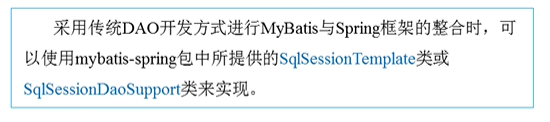<br>
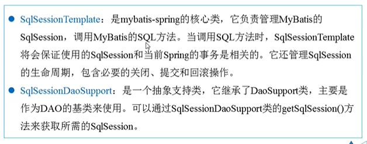<br>
CustomerDao.java 接口
```java
package springWithMybatis.dao;

import springWithMybatis.po.Customer;

public interface CustomerDao {
    //通过id查客户
    public Customer findCustomerById(Integer id);
}

```
CustomerDaoImpl.java 接口实现类
```java
package springWithMybatis.daoImpl;

import org.mybatis.spring.support.SqlSessionDaoSupport;
import springWithMybatis.dao.CustomerDao;
import springWithMybatis.po.Customer;

public class CustomerDaoImpl extends SqlSessionDaoSupport implements CustomerDao {
    @Override
    public Customer findCustomerById(Integer id) {
        return this.getSqlSession().selectOne("springWithMybatis.mapper.Customer.findCustomerById",id);
    }
}
```
applicationContext.xml
```xml
    <!--实例化DAO-->
    <bean id="CustomerDao" class="springWithMybatis.daoImpl.CustomerDaoImpl">
        <!-- 注入sqlSessionFactory对象实例 -->
        <property name="sqlSessionFactory" ref="sqlSessionFactory" />
    </bean>
```
测试类
```java
package springWithMybatis;

import org.junit.Test;
import org.junit.runner.RunWith;
import org.springframework.test.context.ContextConfiguration;
import org.springframework.test.context.junit4.SpringJUnit4ClassRunner;
import springWithMybatis.dao.CustomerDao;
import springWithMybatis.po.Customer;
import javax.annotation.Resource;

@RunWith(SpringJUnit4ClassRunner.class)
@ContextConfiguration("classpath:applicationContext.xml")
public class DaoTest {

    @Resource(name = "CustomerDao")
    CustomerDao customerDao;

    @Test
    public void findCustomerByIdDaoTest(){
        Customer customer = customerDao.findCustomerById(1);
        System.out.println(customer.toString());
    }
}
```
### 基于MapperFactoryBean
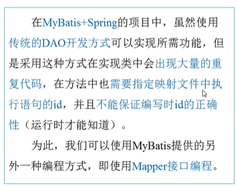<br>
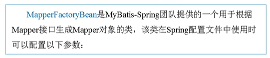<br>
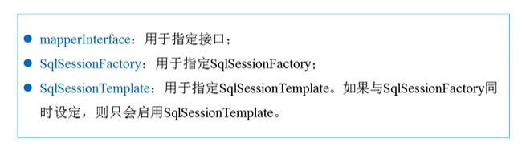<br>
CustomerMapper.java
```java
package springWithMybatis.mapper;

import springWithMybatis.po.Customer;

public interface CustomerMapper {
    //通过id查客户
    public Customer findCustomerById(Integer id);
}
```
CustomerMapper.xml
```xml
<?xml version="1.0" encoding="UTF-8"?>
<!DOCTYPE mapper PUBLIC "-//mybatis.org//DTD Mapper 3.0//EN"
        "http://mybatis.org/dtd/mybatis-3-mapper.dtd">

<!--
Mapper代理开发的规范
1)Mapper接口的名称和对应的Mapper.xml映射文件名称必须一样。
2)Mapper.xml的namespace与Mapper接口类的路径一致。（即接口文件和映射文件在同一包内）
3)Mapper接口的方法名和Mapper.xml中定义的每个执行语句的id相同,输入参数和返回值也要相同。
-->
<mapper namespace="springWithMybatis.mapper.CustomerMapper">
    <!--根据id查客户-->
    <select id="findCustomerById" parameterType="Integer" resultType="customer">
        select * from t_customer where id = #{id}
    </select>
</mapper>
```
applicationContext.xml
```xml
    <!-- 配置Mapper代理(基于MapperFactoryBean) -->
    <bean id="customerMapper" class="org.mybatis.spring.mapper.MapperFactoryBean" >
        <property name="mapperInterface" value="springWithMybatis.mapper.CustomerMapper" />
        <property name="sqlSessionFactory" ref="sqlSessionFactory" />
    </bean>
```
测试类
```java
package springWithMybatis;

import org.junit.Test;
import org.junit.runner.RunWith;
import org.springframework.test.context.ContextConfiguration;
import org.springframework.test.context.junit4.SpringJUnit4ClassRunner;
import springWithMybatis.dao.CustomerDao;
import springWithMybatis.mapper.CustomerMapper;
import springWithMybatis.po.Customer;
import javax.annotation.Resource;

@RunWith(SpringJUnit4ClassRunner.class)
@ContextConfiguration("classpath:applicationContext.xml")
public class DaoTest {

    @Resource(name = "customerMapper")
    CustomerMapper customerMapper;

    @Test
    public void findCustomerByIdMapperTest(){
        Customer customer = customerMapper.findCustomerById(1);
        System.out.println(customer.toString());
    }
}
```
### 基于MapperScannerConfigurer
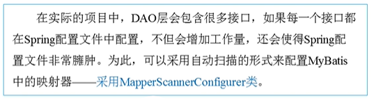<br>
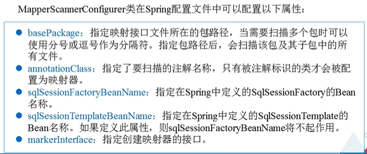<br>
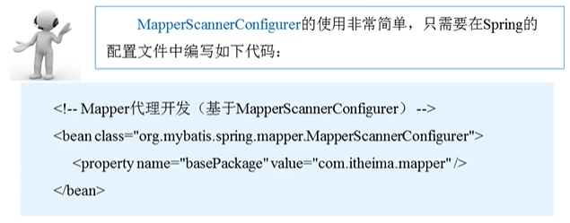<br>
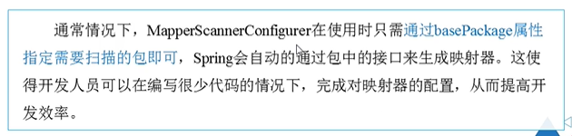<br>
applicationContext.xml
```xml
    <!--Mapper代理开发(基于MapperScannerConfigurer)-->
    <bean class="org.mybatis.spring.mapper.MapperScannerConfigurer">
        <property name="basePackage" value="springWithMybatis.mapper" />
    </bean>
```
mybatis-config.xml **不需要**再配置Mapper,因为会自动扫描
```xml
    <!--配置Mapper的位置-->
    <mappers>
        <!--<mapper resource="springWithMybatis/mapper/CustomerMapper.xml" />-->
    </mappers>
```
Mapper代理开发的规范依然要遵守
```
Mapper代理开发的规范
1)Mapper接口的名称和对应的Mapper.xml映射文件名称必须一样。
2)Mapper.xml的namespace与Mapper接口类的路径一致。（即接口文件和映射文件在同一包内）
3)Mapper接口的方法名和Mapper.xml中定义的每个执行语句的id相同,输入参数和返回值也要相同。
```