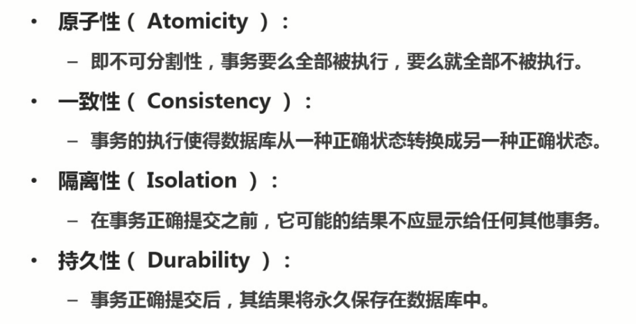
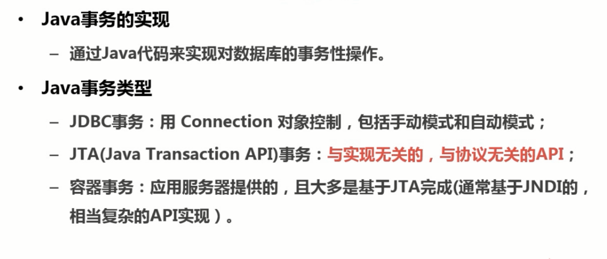
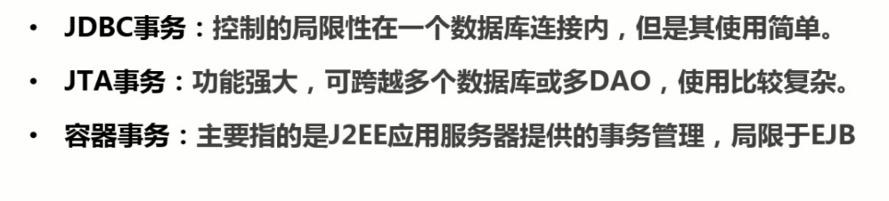
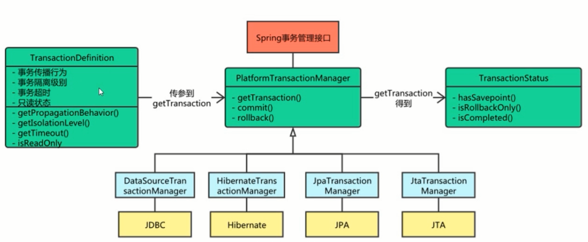
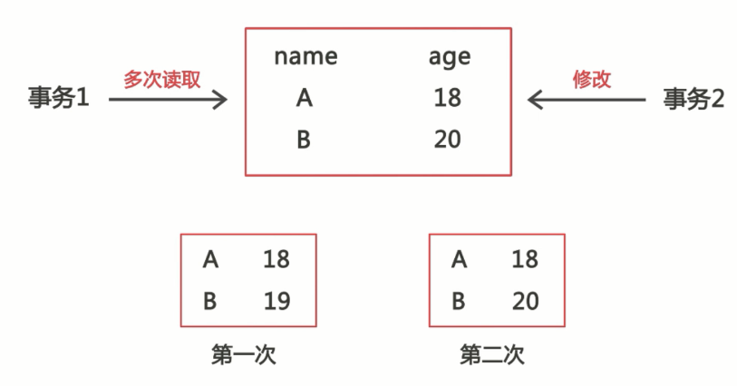
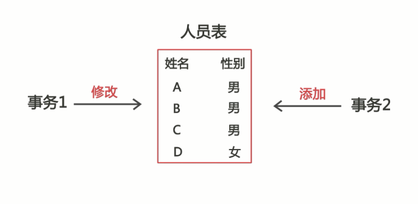
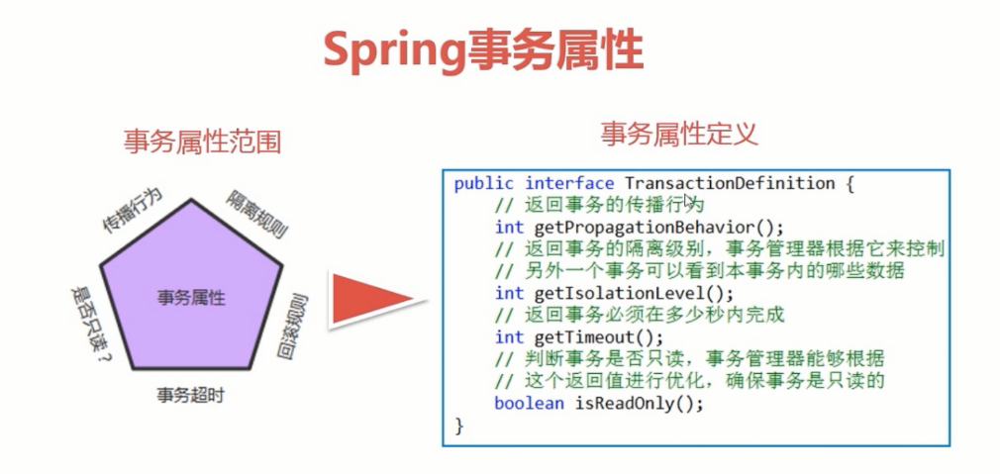
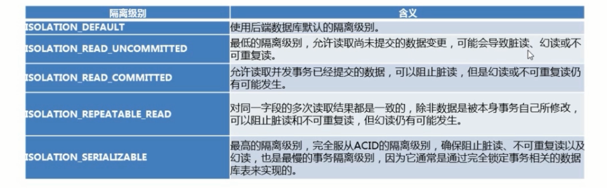
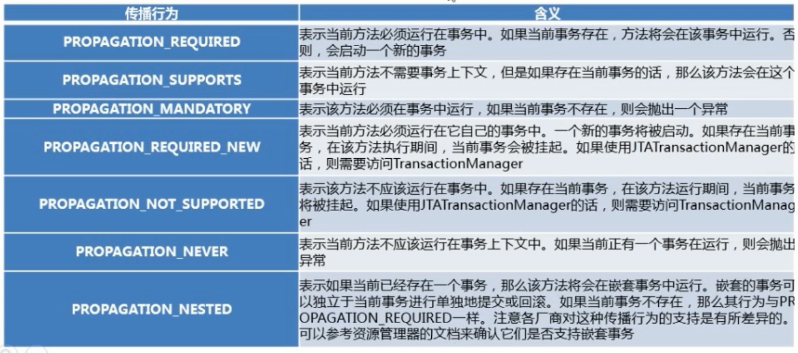
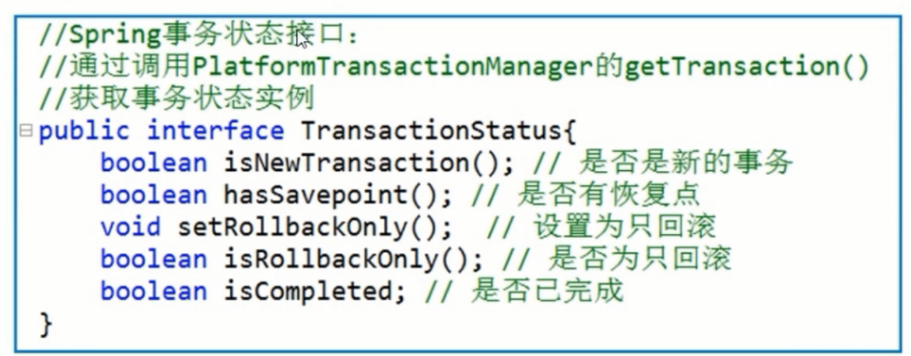

<!-- @import "[TOC]" {cmd="toc" depthFrom=1 depthTo=6 orderedList=false} -->

<!-- code_chunk_output -->

- [事务管理](#事务管理)
  - [简介](#简介)
  - [JAVA事务实现模式(三种)](#java事务实现模式三种)
  - [三种事务的差异](#三种事务的差异)
  - [Spring事务的接口框架](#spring事务的接口框架)
  - [数据读取类型说明](#数据读取类型说明)
    - [脏读:](#脏读)
    - [不可重复读:](#不可重复读)
    - [幻读:](#幻读)
  - [Spring事务属性](#spring事务属性)
    - [事务隔离级别](#事务隔离级别)
    - [事务的传播行为](#事务的传播行为)
    - [事务是否只读](#事务是否只读)
    - [事务超时](#事务超时)
    - [事务回滚](#事务回滚)
    - [Spring事务状态](#spring事务状态)
  - [导包](#导包)
  - [编程式事务管理](#编程式事务管理)
    - [说明](#说明)
    - [实现方式](#实现方式)
  - [声明式事务管理](#声明式事务管理)
    - [说明](#说明-1)
  - [编程式事务管理与声明式事务管理的区别](#编程式事务管理与声明式事务管理的区别)

<!-- /code_chunk_output -->

# 事务管理
## 简介
事务必须服从ISO/IEC所制定的ACID原则<br>
ACID原则是如下:

## JAVA事务实现模式(三种)

## 三种事务的差异

## Spring事务的接口框架

## 数据读取类型说明
### 脏读:
事务没提交，提前读取
### 不可重复读:
两次读取的数据不一致

### 幻读:
事务不是独立执行时发生的一种非预期现象。
<br>
`事务1将人员表数据性别全部修改为男的过程中，事务2添加一条新数据性别为女。事务1结束时，结果与预期不符合，这就是幻读。`
## Spring事务属性

### 事务隔离级别
- 隔离级别定义了一个事务可能受到其他并发事务影响的程度
- 隔离级别分为:
 
### 事务的传播行为
- 当事务方法被另一个事务方法调用时，必须指定事务应该如何传播。
- Spring的7种传播行为:
 
### 事务是否只读
- 利用数据库事务的"只读"属性，进行特定优化处理。
- 设置只读需注意，不同的数据库厂商支持不同。比如:
  \- Oracle "readOnly" 不起作用，不影响增删改查。
  \- Mysql "readOnly" 为true时，只能查，增删改会抛出异常
### 事务超时
- 事务超时就是事务的一个定时器，在特定时间内事务如果没有执行完毕，则自动回滚，而不是一直等待其结束。
- 设计事务时超应该注意:为了程序很好地运行，事务不能运行太长时间。因为事务可能涉及对后端数据库的锁定，所以长时间的事务会不必要的占用数据库资源。
### 事务回滚
- 默认情况下，事务只有遇到运行期异常时才会回滚，而在遇到检查型异常时不会回滚。
- 在自定义回滚策略下则可以实现:
  \- 声明事务在遇到特定的检查型异常时像遇到运行期异常那样回滚;
  \- 声明事务遇到特定的异常不回滚，即使这些异常是运行期异常。
### Spring事务状态
- 通过事务管理器获取TransactionStatus实例;
- 控制事务在回滚或提交时需要应用对应的事务状态；
- Spring事务状态接口:

## 导包
```xml
    <!-- spring-事务 -->
    <dependency>
      <groupId>org.springframework</groupId>
      <artifactId>spring-tx</artifactId>
      <version>${springVersion}</version>
    </dependency>
```
## 编程式事务管理
### 说明
编程式事务使用TransactionTemplate或者直接使用底层的PlatformTransactionManager。对于编程式事务管理，spring推荐使用TransactionTemplate。
### 实现方式
- 事务管理器(PlatformTransactionManager)方式:
  \- 类似应用JTA UserTransaction API方式，但异常处理更简洁;
  \- 核心类为：Spring事务管理的三个接口类以及JdbcTemplate类。
- 模板事务(TransactionTemplate)方式:
  \- 这是Spring官方推荐的编程式事务管理方式;
  \- 主要工具为JdbcTemplate类。

## 声明式事务管理
### 说明
声明式事务是建立在AOP之上的。其本质是对方法前后进行拦截，然后在目标方法开始之前创建或者加入一个事务，在执行完目标方法之后根据执行情况提交或者回滚事务。声明式事务最大的优点就是不需要通过编程的方式管理事务，这样就不需要在业务逻辑代码中掺杂事务管理的代码，只需在配置文件中做相关的事务规则声明(或通过基于@Transactional注解的方式)，便可以将事务规则应用到业务逻辑中。

## 编程式事务管理与声明式事务管理的区别
声明式事务管理要优于编程式事务管理，这正是spring倡导的非侵入式的开发方式。声明式事务管理使业务代码不受污染，一个普通的POJO对象，只要加上注解就可以获得完全的事务支持。和编程式事务相比，声明式事务唯一不足地方是，它的最细粒度只能作用到方法级别，无法做到像编程式事务那样可以作用到代码块级别。但是即便有这样的需求，也存在很多变通的方法，比如，可以将需要进行事务管理的代码块独立为方法等等。