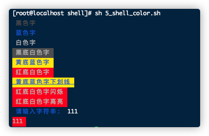
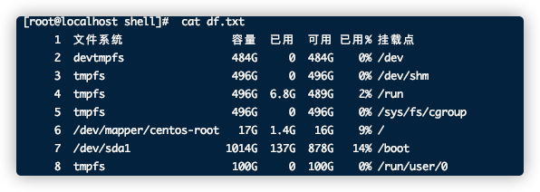
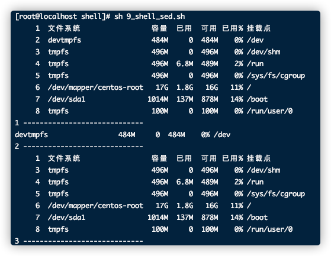
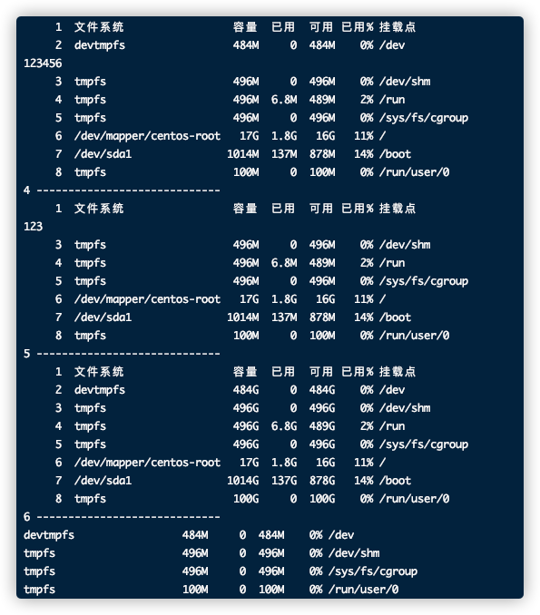

# 目录
<!-- @import "[TOC]" {cmd="toc" depthFrom=1 depthTo=6 orderedList=false} -->

<!-- code_chunk_output -->

- [目录](#目录)
- [shell介绍](#shell介绍)
- [常见解释器](#常见解释器)
- [shell的变量以及常见符号](#shell的变量以及常见符号)
  - [常见变量](#常见变量)
  - [常见符号](#常见符号)
  - [秒变计算器的运算符](#秒变计算器的运算符)
    - [整数](#整数)
    - [小数](#小数)
- [处理海量数据的grep、cut、awk、sed 命令](#处理海量数据的grep-cut-awk-sed-命令)
  - [grep](#grep)
  - [cut](#cut)
  - [awk](#awk)
  - [sed](#sed)
- [循环控制语句if 、for、case、while](#循环控制语句if-for-case-while)
  - [if](#if)
    - [单if](#单if)
    - [多if](#多if)
  - [for](#for)
  - [case](#case)
  - [while](#while)
- [例子](#例子)
  - [1_shell_args.sh](#1_shell_argssh)
  - [2_shell_calculate.sh](#2_shell_calculatesh)
  - [3_shell_conditionals.sh](#3_shell_conditionalssh)
  - [4_shell_read.sh](#4_shell_readsh)
  - [5_shell_color.sh](#5_shell_colorsh)
  - [6_shell_grep.sh](#6_shell_grepsh)
  - [7_shell_cut.sh](#7_shell_cutsh)
  - [8_shell_awk.sh](#8_shell_awksh)
  - [9_shell_sed.sh](#9_shell_sedsh)
  - [10_shell_if.sh](#10_shell_ifsh)
  - [11_shell_for.sh](#11_shell_forsh)
  - [12_shell_while.sh](#12_shell_whilesh)

<!-- /code_chunk_output -->

# shell介绍
简介
```
Shell是一种脚本语言，又是一种命令语言。可以通俗一点来讲，Shell脚本就是一系列命令的集合，可以在Unix/linux
上面直接使用，并且直接调用大量系统内部的功能来解释执行程序把一些重复性工作交给shell做，来实现自动化运维。
Shell 虽然没有C/C++、Java、Python等强大，但也支持了基本的编程元素。例如：if、for、while等循环，
还有变量、数组、字符串、注释、加减乘除逻辑运算等
```
# 常见解释器
```
解释器:是一种命令解释器，主要作用是对命令进行运行和解释，将需要执行的操作传递给操作系统内核并执行
```
```
# !/bin/bash（默认）

# !/bin/ksh

# !/bin/bsh

# !/bin/sh
```
# shell的变量以及常见符号
## 常见变量
```
不同于其它语言需要先声明变量
shell的变量直接使用，eg:a=15
调用变量的话 $或者a 或者 ${a}

$?	#判断上一条命令执行的是否成功 0成功 1失败

$0	#返回脚本的文件名称

$1-$9 #返回对应的参数值

$* #返回所有的参数值是什么

$# #返回参数的个数和
```
## 常见符号
```
>会覆盖原有的内容

>>尾部追加数据(不会覆盖原有的内容)

;	#执行多条命令

|  #管道符

&& #前面的命令执行成功，后面的才可以执行

|| #前面的命令执行失败，后面的才可以执行

"$a" #会输出变量a的值

'$a' #输出$a字符

`` #输出命令结果 eg:a=`date`;echo $a

2>/dev/null     #错误输出到无底洞
1>/dev/null     #正确输出到无底洞
```
## 秒变计算器的运算符
### 整数
```
加：expr 12 + 6 		expr $a + $b

    echo $[12 + 6]		echo $[a + b]

    echo $((12 + 6))	echo $((a + b))
    
减：expr 12 - 6			expr $a - $b

    echo $[12 - 6]		echo $[a - b]

    echo $((12 - 6)) 	echo $((a - b))

乘：expr 12 \* 6		expr $a \* $b

    echo $[12 * 6]	  	echo $[a * b]

    echo $((12 * 6))	echo $((a * b))

除：expr 12 / 6			expr $a / $b

    echo $((12 / 6))	echo $((a / b))

    echo $[12 / 6]		echo $[a / b]

求余：expr 12 % 6 		expr $a % $b

        echo $((12 % 6))	echo $((a % b))

        echo $[12 % 6]	echo $[a % b]
```
### 小数
```
bc计算器
eg: echo "1.2+1.3" | bc

保留多少位小数可以通过scale
但是scale只对除法，取余数，乘幂 有效，对加减没有效。
echo "scale=2;(0.2+0.3)/1" | bc     #计算出0.2+0.3的和并保留俩位小数，此时bc计算器会省略掉个位数的0
echo "scale=2;(1.2+1.3)/1" | bc     #计算出1.2+1.3的和并保留俩位小数
```
# 处理海量数据的grep、cut、awk、sed 命令
## grep
- grep应用场景：通常对数据进行 行的提取
- 语法：grep [选项]...[内容]...[file]
```
选项如下
    -v 	#对内容进行取反提取

    -n 	#对提取的内容显示行号

    -w 	#精确匹配

    -i 	#忽略大小写

    ^ 	#匹配开头行首

    -E 	#正则匹配

    eg:
    # 将url.txt文件中包含qq的行打印出来
    grep qq url.txt 
```
## cut
- cut应用场景：通常对数据进行列的提取
- 语法：cut [选项]...[file]
```
    -d 	#指定分割符
    -f  #指定截取区域
    -c  #以字符为单位进行分割

    注意：不加-d选项，默认为制表符，不是空格
            /bin/bash 		#代表可以登录的用户
            /sbin/nologin	#代表不可以登录的用户

    -d与-f：
    eg:以':'为分隔符，截取出/etc/passwd的第一列跟第三列
    cut -d ':' -f 1,3 /etc/passwd

    eg:以':'为分隔符，截取出/etc/passwd的第一列到第三列
    cut -d ':' -f 1-3 /etc/passwd

    eg:以':'为分隔符，截取出/etc/passwd的第二列到最后一列
    cut -d ':' -f 2- /etc/passwd

    -c：
    eg:截取/etc/passwd文件从第二个字符到第九个字符
    cut -c 2-9 /etc/passwd
```
## awk

## sed
- sed的应用场景：主要对数据进行处理（选取，新增，替换，删除，搜索）
- sed语法：sed [选项][动作] 文件名
```
常见的选项与参数：

    -n 	#把匹配到的行输出打印到屏幕
    p 	#以行为单位进行查询，通常与-n一起使用
        eg：df -h | sed -n '2p'

    d 	#删除  
        eg: sed '2d' df.txt

    a 	#在行的下面插入新的内容
        eg: sed '2a 1234567890' df.txt

    i 	#在行的上面插入新的内容
        eg: sed '2i 1234567890' df.txt

    c 	#替换   
        eg: sed '2c 1234567890' df.txt
    
    s/要被取代的内容/新的字符串/g  #指定内容进行替换
        eg: sed 's/0%/100%/g' df.txt

    -i  #对源文件进行修改(高危操作，慎用，用之前需要备份源文件)

    搜索：在文件中搜索内容
        eg：cat -n df.txt  | sed -n '/100%/p'

    -e 	#表示可以执行多条动作
        eg：cat -n df.txt  | sed -n -e 's/100%/100%-----100%/g' -e '/100%-----100%/p'
```
# 循环控制语句if 、for、case、while
## if
### 单if
```
    if [ 条件判断 ];
        then
        执行动作
    fi

    if [ 条件判断 ];
        then
        执行动作
    else
        执行动作
    fi
```
### 多if
```
    if [条件判断];
        then
        执行动作
    elif [条件判断];
        then
        执行动作
    elif [条件判断];
        then
        执行动作
    fi
```
## for
```
（1）for 变量名 in 值1 值2 值3
    do
    执行动作
    done
```
```
（2）for 变量名 in `命令`
    do
    执行动作	
    done
```
```
（3）for ((条件))
    do
    执行动作
    done
```
## case
``
应用场景：case循环常使用于多重分支，与if不同的是，if可以判断多个条件，case一次只能判断一种条件
``
```
    case 变量 in 

        值1 )
        执行动作1
        ;;

        值2 )
        执行动作2
        ;;

        值3 )
        执行动作3
        ;;

        ....
    esac
```
## while
```
    while [ 条件判断式 ]
    do
        执行动作
    done
```
# 例子
## 1_shell_args.sh
```bash
#!/bin/bash
#by afa
#shell 参数相关命令

echo "第1个参数是：$1"
echo "第2个参数是：$2"
echo "一共有多少参数：$#"
echo "这些参数是什么：$*"
```
命令
```
sh 1_shell_args.sh 参数1 参数2 a b c
```
输出
```
第1个参数是：参数1
第2个参数是：参数2
一共有多少参数：5
这些参数是什么：参数1 参数2 a b c
```
## 2_shell_calculate.sh
```bash
#!/bin/bash
# by afa
# shell中的加减乘除计算

a=12
b=6

expr $a + $b
echo $[a + b]
echo $((a + b))

#乘法
expr $a \* $b
echo $[a * b]
echo $((a * b))
#除法
expr $a / $b
echo $[a / b]
echo $((a / b))
#取余
expr $a % $b
echo $[a % b]
echo $((a % b))

#浮点数计算
echo "1.2 + 1.3" | bc
#浮点数计算保留两位小数 加减无效
echo "scale=2;1.2333 / 2" | bc

```
命令
```
sh 2_shell_calculate.sh
```
输出
```
18
18
18
72
72
72
2
2
2
0
0
0
2.5
.61
```
## 3_shell_conditionals.sh
```bash
#!/bin/bash
# by afa
# shell常见条件判断

#文件（夹）或者路径

#判断xxx.x文件是否存在
if [ -e xxx.x ] 
then
	echo "存在"
else
	echo "不存在"
fi

[ -e shell_conditionals.sh ] && echo '存在'

[ -d shell_conditionals.sh ] && echo '是文件夹'
[ -f shell_conditionals.sh ] && echo '是文件'


[ -r shell_conditionals.sh ] && echo '有读权限'
[ -w shell_conditionals.sh ] && echo '有写权限'
[ -x shell_conditionals.sh ] && echo '有执行权限'


#整形比较 -ge 大于等于 -le小于等于
[ 1 -eq 1 ] && echo "1 equal 1"

[ 1 -ne 0 ] && echo "1 not equal 0"

[ 2 -gt 1 ] && echo "2 greater than 1"
[ 1 -lt 2 ] && echo "1 lesser than 2"

#浮点型比较
[ ` echo '1.2 > 1.3' | bc ` -lt 1 ] && echo '小于'
```
命令
```
sh 3_shell_conditionals.sh
```
输出
```
不存在
1 equal 1
1 not equal 0
2 greater than 1
1 lesser than 2
小于
```
## 4_shell_read.sh
```bash
#!/bin/bash
# by afa
# read读取用户输入数据 -p 给出提示符 -s 隐藏输入内容 
# -t 给出等待时间单位是秒 -n 限制读取字数出发到临界值会自动执行
read -p "请输入用户名：" username
echo $username
read -s -p "请输入密码：" password
echo "\n输入的密码是：$password"
# 等价于
echo "请输入内容："
read str
echo "输入内容是：$str"
```
命令
```
sh 4_shell_read.sh 
```
输出
```
请输入用户名：123
123
请输入密码：
输入的密码是：456
请输入内容：
789
输入内容是：789
```
## 5_shell_color.sh
```bash
#!/bin/bash
# by afa 2020.05.25
# 脚本输出上色
# echo -e "\033[字背景色;字体颜色;特效m字符串\033[关闭属性"
# -e 输出特殊字符

#字体色范围：30-37
echo -e "\033[30m 黑色字 \033[0m"
echo -e "\033[34m 蓝色字 \033[0m"
echo -e "\033[37m 白色字 \033[0m"

#背景色范围：40-47
echo -e "\033[40;37m 黑底白色字 \033[0m"
echo -e "\033[43;34m 黄底蓝色字 \033[0m"
echo -e "\033[41;37m 红底白色字 \033[0m"

#特效范围
echo -e "\033[43;34;4m 黄底蓝色字下划线 \033[0m"
echo -e "\033[41;37;5m 红底白色字闪烁 \033[0m"
echo -e "\033[41;37;1m 红底白色字高亮 \033[0m"


read -p " `echo -e "\033[34m请输入字符串: \033[0m"` " str1
echo -e "\033[41;37m$str1 \033[0m"
```
<br>
## 6_shell_grep.sh
```bash
#!/bin/bash
# by afa 2020.5.25

# grep 是对数据进行 行提取
# 语法grep [选项] [内容] [file]
# -v 对内容进行取反(结合 > 剔除内容)

grep -v 'root' /etc/passwd
echo "-v --------------------------------------------------"
# -n 对提取内容显示行号

grep  -n 'root' /etc/passwd
echo "-n --------------------------------------------------"
# -w 精确匹配

# -i 忽略大小写
grep  -i 'rOOt' /etc/passwd
echo "-i --------------------------------------------------"
# ^ 匹配开头行首
grep '^root' /etc/passwd
echo "^ --------------------------------------------------"
# -E 正则匹配
grep -E '*oot*' /etc/passwd
echo "-E --------------------------------------------------"
```
命令
```
sh 6_shell_grep.sh 
```
输出
```
bin:x:1:1:bin:/bin:/sbin/nologin
daemon:x:2:2:daemon:/sbin:/sbin/nologin
adm:x:3:4:adm:/var/adm:/sbin/nologin
lp:x:4:7:lp:/var/spool/lpd:/sbin/nologin
sync:x:5:0:sync:/sbin:/bin/sync
shutdown:x:6:0:shutdown:/sbin:/sbin/shutdown
halt:x:7:0:halt:/sbin:/sbin/halt
mail:x:8:12:mail:/var/spool/mail:/sbin/nologin
games:x:12:100:games:/usr/games:/sbin/nologin
ftp:x:14:50:FTP User:/var/ftp:/sbin/nologin
[root@localhost shell]# sh 6_shell_grep.sh 
bin:x:1:1:bin:/bin:/sbin/nologin
daemon:x:2:2:daemon:/sbin:/sbin/nologin
adm:x:3:4:adm:/var/adm:/sbin/nologin
lp:x:4:7:lp:/var/spool/lpd:/sbin/nologin
sync:x:5:0:sync:/sbin:/bin/sync
shutdown:x:6:0:shutdown:/sbin:/sbin/shutdown
halt:x:7:0:halt:/sbin:/sbin/halt
mail:x:8:12:mail:/var/spool/mail:/sbin/nologin
games:x:12:100:games:/usr/games:/sbin/nologin
ftp:x:14:50:FTP User:/var/ftp:/sbin/nologin
nobody:x:99:99:Nobody:/:/sbin/nologin
systemd-network:x:192:192:systemd Network Management:/:/sbin/nologin
dbus:x:81:81:System message bus:/:/sbin/nologin
polkitd:x:999:998:User for polkitd:/:/sbin/nologin
sshd:x:74:74:Privilege-separated SSH:/var/empty/sshd:/sbin/nologin
postfix:x:89:89::/var/spool/postfix:/sbin/nologin
chrony:x:998:996::/var/lib/chrony:/sbin/nologin
-v --------------------------------------------------
1:root:x:0:0:root:/root:/bin/bash
10:operator:x:11:0:operator:/root:/sbin/nologin
-n --------------------------------------------------
root:x:0:0:root:/root:/bin/bash
operator:x:11:0:operator:/root:/sbin/nologin
-i --------------------------------------------------
root:x:0:0:root:/root:/bin/bash
^ --------------------------------------------------
root:x:0:0:root:/root:/bin/bash
lp:x:4:7:lp:/var/spool/lpd:/sbin/nologin
mail:x:8:12:mail:/var/spool/mail:/sbin/nologin
operator:x:11:0:operator:/root:/sbin/nologin
postfix:x:89:89::/var/spool/postfix:/sbin/nologin
-E --------------------------------------------------
```
## 7_shell_cut.sh
```bash
#!/bin/bash
# by afa
# cut [选项]  [file]

# -d #指定分隔符
# -f #指定截取区域 
# 分隔符是:截取 第1列和第3列
cut -d ':' -f 1,3 /etc/passwd

echo -e "\n-----------------------\n"

# 分隔符是:截取 第1列到第3列
cut -d ':' -f 1-3 /etc/passwd
echo -e "\n-----------------------\n"

# 分隔符是:截取 第2列到第最后一列
cut -d ':' -f 2- /etc/passwd
echo -e "\n-----------------------\n"

# -c #以字符为单位进行分割
# 截取/etc/passwd文件从第二个字符到第九个字符

cut -c 2-9 /etc/passwd
# 注意： 不加-d选项，默认为制表符(tab)，不是空格
```
命令
```
sh 7_shell_cut.sh 
```
输出
```
root:0
bin:1
daemon:2
adm:3
lp:4
sync:5
shutdown:6
halt:7
mail:8
operator:11
games:12
ftp:14
nobody:99
systemd-network:192
dbus:81
polkitd:999
sshd:74
postfix:89
chrony:998

-----------------------

root:x:0
bin:x:1
daemon:x:2
adm:x:3
lp:x:4
sync:x:5
shutdown:x:6
halt:x:7
mail:x:8
operator:x:11
games:x:12
ftp:x:14
nobody:x:99
systemd-network:x:192
dbus:x:81
polkitd:x:999
sshd:x:74
postfix:x:89
chrony:x:998

-----------------------

x:0:0:root:/root:/bin/bash
x:1:1:bin:/bin:/sbin/nologin
x:2:2:daemon:/sbin:/sbin/nologin
x:3:4:adm:/var/adm:/sbin/nologin
x:4:7:lp:/var/spool/lpd:/sbin/nologin
x:5:0:sync:/sbin:/bin/sync
x:6:0:shutdown:/sbin:/sbin/shutdown
x:7:0:halt:/sbin:/sbin/halt
x:8:12:mail:/var/spool/mail:/sbin/nologin
x:11:0:operator:/root:/sbin/nologin
x:12:100:games:/usr/games:/sbin/nologin
x:14:50:FTP User:/var/ftp:/sbin/nologin
x:99:99:Nobody:/:/sbin/nologin
x:192:192:systemd Network Management:/:/sbin/nologin
x:81:81:System message bus:/:/sbin/nologin
x:999:998:User for polkitd:/:/sbin/nologin
x:74:74:Privilege-separated SSH:/var/empty/sshd:/sbin/nologin
x:89:89::/var/spool/postfix:/sbin/nologin
x:998:996::/var/lib/chrony:/sbin/nologin

-----------------------

oot:x:0:
in:x:1:1
aemon:x:
dm:x:3:4
p:x:4:7:
ync:x:5:
hutdown:
alt:x:7:
ail:x:8:
perator:
ames:x:1
tp:x:14:
obody:x:
ystemd-n
bus:x:81
olkitd:x
shd:x:74
ostfix:x
hrony:x:
```
## 8_shell_awk.sh
```bash
#!/bin/bash
# awk
# 语法1 awk '条件 {执行动作}' 文件名
# 语法2 awk '条件1 {执行动作} 条件2 {执行动作}'
# 语法3 awk '[选项] 条件1 {执行动作} 条件2 {执行动作}' 文件名

# 注意 printf 是格式化输出不自动换行。 print 打印输出，会自动换行

# df -h 磁盘信息中 grep找到/dev/sda1 那一行 送入awk 输出第五列  $0 代表一整行
df -h | grep /dev/sda1 | awk '{printf "/dev/sda1的使用率是："} {print $5}'
echo '1 --------------------------------------'
# 格式化输出bc 计算的浮点数
echo "scale=2;0.13+0.1" | bc | awk '{printf "%.4f\n", $0}'
echo '2 --------------------------------------'

# -F 指定分隔符 默认为制表符
cat /etc/passwd | awk -F ":" '{print $1}'
echo '3 --------------------------------------'

# BEGIN 在读取所有行内容前就开始执行，通常用于修改内置变量的值
# 将所有输入awk 的行前  设置分隔符为:
cat /etc/passwd | awk 'BEGIN {FS=":" } {print $1}'
echo '4 --------------------------------------'

# END 结束的时候执行
cat /etc/passwd | awk -F ":" '{print $1} END {print "以上为执行结果"}'
echo '5 --------------------------------------'

# NR 行号
# 打印第2-5行的第1列
df -h | awk ' (NR>=2 && NR<=5 ){print $1}' 
echo '6 --------------------------------------'

awk -F ":" 'NR<=5 {print $1}' /etc/passwd
```
命令
```
sh 8_shell_awk.sh
```
输出
```
/dev/sda1的使用率是：14%
1 --------------------------------------
0.2300
2 --------------------------------------
root
bin
daemon
adm
lp
sync
shutdown
halt
mail
operator
games
ftp
nobody
systemd-network
dbus
polkitd
sshd
postfix
chrony
3 --------------------------------------
root
bin
daemon
adm
lp
sync
shutdown
halt
mail
operator
games
ftp
nobody
systemd-network
dbus
polkitd
sshd
postfix
chrony
4 --------------------------------------
root
bin
daemon
adm
lp
sync
shutdown
halt
mail
operator
games
ftp
nobody
systemd-network
dbus
polkitd
sshd
postfix
chrony
以上为执行结果
5 --------------------------------------
devtmpfs
tmpfs
tmpfs
tmpfs
6 --------------------------------------
root
bin
daemon
adm
lp
```
## 9_shell_sed.sh
```bash
#!/bin/bash

#sed的应用场景：主要对数据进行处理（选取，新增，替换，删除，搜索）
#语法： sed [选项] [动作] 文件名

df -h | nl
echo "1 -----------------------------"
# -n 把匹配行输出打印到屏幕
# p 以行为单位进行查询。通常与-n一起使用
# 打印第二行
df -h | sed -n '2p'
echo "2 -----------------------------"

# d 删除第X行并打印
df -h | nl | sed '2d' 
echo "3 -----------------------------"

# a 在指定行下面插入新内容并打印 。 对文件的操作不会影响原文件
df -h | nl | sed '2a 123456' 
echo "4 -----------------------------"
# i 在指定行上面插入新内容并打印 。 对文件的操作不会影响原文件

# c 替换将指定行的内容替换 并打印 。 对文件的操作不会影响原文件
df -h | nl | sed '2c 123'
echo "5 -----------------------------"
# 替换 的高级用法 s/原字符串/替换后字符串/g 并打印 。 对文件的操作不会影响原文件
# 把M全部替换成G
df -h | nl | sed 's/M/G/g' 
echo "6 -----------------------------"

# -i 对源文件进行修改 ，慎用，用之前最好备份源文件
# sed -i 's/M/G/g' df.txt
# -e 表示可以执行多条动作


# 打印包含100%的行 
df -h | sed -n '/0%/p' 
```
<br>
命令
```
sh 9_shell_sed.sh
```
输出
<br>
<br>
## 10_shell_if.sh
```bash
#!/bin/bash
# if案例
# 单if
if [ -e 1.txt ];
	then
	echo '1.txt文件存在'
else
	echo '1.txt文件不存在'
fi

# 多ifa

echo '请输入一个数字: '
read number

if [ $number -lt 0 ];
	then
	echo '这个数小于于0'
elif [ $number -eq 10 ];
	then
	echo '这个数等于10'
else
	echo '这个数大于0不等于10'
fi
```
命令
```
sh 10_shell_if.sh
```
输出
```
1.txt文件不存在
请输入一个数字: 
10
这个数等于10
```
## 11_shell_for.sh
```bash
#!/bin/bash
#for循环

for i in 1 2 3 4 5
do
echo $i
sleep 1
done

#url.txt每行的网站取出来ping4次
for url in $(cat url.txt)
do
ping -c 4 $url
echo "\n"
done

#打印6-10
for (( i=6;i<11;i++ ))
do
echo $i
sleep 1
done
```
命令
```
sh 11_shell_for.sh
```
输出
```
1
2
3
4
5
PING www.a.shifen.com (14.215.177.39): 56 data bytes
64 bytes from 14.215.177.39: icmp_seq=0 ttl=56 time=7.485 ms
64 bytes from 14.215.177.39: icmp_seq=1 ttl=56 time=8.301 ms
64 bytes from 14.215.177.39: icmp_seq=2 ttl=56 time=7.982 ms
64 bytes from 14.215.177.39: icmp_seq=3 ttl=56 time=5.971 ms

--- www.a.shifen.com ping statistics ---
4 packets transmitted, 4 packets received, 0.0% packet loss
round-trip min/avg/max/stddev = 5.971/7.435/8.301/0.894 ms


PING public-v6.sparta.mig.tencent-cloud.net (113.96.232.215): 56 data bytes
64 bytes from 113.96.232.215: icmp_seq=0 ttl=56 time=4.926 ms
64 bytes from 113.96.232.215: icmp_seq=1 ttl=56 time=7.664 ms
64 bytes from 113.96.232.215: icmp_seq=2 ttl=56 time=4.931 ms
64 bytes from 113.96.232.215: icmp_seq=3 ttl=56 time=7.252 ms

--- public-v6.sparta.mig.tencent-cloud.net ping statistics ---
4 packets transmitted, 4 packets received, 0.0% packet loss
round-trip min/avg/max/stddev = 4.926/6.193/7.664/1.273 ms


6
7
8
9
10

```
## 12_shell_while.sh
```bash
#!/bin/bash
#while循环
#计算 0加到输入的参数
i=0
sum=0

while [ $i -lt $1 ]
do
sum=$(($sum+$i))
i=$(($i+1))
done

echo "0加到$1的和为:"$sum
```
命令
```
sh 12_shell_while.sh 10
```
输出
```
0加到10的和为:45
```