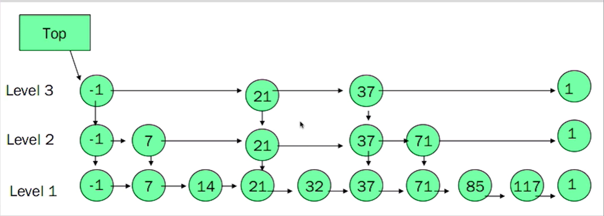

<!-- @import "[TOC]" {cmd="toc" depthFrom=1 depthTo=6 orderedList=false} -->

<!-- code_chunk_output -->

- [简介](#简介)
- [安装](#安装)
- [五种数据类型](#五种数据类型)
  - [一、String](#一-string)
    - [redis中的string源码](#redis中的string源码)
    - [命令](#命令)
      - [1.get/set](#1getset)
      - [2.mget](#2mget)
      - [3.incr && incrby](#3incr-incrby)
      - [4.decr && decrby](#4decr-decrby)
      - [5.setnx](#5setnx)
      - [6.setex](#6setex)
      - [7.getrange](#7getrange)
      - [8.mset](#8mset)
      - [9.msetnx](#9msetnx)
      - [10.getset](#10getset)
      - [11.append](#11append)
  - [二、Hashes](#二-hashes)
  - [三、List](#三-list)
    - [命令](#命令-1)
      - [1.lpush](#1lpush)
      - [2.lrange](#2lrange)
      - [3.lpop](#3lpop)
      - [4.rpush](#4rpush)
      - [5.rpop](#5rpop)
      - [6.llen](#6llen)
      - [7.lindex](#7lindex)
      - [8.lrem](#8lrem)
  - [四、Set](#四-set)
    - [命令](#命令-2)
      - [1.sadd](#1sadd)
      - [2.smembers](#2smembers)
      - [3.spop](#3spop)
      - [4.sdiff](#4sdiff)
      - [5.sunion](#5sunion)
      - [6.sinter](#6sinter)
  - [五、SortSet](#五-sortset)
    - [命令](#命令-3)
      - [1.zadd](#1zadd)
      - [2.zrange](#2zrange)
      - [3.zrem](#3zrem)
      - [4.zrangebyscore](#4zrangebyscore)
      - [5.zrank](#5zrank)
      - [6.zcard](#6zcard)
      - [7.zcount](#7zcount)
- [redis的发布与订阅](#redis的发布与订阅)
  - [public](#public)

<!-- /code_chunk_output -->

# 简介
- 内存+硬盘的数据持久化。
- Redis 是一个开源（BSD许可）的，内存中的数据结构存储系统，它可以用作NoSql数据库、缓存和消息中间件。 
- 支持多 种类型的数据结构，如 字符串（strings）、散列（hashes）、 列表（lists）、 集合（sets）、 有序集合（sorted sets）等。
# 安装
https://www.cnblogs.com/heqiuyong/p/10463334.html

# 五种数据类型
## 一、String
### redis中的string源码
type int/string 结构体x
```c
struct sdshdr {
    int len;    //字符串长度
    int free;   //buf中空闲的长度
    char buf[]; //buf用于存储字符串内容
}
```
### 命令
#### 1.get/set
设置/获取指定key的String Value
```
127.0.0.1:6379> set "111" "222"
OK
127.0.0.1:6379> get "111"
"222"
```

#### 2.mget
mget = many get <br>获取多个key的String Value 如果key不存在返回nil
```
127.0.0.1:6379> set name afa
OK
127.0.0.1:6379> set age 18
OK
127.0.0.1:6379> mget age name 
1) "18"
2) "afa"
127.0.0.1:6379> mget age name addr
1) "18"
2) "afa"
3) (nil)
```
#### 3.incr && incrby
incr 将指定key的value 进行`+1`操作 并返回新的值<br>
incrby 将指定key的value 进行`+n`操作 并返回新的值<br>
如果操作的value无法转换成数值则报错
```
127.0.0.1:6379> set age 18
OK
127.0.0.1:6379> incr age
(integer) 19
127.0.0.1:6379> get age
"19"
127.0.0.1:6379> incrby age 10
(integer) 29
127.0.0.1:6379> get age
"29"
127.0.0.1:6379> incr name
(error) ERR value is not an integer or out of range
```
#### 4.decr && decrby
decr 将指定key的value 进行`-1`操作,并返回新的值<br>
decrby 将指定key的value 进行`-n`操作,并返回新的值<br>
如果操作的value无法转换成数值则报错
```
127.0.0.1:6379> get age
"28"
127.0.0.1:6379> decr age
(integer) 27
127.0.0.1:6379> get age
"27"
127.0.0.1:6379> decrby age 10
(integer) 17
127.0.0.1:6379> get age
"17"
127.0.0.1:6379> decr name
(error) ERR value is not an integer or out of range
```
#### 5.setnx
setnx = set if no exit<br>
和set的功能基本一样。<br>
如果key`存在`则`返回0`  不修改数据。<br>
如果key`不存在`则`返回1` 设置数据
```
127.0.0.1:6379> mget age addr
1) "17"
2) (nil)
127.0.0.1:6379> setnx age 18
(integer) 0
127.0.0.1:6379> setnx addr sz
(integer) 1
127.0.0.1:6379> mget age addr
1) "17"
2) "sz"
```
#### 6.setex
setex = set expire<br>
设置key的数据。并指定失效时间。单位秒。时间一到key会被删除变成nil
```
127.0.0.1:6379> set age 18
OK
127.0.0.1:6379> mget age age1
1) "18"
2) (nil)
127.0.0.1:6379> setex age 5 20
OK
127.0.0.1:6379> get age
"20"
127.0.0.1:6379> setex age1 5 30
OK
127.0.0.1:6379> get age1
"30"
127.0.0.1:6379> mget age age1
1) (nil)
2) (nil)
```

#### 7.getrange
获取key对应string value从`start到end的闭区间`
```
127.0.0.1:6379> set str1 abcdefghijk
OK
127.0.0.1:6379> getrange str1 2 3
"cd"
127.0.0.1:6379> getrange str1 2 6
"cdefg"
127.0.0.1:6379> getrange str1 0 0
"a"
127.0.0.1:6379> getrange str1 0 -1
"abcdefghijk"
```

#### 8.mset
设置多个数据<br>
mset = many set
```
127.0.0.1:6379> set age1 15
OK
127.0.0.1:6379> mset age1 18 age2 28
OK
127.0.0.1:6379> mget age1 age2 age3
1) "18"
2) "28"
3) (nil)
```
#### 9.msetnx
msetnx = many setnx<br>
和setnx的功能基本一样。<br>
如果有个key`存在`则`返回0` 本条命令不执行。(数据不会变)<br>
如果key`都不存在`则`返回1` 设置数据
```
127.0.0.1:6379> mget name1 name2
1) "123"
2) (nil)
127.0.0.1:6379> msetnx name2 222 name1 111
(integer) 0
127.0.0.1:6379> mget name1 name2
1) "123"
2) (nil)
127.0.0.1:6379> msetnx name2 222 name3 333
(integer) 1
127.0.0.1:6379> mget name1 name2 name3
1) "123"
2) "222"
3) "333"
```
#### 10.getset
设置key的值。并返回原先的值。
```
127.0.0.1:6379> set age 18
OK
127.0.0.1:6379> get age
"18"
127.0.0.1:6379> getset age 28
"18"
127.0.0.1:6379> get age
"28"
127.0.0.1:6379> getset age100 18
(nil)
127.0.0.1:6379> get age100
"18"
```

#### 11.append
追加数据。然后返回新字符串的长度。
```
127.0.0.1:6379> set name afa
OK
127.0.0.1:6379> append name boy
(integer) 6
127.0.0.1:6379> get name
"afaboy"
127.0.0.1:6379> append name5 guy
(integer) 3
127.0.0.1:6379> get name5
"guy"
```
## 二、Hashes
类似java的HashMap以key value的形式存储数据。value是一套(key,value)数据。
```
127.0.0.1:6379> hset myinfo name afa
(integer) 1
127.0.0.1:6379> hset myinfo age 18
(integer) 1
127.0.0.1:6379> hgetall myinfo
1) "name"
2) "afa"
3) "age"
4) "18"
127.0.0.1:6379> hget myinfo name
"afa"
127.0.0.1:6379> hmset myinfo name afa age 24 addr shenzhen sex boy
OK
127.0.0.1:6379> hgetall myinfo
1) "name"
2) "afa"
3) "age"
4) "24"
5) "addr"
6) "shenzhen"
7) "sex"
8) "boy"
127.0.0.1:6379> hmget myinfo age addr
1) "24"
2) "shenzhen"
127.0.0.1:6379> hlen myinfo
(integer) 4
127.0.0.1:6379> hdel myinfo sex
(integer) 1
127.0.0.1:6379> hlen myinfo
(integer) 3
127.0.0.1:6379> hgetall myinfo
1) "name"
2) "afa"
3) "age"
4) "24"
5) "addr"
6) "shenzhen"
```

## 三、List
- 可以用作MQ队列
- list的名字就是key
- 一个list可以放入多个value
- 相当于一个key对应多个value
- 类似链表
### 命令
#### 1.lpush
头插。返回插入的数据数量
```
127.0.0.1:6379> lpush  newlist value1 value2 value3 value1
(integer) 4
```
#### 2.lrange
获取下标指定范围的值。下标从0开始。闭区间
```
127.0.0.1:6379> lrange newlist 0 -1
1) "value1"
2) "value3"
3) "value2"
4) "value1"
127.0.0.1:6379> lrange newlist 0 2
1) "value1"
2) "value3"
3) "value2"
```
#### 3.lpop
尾部删除,返回删除的数据
```
127.0.0.1:6379> lpop newlist
"value1"
```
#### 4.rpush
尾插,返回list中的总数据数
```
127.0.0.1:6379> rpush newlist value4
(integer) 4
127.0.0.1:6379> lrange newlist 0 -1
1) "value3"
2) "value2"
3) "value1"
4) "value4"
```
#### 5.rpop
尾部删除,返回删除的数据
```
127.0.0.1:6379> rpop newlist
"value4"
127.0.0.1:6379> lrange newlist 0 -1
1) "value3"
2) "value2"
3) "value1"
```
#### 6.llen
返回list大小
```
127.0.0.1:6379> llen newlist
(integer) 3
```
#### 7.lindex
返回指定下标的数据。
```
127.0.0.1:6379> lindex newlist 0
"value3"
127.0.0.1:6379> lrange newlist 0 -1
1) "value3"
2) "value2"
3) "value1"
127.0.0.1:6379> lindex newlist 100
(nil)
```
#### 8.lrem
移除数据<br>
LREM key count value
- count > 0 : 从表头开始向表尾搜索，移除与 value 相等的元素，数量为 count 。
- count < 0 : 从表尾开始向表头搜索，移除与 value 相等的元素，数量为 count 的绝对值。
- count = 0 : 移除表中所有与 value 相等的值。

返回值被移除元素的数量
```
127.0.0.1:6379> lpush newlist2 v1 v2 v3 v4 v1
(integer) 5
127.0.0.1:6379> lrange newlist2 0 -1
1) "v1"
2) "v4"
3) "v3"
4) "v2"
5) "v1"
127.0.0.1:6379> lrem newlist2 0 v2
(integer) 1
127.0.0.1:6379> lrange newlist2 0 -1
1) "v1"
2) "v4"
3) "v3"
4) "v1"
127.0.0.1:6379> lrem newlist2 3 v1
(integer) 2
127.0.0.1:6379> lrange newlist2 0 -1
1) "v4"
2) "v3"
```
## 四、Set
排重的集合
### 命令
#### 1.sadd
添加数据到set里边
```
127.0.0.1:6379> sadd myset v1 v2 v3 v1
(integer) 3
```
#### 2.smembers
查看set所有数据
```
127.0.0.1:6379> smembers myset
1) "v3"
2) "v2"
3) "v1"
```
#### 3.spop
随机移除一个数据，返回移除的数据
```
127.0.0.1:6379> spop myset  随机移除一个数据
"v2"
127.0.0.1:6379> smembers myset
1) "v3"
2) "v1"
```
#### 4.sdiff
找出两个set的差异。
```
127.0.0.1:6379> smembers myset
1) "v3"
2) "v1"
127.0.0.1:6379> smembers myset2
1) "v3"
2) "v2"
3) "v1"
4) "v4"
127.0.0.1:6379> sdiff myset2 myset  找出myset2有的myset没有的数据
1) "v2"
2) "v4"
127.0.0.1:6379> sdiff myset myset2 找出myset有的myset2没有的数据
(empty list or set)
```
#### 5.sunion
求得多个set的并集
```
127.0.0.1:6379> sunion myset myset2
1) "v2"
2) "v1"
3) "v3"
4) "v4"
```
#### 6.sinter
求得多个set的交集
```
127.0.0.1:6379> sinter myset myset2 
1) "v3"
2) "v1"
127.0.0.1:6379> sinter myset myset2 myset3
(empty list or set)
```
## 五、SortSet
在set的基础上增加顺序score,根据score进行排序。<br>
set是通过hashmap存储 key对应set的元素,value是空对象。<br>
sortset添加多一层跳跃表。

-1和1是边界。从top开始检索。当查找的数据在两个值之间。到下一层去找数据。依次循环。性能和tree差不多,更省空间
### 命令
#### 1.zadd
添加数据
```
127.0.0.1:6379> zadd myzset 1 one 2 two 3 three
(integer) 3
```
#### 2.zrange
获取数据
```
127.0.0.1:6379> zrange myzset 0 -1
1) "one"
2) "two"
3) "three"
127.0.0.1:6379> zrange myzset 0 -1 withscores
1) "one"
2) "1"
3) "two"
4) "2"
5) "three"
6) "3"
```
#### 3.zrem
删除数据
```
127.0.0.1:6379> zrem myzset "two"
(integer) 1
127.0.0.1:6379> zrange myzset 0 -1
1) "one"
2) "three"
127.0.0.1:6379> zrem myzset five
(integer) 0
```
#### 4.zrangebyscore
返回有序集key中 指定score范围的数据。广泛用于排行榜
```
127.0.0.1:6379> zadd myzset 6 six 2 two 
(integer) 2
127.0.0.1:6379> zrange myzset 0 -1
1) "one"
2) "two"
3) "three"
4) "six"
127.0.0.1:6379> zrangebyscore myzset 3 6    闭区间
1) "three"
2) "six"
127.0.0.1:6379> zrangebyscore myzset (2 (6  开区间
1) "three"
127.0.0.1:6379> zrangebyscore myzset 2 (6
1) "two"
2) "three"
```
#### 5.zrank
获取指定value的score排名,第一名是0
```
127.0.0.1:6379> zrank myzset three
(integer) 2
```
#### 6.zcard
获取成员数
```
127.0.0.1:6379> zcard myzset
(integer) 5
```
#### 7.zcount
获取指定score范围的成员数
```
127.0.0.1:6379> zcount myzset 0 5
(integer) 4
127.0.0.1:6379> zcount myzset 0 100
(integer) 5
```
# redis的发布与订阅
类似mqtt。mq
## public