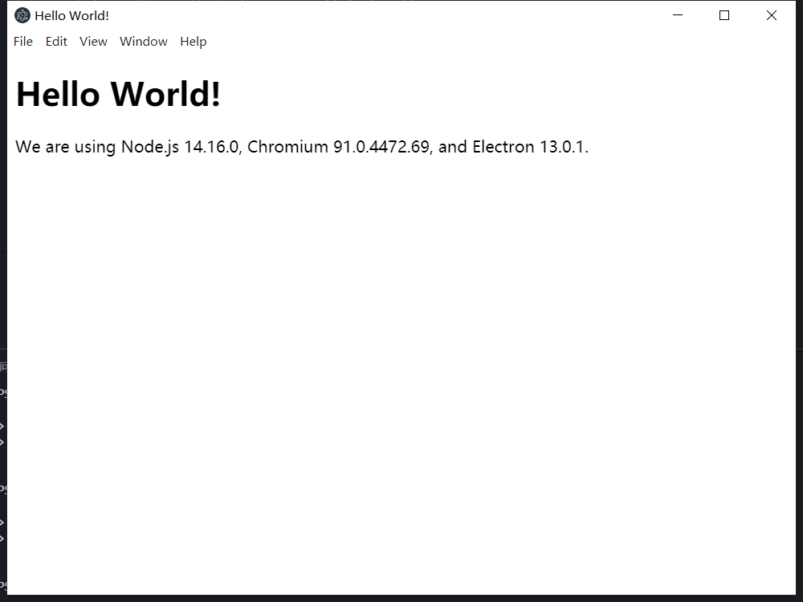

# 快速启动
看看 Electron 是如何运转的

```shell
# 克隆示例项目的仓库
git clone https://github.com/electron/electron-quick-start

# 进入这个仓库
cd electron-quick-start

# 切换源
npm config set electron_mirror="https://npm.taobao.org/mirrors/electron/"

# 安装依赖
npm install
# 运行
npm start
```
