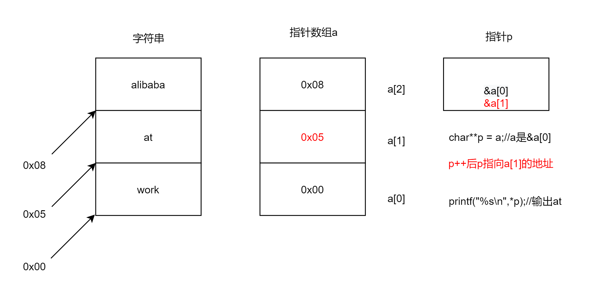
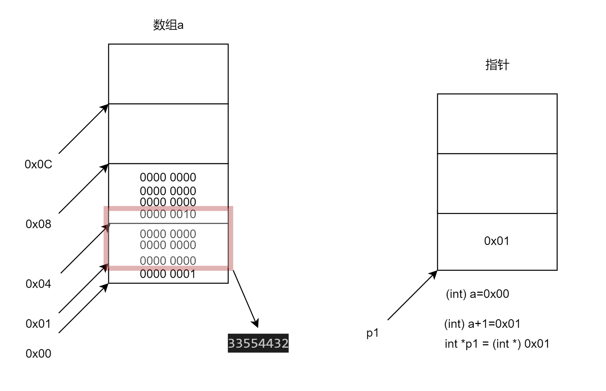

<!-- @import "[TOC]" {cmd="toc" depthFrom=1 depthTo=6 orderedList=false} -->

<!-- code_chunk_output -->

- [介绍](#介绍)
- [重点](#重点)
  - [1.指针数组](#1指针数组)
    - [example](#example)
  - [2.数组指针](#2数组指针)
    - [example1](#example1)
    - [example2](#example2)
    - [example3](#example3)
  - [3.指针强制类型转换](#3指针强制类型转换)
    - [example1](#example1-1)
  - [4.指针与数组](#4指针与数组)
  - [5.指针强转int](#5指针强转int)
  - [6.指针与函数](#6指针与函数)

<!-- /code_chunk_output -->

# 介绍
- 指针是一种变量，存储着内存单元地址。
- 指针变量本身占4字节(32位系统)
- 指针变量本身占8字节(64位系统)
- 指针之间可以进行任意的强制类型转换，转换后地址不变，++ --偏移量和指针类型相关。
- 指针与int数据加减法就是指针地址偏移。偏移量与指针类型有关。
# 重点
## 1.指针数组
```c
int *p[5];
(int*)p[5];//二者等价 p[0] p[1]..都是指针
```
### example
```c
int main(void)
{
    char* a[] = {"work","at","alibaba"};
    char**p = a;                        
    //二级指针char**p拆成char*和*p, 
    //后半部分*表示 p 是一个指针变量,前半部分说明存放的是char*类型的地址
    p++;
    printf("%s\n",*p);
    return 0;
}
```
结果
```
at
```
<br>
## 2.数组指针
### example1
```c
int main(void)
{
    int arry[5] = {1,2,3,4,5};
    printf("&arry:%p\n",&arry);

    int (*p)[5] = &arry;            //int (*p)[5]; p = &arry; 
    printf("p:%p\n",p);
    
    int i;
    for(i=0; i<5 ; i++)
    {
        printf("%d\n",p[0][i]);
        printf("%d\n",*(*p+i));     //两种形式输出结果一样
    }

    p++;                            //偏移5*4=20个字节
    printf("p:%p\n",p);

    return 0;
}
```
结果
```
&arry:0xbff0f8b4
p:0xbff0f8b4
1
1
2
2
3
3
4
4
5
5
p:0xbff0f8c8
```
### example2
```c
int main(void)
{
    int arry[2][3] = {{1, 2, 3}, {4, 5, 6}}; 
    //等价于int (*p)[3] = &arry[0];因为数组的第一个元素取地址等于数组名
    int (*p)[3] = arry;                     
    int i,j;
    for( i=0 ; i<2 ; i++ )
        for( j=0 ; j<3 ; j++ )
        {
            printf("a[%d][%d]=%d\n",i,j,p[i][j]);
            // *(p+i)就是arry[i]
            // *(arry[i]+j)就是arry[i][j]的值即*(*(p+i)+j)
            printf("a[%d][%d]=%d\n",i,j, *(*(p+i)+j) );
        }

    for( j=0 ; j<3 ; j++ )
        printf("%d\n",(*p)[j] );   
    p++;    //偏移3个int即12个字节
    for( j=0 ; j<3 ; j++ )
        printf("%d\n",(*p)[j] );


    return 0;
}
```
结果
```
a[0][0]=1
a[0][0]=1
a[0][1]=2
a[0][1]=2
a[0][2]=3
a[0][2]=3
a[1][0]=4
a[1][0]=4
a[1][1]=5
a[1][1]=5
a[1][2]=6
a[1][2]=6
1
2
3
4
5
6
```
### example3
```c
#include <stdio.h>

int main(void)
{
    int arry[2][3] = {{1, 2, 3}, {4, 5, 6}}; 
    int (*p)[3] = arry;
    int j;

    for( j=0 ; j<3 ; j++ )
        printf("%d\n",(*p)[j] );   //此时(*p) 等价于arry[0]

    p++;                           //偏移一个 int[3] 的字节 （3*4=12）

    for( j=0 ; j<3 ; j++ )
        printf("%d\n",(*p)[j] );   //此时(*p) 等价于arry[1]
    return 0;
}
```
结果
```
1
2
3
4
5
6
```
## 3.指针强制类型转换
### example1
```c
int main(void)
{
    int a = 383;            // 00000000 00000000 000000001 01111111
    int *p = &a;
    char *q =(char *) p;    // int指针p强转为char指针q。即q指向a变量首地址，大小为1字节。

    printf("%d\n",*q);

    return 0;

}
```
结果
```
127
```
## 4.指针与数组
```C
int a = {1,3,5};
int b[2][3] = {{1,2,3},{4,5,6}};
```
- &a 和 sizeof(a) 中的a指的是数组本身。
- 其余的时候a是指代 &a[0]。
- b指的是&b[0]，b[0]是一个一维数组int [3]。所以&b[0]是一维数组本身，即指向b[0][0]的地址，指针空间占3个int（12个字节）
```c
#include <stdio.h>

int main(void)
{
    int a[3] = {1,2,3};
    int b[3] = {4,5,6};

    int *p = &a[0];
    printf("%d\n",*p);      //1
    p+=3;
    printf("%d\n",*p);      //4

    int *q = (int *)(&a+1); //&a是数组本身，+1偏移整个数组空间即12个字节
    printf("%d\n",*q);      //4
    q++;                    
    printf("%d\n",*q);      //5
    
    int *z = &a[0];         //等价于int *z = a;
    printf("%d\n",z[1]);    //2 此时z已经可以替换a了

    printf("z:%p\n",z);             //z:0xbfb85c9c
    printf("&z:%p\n",&z);           //&z:0xbfb85cb4
    printf("z+1:%p\n", (z+1) );     //z+1:0xbfb85ca0  偏移4字节含义是z指向a[1]   
    printf("&z+1:%p\n", (&z+1) );   //&z+1:0xbfb85cb8 偏移4字节含义是偏移到上一个指针。

    return 0;
}
```
## 5.指针强转int
```c
int main(void)
{
    int a[4] = {1,2,3,4};
    int *p1 = (int*) ((int)a+1);
    printf("%d\n",*p1);             //33554432
    return 0;
}
```
<br>
## 6.指针与函数
```c
#include <stdio.h>

void funcion(void)
{
    printf("output\n");
}
int main(void)
{
    void (*pFuncion)(void);
    unsigned long p;

    p = (unsigned long)funcion;

    printf("funcion addr:%p\n",funcion);
    printf("p value:%lx\n",p);

    pFuncion = (void *)p;   //等价于    pFuncion = funcion;
    printf("funcion addr:%p\n",pFuncion);


    funcion();
    pFuncion();
}
```
```shell
afa@ubuntu:~/fs210/android$ ./a.out 
funcion addr:0x556d783c36f0
p value:556d783c36f0
funcion addr:0x556d783c36f0
output
output
afa@ubuntu:~/fs210/android$ 
```