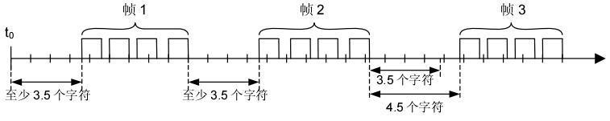
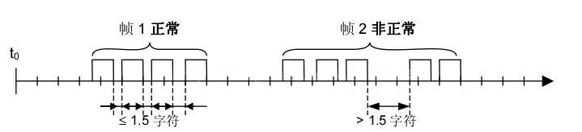

<!-- @import "[TOC]" {cmd="toc" depthFrom=1 depthTo=6 orderedList=false} -->

<!-- code_chunk_output -->

- [简介](#简介)
  - [modbus RTU](#modbus-rtu)
    - [字符时间](#字符时间)
    - [帧格式](#帧格式)
      - [地址码](#地址码)
- [实现](#实现)
- [参考](#参考)

<!-- /code_chunk_output -->

# 简介
modbus是一种通讯协议，可基于RS485、或RS232实现，485和232只是通讯物理的标准不含协议。
## modbus RTU
### 字符时间
在数据无压缩的情况下，**波特率是等于比特率**，即1baud=1bit/s。9600baud即9600bit/s，1bit所需的传输时间就是1/9600秒，这样**3.5个字符时间=3.5\*8\*1/9600秒**。
### 帧格式
1. 信息帧发送至少要以3.5个字符时间的停顿间隔开始。在最后一个字符传输字符之后，一个至少3.5个字符时间的停顿标定了信息帧的结束。一个新的信息帧可在此停顿之后开始。如果一个新消息在小于3.5个字符时间内接着前个消息开始，接受的设备将认为它是前一信息帧的延续，这将导致CRC码的值出错。

2. 整个信息帧必须作为一连续的流传输。如果在帧完成之前有超过1.5字符时间的停顿时间，接受设备将刷新不完整的信息帧并认为存在丢包现象。

|  起始位   | 设备地址  | 功能码  | 数据  | CRC校验  | 结束符  |
|:----:|:----:|:----:|:----:|:----:|:----:|
| >=3.5字符  | 8bit |  8bit  |n * 8bit|16bit| >=3.5字符 |
 
 

#### 地址码
地址码是信息帧的第一个字节（8位），从0到255。每个从机都必须有唯一的地址。在下行帧中，表明只有符合地址码的从机才能接收由主机发送来的信息。在上行帧中，表明该信息来自于何处。

备注：如果地址为0x00，则认为是一个广播命令，就是所有从机要接收主机发来的信息。规约规定广播命令必须是写命令，并且从站也不发送回答。

# 实现

# 参考
>作者：洪城小电工
>链接：https://www.jianshu.com/p/676744381473