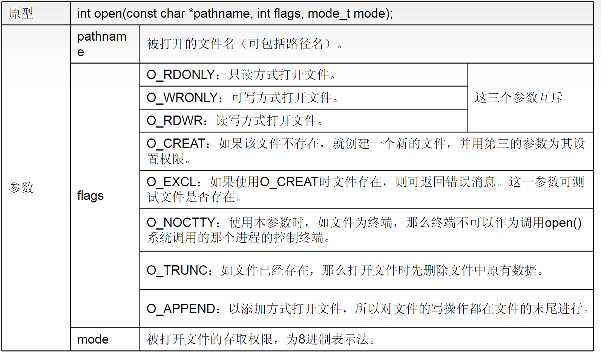
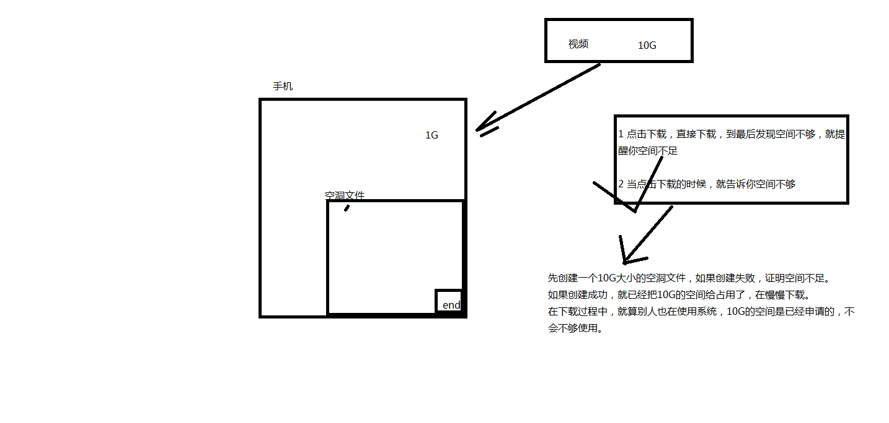

<!-- @import "[TOC]" {cmd="toc" depthFrom=1 depthTo=6 orderedList=false} -->

<!-- code_chunk_output -->

- [标准IO](#标准io)
  - [简介](#简介)
  - [缓冲区](#缓冲区)
    - [说明](#说明)
    - [分类](#分类)
      - [1.无缓冲](#1无缓冲)
      - [2.行缓冲](#2行缓冲)
      - [3.全缓冲](#3全缓冲)
      - [4.特殊情况](#4特殊情况)
  - [Stream流](#stream流)
    - [三个默认打开的流](#三个默认打开的流)
  - [函数](#函数)
    - [打开文件](#打开文件)
    - [一次读/写一个字符](#一次读写一个字符)
    - [一次读/写一行字符](#一次读写一行字符)
    - [一次读/写一块数据](#一次读写一块数据)
    - [出错函数](#出错函数)
    - [关闭文件](#关闭文件)
    - [文件指针的定位](#文件指针的定位)
    - [格式化输入输出语句（字符流）](#格式化输入输出语句字符流)
    - [fflush()](#fflush)
- [Linux下文件IO](#linux下文件io)
  - [简介](#简介-1)
  - [文件描述符](#文件描述符)
  - [函数](#函数-1)
    - [打开文件](#打开文件-1)
    - [读写](#读写)
    - [关闭](#关闭)
    - [指针定位](#指针定位)
    - [文件描述符的创建和修改](#文件描述符的创建和修改)
    - [删除文件](#删除文件)
    - [创建文件的权限掩码(待补充)](#创建文件的权限掩码待补充)
    - [调整文件大小](#调整文件大小)
    - [访问目录](#访问目录)
      - [1获取目录流](#1获取目录流)
      - [2读取目录流](#2读取目录流)
      - [3关闭目录流](#3关闭目录流)
      - [4例子（遍历文件夹，打印文件名）](#4例子遍历文件夹打印文件名)

<!-- /code_chunk_output -->
# 标准IO
## 简介
- 遵循ANSI C标准
- 带缓冲
- 操作对象是流FILE
- Linux下标准IO可以看作是基于文件IO的基础上封装了缓冲机制。
## 缓冲区
### 说明
缓冲区的分类不是看函数的，是看函数对什么流进行操作。    同一个函数，操作不同的流，就是不同的缓冲区类型。
### 分类
#### 1.无缓冲
标准错误输出`perror()`
__flush条件__
```
无条件，一有数据就flush
```
#### 2.行缓冲
标准输入流``printf()`` 
标准输出流``scanf()``
__flush条件__
```
\n
程序正常结束
fflush()
```
#### 3.全缓冲
文本文件的操作
__flush条件__
```
缓冲区满
程序正常结束
fflush()
```
#### 4.特殊情况
特殊情况：
在printf后有scanf会立刻刷新缓冲区;
while(getchar()!='\n');  用于清空输入缓冲区


## Stream流
### 三个默认打开的流
|  名称   | 名称  | 对象 | Linux下文件描述符 |
|  ----  | ----  | ---- | ---- |
|标准输入|stdin|键盘| 0 |
标准输出|stdout|屏幕| 1 |
|标准错误输出|stderr|屏幕| 2 |
## 函数
### 打开文件
```c
#include <stdio.h>

FILE *fopen(const char *path, const char *mode);
path : 你要打开的文件路径   "1.txt"  == "./1.txt"
mode : 权限  它是一个字符串  代表接下来你要对文件做什么操作。
```
|  参数   | 读写  | 文件存在 | 文件指针 |
|  ----  | ----  | ---- | ---- |
|r| 只读 | 文件必须存在	| 文件指针指向文件起始位置 |
|r+| 读写 |	文件必须存在| 文件指针指向文件起始位置 |
|w|	只写 | 文件不存在就创建，文件存在就清空 | 文件指针指向文件起始位置 |
|w+|	读写| 文件不存在就创建，文件存在就清空|文件指针指向文件起始位置|
|a|	追加写|	文件不存在就创建，文件存在在文件末尾追加写	|文件指针指向文件末尾位置|
|a+| 读写 |	文件不存在就创建| 文件存在从起始位置读，在末尾位置写|

__返回值：成功返回流代表打开的文件,失败返回``NULL``__
### 一次读/写一个字符
```c
int getchar(void);        //从固定的流：标准输入流 获取一个字符	
int getc(FILE *stream);
int fgetc(FILE *stream);  //从指定的流中读取一个字符。
                          //成功返回读到的字符，失败或者读到文件末尾返回-1
```
```c
int putchar(int c);	 //往固定的流：标准输出流  写一个字符
int putc(int c, FILE *stream);
int fputc(int c, FILE *stream); //往指定流中输入字符c
```
### 一次读/写一行字符
读
```c
char *gets(char *s);  
//从固定流中：标准输入流 获取一行字符
//最后的\n用\0替换

char *fgets(char *s, int size, FILE *stream);   
//从指定流中 获取不大于size个字节的字符
//存到s指定的缓冲区中\n也会获取到，最后加\0,所以更安全
//返回值：成功返回存储数据的缓冲区地址，失败或者读到文件末尾返回NULL
```
```c
/*
gets一般不用，用fgets能实现gets的功能.  fgets(s,size,stdin)
如果遇到\n字符，就读停止
如果一行字符少于size个字节，读到\n结束。 (获取一行)
如果一行字符多于size个字节，读size-1个字节就结束.
*/
```
写
```c
int puts(const char *s);        
//输出s字符串到固定流：标准输出流 会自动在字符串末尾加\n

int fputs(const char *s, FILE *stream); 
//输出s字符串到指定流  
```
### 一次读/写一块数据
```c
#include <stdio.h>

size_t fread(void *ptr, size_t size, size_t nmemb, FILE *stream);  
//从指定流中读nmemb块数据，每块size个字节大小，存到ptr中

size_t fwrite(void *ptr, size_t size, size_t nmemb,FILE *stream);  
//把ptr中，nmemb块数据，每块size个字节的数据，写到指定流中


返回值：成功返回块数   失败或者读到文件末尾，返回小的块数或0
void * ：可以读写任意类型(结构体)
```
### 出错函数
```c
int feof(FILE *stream);    //测试有无到文件末尾，如果到文件末尾返回非0     
```
```c
int ferror(FILE *stream);   //测试有无错误发生，如果有错误发生返回非0
```
```c
void clearerr(FILE *stream); //清除给定流 stream 的文件结束和错误标识符。
```
应用
```c
while(!feof(fp) && !ferror(fp))
{
  bzero(ch,20);
  ret=fread(ch,1,20,fp);
  fwrite(ch,1,ret,fp2);
}
```
### 关闭文件
```c
#include <stdio.h>

int fclose(FILE *fp);   
//关闭文件流fp：如果流被关闭了，将不能再对这个文件进行读写操作   清空流的缓冲区

返回值：成功返回0，失败返回-1
```
### 文件指针的定位
```c

int fseek(FILE *stream, long offset, int whence);
stream : 你要操作的文件
offset ：偏移量    >0 往后移   < 0 往前移 
whence :  SEEK_SET		文件起始位置
          SEEK_CUR		文件当前位置
          SEEK_END		文件末尾位置

long ftell(FILE *stream);    //返回文件指针的位置。最开始是0

void rewind(FILE *stream);   //将文件指针指向起始位置
```
### 格式化输入输出语句（字符流）
```c
int printf(const char *format, ...);			
//把字符串输出到固定流：stdout     
//把不同的数据类型转为字符流，写到标准输出流
int fprintf(FILE *stream, const char *format, ...);	
//把不同的数据类型，转为字符流，写入到指定流中

int sprintf(char *str, const char *format, ...);        
//字符串的拼接
int snprintf(char *str, size_t size, const char *format, ...);


int scanf(const char *format, ...);			
//从标准输入流获取一个字符串，把字符串转为不同类型的数据进行存放。
int fscanf(FILE *stream, const char *format, ...);
//从字符流中按指定格式读取 例如fscanf(fp,"a=%d b=%f",&a,&b);

int sscanf(const char *str, const char *format, ...);    
//字符串的切割
```
### fflush()
__定义__
```c
       #include <stdio.h>

       int fflush(FILE *stream);
```
在任何时刻，可以使用fflush强制刷新一个数据流
# Linux下文件IO
## 简介
- 遵循POSIX标准
- 无缓冲，每次读写都引起系统调用
- 操作对象是文件描述符fd
- Linux下标准IO可以看作是基于文件IO的基础上封装了缓冲机制。
## 文件描述符
- 每个打开的文件都对应一个文件描述符
- 文件描述符是一个`非负整数`
- 文件描述符从0开始分配，依次递增
- linux下0 1 2描述符分别被stdin stdout stderr占用
## 函数
### 打开文件
```c
#include <sys/types.h>
#include <sys/stat.h>
#include <fcntl.h>

  int open(const char *pathname, int flags);
  //打开文件，成功返回文件描述符，失败返回EOF

  int open(const char *pathname, int flags, mode_t mode);
  //创建文件时，第三个参数用于指定权限
  //无法创建设备文件，只能打开
```
<br>
|标准IO操作符|文件IO操作符|
| ---- | ---- |
|r:| O_RDONLY|
|r+:|	O_RDWR|
|w:| O_WRONLY \| O_CREAT \| O_TRUNC	|
|w+:| O_RDWR 	 \| O_CREAT \| O_TRUNC |
|a:|O_WRONLY \| O_CREAT \| O_APPEND|
|a+:|O_RDWR   \| O_CREAT \| O_APPEND|
```
mode ： 创建的文件的权限   以八进制的形式表示：0664
```
```
文件描述符：int 实际上是一个struct file的结构体数组下标   
返回最小的未用的int作为打开的文件的文件描述符
```
### 读写
```c
#include <unistd.h>

  ssize_t read(int fd, void *buf, size_t count);    
  //从文件中读count个字节，保存到buf中   
  //read函数会获取count个字节，而不是count-1个，比较危险
  //人为控制，char buf[20];  bzero(buf,20); read(fd,buf,sizeof(buf)-1);


  ssize_t write(int fd, void *buf, size_t count);   
  //把buf中size个字节写入fd表示的文件中
```
返回值：成功返回读到的字节数，失败返回-1
### 关闭
```c
#include <unistd.h>

  int close(int fd);
```
### 指针定位
```c
#include <sys/types.h>
#include <unistd.h>

off_t lseek(int fd, off_t offset, int whence);     
//创建空洞文件   追加方式不能创建空洞文件

//用法和fseek类似
```
<br>
### 文件描述符的创建和修改
```c
#include <unistd.h>			    

  int dup(int oldfd);		
  //创建一个新的文件描述符（最小的未用的），是旧的文件描述符的拷贝     
  //新的文件描述符与旧的文件描述符都指向旧的文件描述符表示的文件。

  int dup2(int oldfd, int newfd);  
  //不会创建新的文件描述符。 传进来两个文件描述符。
  //把两个文件描述符都指向旧的文件描述符表示的文件。 文件描述符重定位
```
### 删除文件
```c
#include <unistd.h>

  int unlink(const char *pathname);  //删除文件
  //成功返回0 失败返回-1
```
### 创建文件的权限掩码(待补充)
```c
#include <sys/types.h>
#include <sys/stat.h>

  mode_t umask(mode_t mask);   //设置创建文件的权限掩码
```
### 调整文件大小
```c
#include <unistd.h>
#include <sys/types.h>

int truncate(const char *path, off_t length);
```
```
参数1：文件名

参数2:  文件需要被调整的大小

length 大于 文件大小， 文件后面会填充空白字节或者空洞

length 小于 文件大小， 文件多出的部分，会被舍弃
```
### 访问目录
#### 1获取目录流
```c
 #include <sys/types.h>
 #include <dirent.h>

  DIR *opendir(const char *name);
```
DIR * : 目录流  本质上也是一个结构体地址 保存结构体信息，表示打开的目录
#### 2读取目录流
```c
#include <dirent.h>

  struct dirent *readdir(DIR *dirp);
```
返回值：成功返回 目录项（保存一个文件信息的结构体）指针，失败返回或者读到目录末尾NULL
```c
On Linux, the dirent structure is defined as follows:
struct dirent {
  ino_t          d_ino;       /* inode number */
  off_t          d_off;       /* offset to the next dirent */
  unsigned short d_reclen;    /* length of this record */
  unsigned char  d_type;      /* type of file; not supported by all file system types */
  char           d_name[256]; /* filename */
};
```
#### 3关闭目录流
```c
#include <sys/types.h>
#include <dirent.h>

  int closedir(DIR *dirp);
```
#### 4例子（遍历文件夹，打印文件名）
```c
#include <stdlib.h>
#include <stdio.h>
#include <dirent.h>
#include <sys/types.h>
#include <dirent.h>

int main(int argc,char *argv[])
{
    DIR *dirp;
    struct dirent *dp;
    if(argc!=2)
    {
        printf("usage: %s <dirname>\n",argv[0]);
        return -1;
    }

    if( (dirp=opendir(argv[1])) ==NULL ){
        perror("opendir");
        return -1;
    }

    while((dp=readdir(dirp))!=NULL)
    {
        printf("%s\n",dp->d_name);
    }

    putchar(10);
    closedir(dirp);

    
    return 0;
}
```