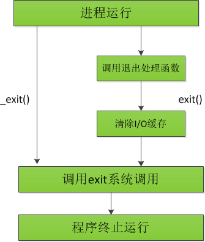

# 简介
进程是资源分配的最小单位
# 函数
## 1.fork() 函数
```c
#include <sys/types.h>
#include <unistd.h>

pid_t fork(void);
创建一个进程，失败返回-1 
成功在父进程中返回子进程pid 子进程中返回0
因此在后续的代码中判断pid_t的数值，即可区分父子进程
```
例子
```c
#include <stdio.h>
#include <unistd.h>
#include <stdlib.h>

int main(int argc, char *argv[])
{
    pid_t pt = fork();

    if(pt<0){
        perror("fork error\n");
    }else if(pt==0){
        printf("i am son my pid:%d  my ppid:%d\n",getpid(),getppid());
        exit(0);
    }else{
        printf("i am father my pid:%d  my ppid:%d  my sonpid: %d \n",getpid(),getppid(),pt);
    }

    return 0;
}
```
## 2.exit()和_exit()函数
结束当前进程并返回状态。
exit（0）：正常运行程序并退出程序
exit（1）：非正常运行导致退出程序
```c
#include <stdlib.h>

void exit(int status);

#include <unistd.h>

void _exit(int status);
```
区别
<br>
exit()会fflush();
_exit()不会
## 3.wait
父进程一旦调用了wait，就立即阻塞自己，由wait自动分析是否当前进程的某个子进程已经退出，如果让它找到了这样一个已经变成僵尸的子进程，wait就会收集这个子进程的信息，并把它彻底销毁后返回；如果没有找到这样一个子进程，wait就会一直阻塞在这里，直到有一个出现为止。
```c
#include <sys/types.h>

#include <wait.h>

int wait(int *status)
```
参数status用来保存被收集进程退出时的一些状态，它是一个指向int类型的指针。
如果成功，wait会返回被收集的子进程的进程ID
如果调用进程没有子进程，调用就会失败，此时wait返回-1，同时errno被置为ECHILD。
## 4.waitpid
```c
#include<sys/types.h>
#include<sys/wait.h>

pid_t waitpid(pid_t pid, int *status, int options);

```
options： 0 阻塞
WNOHANG ： 不阻塞
参数status用来保存被收集进程退出时的一些状态，它是一个指向int类型的指针。
成功：返回清理掉的子进程ID
失败：-1（无子进程）
失败原因存于errno中。