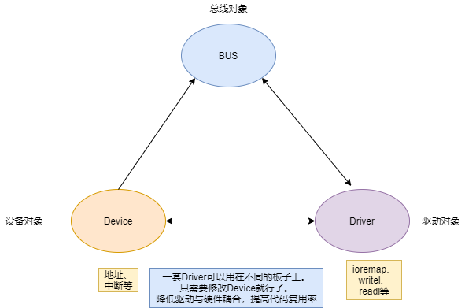
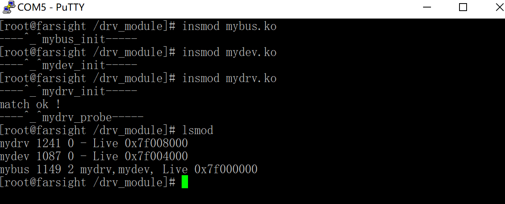

<!-- @import "[TOC]" {cmd="toc" depthFrom=1 depthTo=6 orderedList=false} -->

<!-- code_chunk_output -->

- [简介](#简介)
- [相关函数结构体](#相关函数结构体)
  - [1 bus对象构建(平台总线加载与卸载)](#1-bus对象构建平台总线加载与卸载)
    - [struct bus_type bus](#struct-bus_type-bus)
    - [注册](#注册)
    - [导出总线结构体](#导出总线结构体)
    - [注销](#注销)
    - [实例](#实例)
  - [2 device对象构建](#2-device对象构建)
    - [struct devcie](#struct-devcie)
    - [注册](#注册-1)
    - [注销](#注销-1)
    - [实例](#实例-1)
  - [3 driver对象的构建](#3-driver对象的构建)
    - [struct device_driver](#struct-device_driver)
    - [注册](#注册-2)
    - [注销](#注销-2)
    - [实例](#实例-2)
  - [4 bus中实现总线匹配](#4-bus中实现总线匹配)
    - [实现bus对象中的match](#实现bus对象中的match)

<!-- /code_chunk_output -->

# 简介
驱动开发的将用户态和内核态隔离开来。平台总线是采用面向对象和解耦的方式将驱动中的硬件部分(ioremap、GPIO、中断)分离开来。降低驱动与硬件的耦合，增强驱动的移植性。
<br>
<br>
<br>
# 相关函数结构体
## 1 bus对象构建(平台总线加载与卸载)
### struct bus_type bus
```c
//   /sys/bus/mybus
struct bus_type bus = {
    .name = "mybus", 
};
```
### 注册
```c
int bus_register(struct bus_type *bus)
```
### 导出总线结构体
driver和device文件要通过extern用到总线结构体所以要导出。
```c
EXPORT_SYMBOL(struct bus_type *bus);
```
### 注销
```c
void bus_unregister(struct bus_type *bus)
```
### 实例
mybus.c
```c
#include <linux/init.h>
#include <linux/module.h>
#include <linux/device.h>
#include <linux/fs.h>
#include <linux/types.h>
#include <linux/slab.h>
#include <linux/cdev.h>
#include <asm/io.h>
#include <asm/uaccess.h>

//实例化bus对象
struct bus_type bus = {
    .name = "mybus",
};

//导出总线
EXPORT_SYMBOL(bus);

static int __init mybus_init(void)
{
    printk("----^_^%s-----\n",__FUNCTION__);
    int ret;
    //构建一个总线
    // 在/sys/bus/下可以查看。总线文件名 由struct bus_type中的name属性决定
    ret = bus_register(&bus);
    if(ret != 0)
    {
        printk("bus_register error! \n");
        return ret;
    }
    return 0;
}

static void __exit mybus_exit(void)
{
    printk("----@_@%s-----\n",__FUNCTION__);
    bus_unregister(&bus);
}

module_init(mybus_init);
module_exit(mybus_exit);
MODULE_LICENSE("GPL");

```
com5
```shell
[root@farsight /drv_module]# ls
mybus.ko
[root@farsight /drv_module]# insmod mybus.ko
----^_^mybus_init-----
[root@farsight /drv_module]# ls /sys/bus/
mybus     platform  scsi      serio
[root@farsight /drv_module]#
```
## 2 device对象构建
### struct devcie
```c
struct device {
    struct kobject kobj;        //内核中所有对象的父类

    //在总线中会有个名字，用于匹配。/sys/bus/mybus/devices/xxx
    const char *init_name;

    //指定这个device依附的总线
    struct bus_type	*bus;

    //自定义的数据
    void *platform_data;
    ...
}
```
### 注册
```c
int device_register(struct device *dev)
```
### 注销
```c
void device_unregister(struct device *dev)
```
### 实例
mydev.c
```c
#include <linux/init.h>
#include <linux/module.h>
#include <linux/device.h>
#include <linux/fs.h>
#include <linux/types.h>
#include <linux/slab.h>
#include <linux/cdev.h>
#include <asm/io.h>
#include <asm/uaccess.h>

extern struct bus_type bus;

//实例化device对象
struct device my_device = {
    .init_name = "mydev",
    .bus = &bus,
};

static int __init mydev_init(void)
{
    int ret;
    printk("----^_^%s-----\n",__FUNCTION__);

    //将device 注册到总线中
    ret = device_register(&my_device);
    if(ret <0 )
    {
        printk("device_register error \n");
    }
    return 0;
}

static void __exit mydev_exit(void)
{
    printk("----@_@%s-----\n",__FUNCTION__);
    device_unregister(&my_device);
}

module_init(mydev_init);
module_exit(mydev_exit);
MODULE_LICENSE("GPL");
```
com5
<br>
自定义总线mybus中出现了mydev设备
## 3 driver对象的构建
driver对象是描述设备驱动方法(有哪些功能)
### struct device_driver
```c
//在总线中会有个名字，用于匹配。/sys/bus/xxbus/drivers/xxx
const char *name;

//隶属于哪个总线
struct bus_type *bus;   // /sys/bus/xxbus

//device和driver匹配后 driver要做的事
int (*probe) (struct device *dev);

//device和driver从总线移除后 driver要做的事
int (*remove) (struct device *dev);
```
### 注册
```c
int driver_register(struct device_driver *drv)
```
### 注销
```c
void driver_unregister(struct device_driver *drv)
```
### 实例
mydrv.c
```c
#include <linux/init.h>
#include <linux/module.h>
#include <linux/device.h>
#include <linux/fs.h>
#include <linux/types.h>
#include <linux/slab.h>
#include <linux/cdev.h>
#include <asm/io.h>
#include <asm/uaccess.h>

extern struct bus_type bus;

int mydrv_probe (struct device *dev)
{
    printk("----^_^%s-----\n",__FUNCTION__);
    return 0;
}

int mydrv_remove (struct device *dev)
{
    printk("----^_^%s-----\n",__FUNCTION__);
    return 0;
}

struct device_driver my_driver = {
    .name = "mydrv",
    .bus = &bus,
    .probe = mydrv_probe,
    .remove = mydrv_remove,

};

static int __init mydrv_init(void)
{
    int ret;
    printk("----^_^%s-----\n",__FUNCTION__);

    //将driver 注册到总线中
    ret = driver_register(&my_driver);
    if(ret < 0)
    {
        printk("driver_register error \n");
        return ret;
    }
    return 0;
}

static void __exit mydrv_exit(void)
{
    printk("----@_@%s-----\n",__FUNCTION__);
    driver_unregister(&my_driver);
}

module_init(mydrv_init);
module_exit(mydrv_exit);
MODULE_LICENSE("GPL");

```
com5
```shell
[root@farsight /drv_module]# insmod mybus.ko
----^_^mybus_init-----
[root@farsight /drv_module]# insmod mydev.ko
----^_^mydev_init-----
[root@farsight /drv_module]# insmod mydrv.ko
----^_^mydrv_init-----
----^_^mydrv_probe-----
[root@farsight /drv_module]# ls /sys/bus/mybus/devices/
mydev
[root@farsight /drv_module]# ls /sys/bus/mybus/drivers
mydrv
```
## 4 bus中实现总线匹配
### 实现bus对象中的match
```c
int mybus_match(struct device *dev, struct device_driver *drv);
//匹配成功返回 1 失败返回0
```
实例
```c
int mybus_match(struct device *dev, struct device_driver *drv)
{
    //如果名字一样 就匹配成功
    if( strncmp(drv->name, dev->kobj.name, strlen(drv->name)) == 0 ){
        printk("match ok !\n");
        return 1;
    }

    return 0;
}

//实例化bus对象
struct bus_type bus = {
    .name = "mybus",
    .match = mybus_match,
};
```
<br>