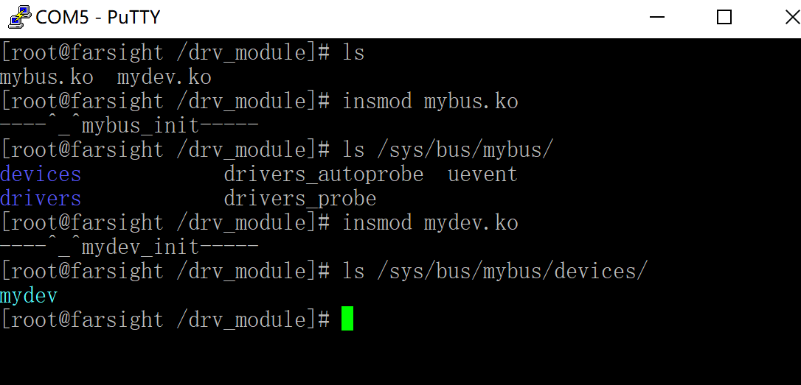

<!-- @import "[TOC]" {cmd="toc" depthFrom=1 depthTo=6 orderedList=false} -->

<!-- code_chunk_output -->

- [总线](#总线)
  - [简介](#简介)
  - [相关函数结构体](#相关函数结构体)
    - [1 bus对象构建(平台总线加载与卸载)](#1-bus对象构建平台总线加载与卸载)
      - [struct bus_type bus](#struct-bus_type-bus)
      - [注册](#注册)
      - [导出总线结构体](#导出总线结构体)
      - [注销](#注销)
      - [实例](#实例)
    - [2 device对象构建](#2-device对象构建)
      - [struct devcie](#struct-devcie)
      - [注册](#注册-1)
      - [注销](#注销-1)
      - [实例](#实例-1)
    - [3 driver对象的构建](#3-driver对象的构建)
      - [struct device_driver](#struct-device_driver)
      - [注册](#注册-2)
      - [注销](#注销-2)
      - [实例](#实例-2)
    - [4 bus中实现总线匹配](#4-bus中实现总线匹配)
      - [实现bus对象中的match](#实现bus对象中的match)
- [平台总线](#平台总线)
  - [简介](#简介-1)
    - [用于平台总线用于平台的升级](#用于平台总线用于平台的升级)
      - [问题](#问题)
      - [解决](#解决)
  - [平台总线三元素:](#平台总线三元素)
    - [1 bus:](#1-bus)
    - [2 device对象](#2-device对象)
      - [注册](#注册-3)
      - [注销](#注销-3)
    - [3 driver对象](#3-driver对象)
      - [注册](#注册-4)
      - [注销](#注销-4)
  - [实例](#实例-3)
    - [led灯](#led灯)

<!-- /code_chunk_output -->
# 总线
## 简介
驱动开发的将用户态和内核态隔离开来。总线是采用面向对象和解耦的方式将驱动中的硬件部分(ioremap、GPIO、中断)分离开来。降低驱动与硬件的耦合，增强驱动的移植性。
<br><br>
<br><br>
<br><br>

## 相关函数结构体
### 1 bus对象构建(平台总线加载与卸载)
#### struct bus_type bus
```c
//   /sys/bus/mybus
struct bus_type bus = {
    .name = "mybus", 
};
```
#### 注册
```c
int bus_register(struct bus_type *bus)
```
#### 导出总线结构体
driver和device文件要通过extern用到总线结构体所以要导出。
```c
EXPORT_SYMBOL(struct bus_type *bus);
```
#### 注销
```c
void bus_unregister(struct bus_type *bus)
```
#### 实例
mybus.c
```c
#include <linux/init.h>
#include <linux/module.h>
#include <linux/device.h>
#include <linux/fs.h>
#include <linux/types.h>
#include <linux/slab.h>
#include <linux/cdev.h>
#include <asm/io.h>
#include <asm/uaccess.h>

//实例化bus对象
struct bus_type bus = {
    .name = "mybus",
};

//导出总线
EXPORT_SYMBOL(bus);

static int __init mybus_init(void)
{
    printk("----^_^%s-----\n",__FUNCTION__);
    int ret;
    //构建一个总线
    // 在/sys/bus/下可以查看。总线文件名 由struct bus_type中的name属性决定
    ret = bus_register(&bus);
    if(ret != 0)
    {
        printk("bus_register error! \n");
        return ret;
    }
    return 0;
}

static void __exit mybus_exit(void)
{
    printk("----@_@%s-----\n",__FUNCTION__);
    bus_unregister(&bus);
}

module_init(mybus_init);
module_exit(mybus_exit);
MODULE_LICENSE("GPL");

```
com5
```shell
[root@farsight /drv_module]# ls
mybus.ko
[root@farsight /drv_module]# insmod mybus.ko
----^_^mybus_init-----
[root@farsight /drv_module]# ls /sys/bus/
mybus     platform  scsi      serio
[root@farsight /drv_module]#
```
### 2 device对象构建
#### struct devcie
```c
struct device {
    struct kobject kobj;        //内核中所有对象的父类

    //在总线中会有个名字，用于匹配。/sys/bus/mybus/devices/xxx
    const char *init_name;

    //指定这个device依附的总线
    struct bus_type	*bus;

    //自定义的数据
    void *platform_data;
    ...
}
```
#### 注册
```c
int device_register(struct device *dev)
```
#### 注销
```c
void device_unregister(struct device *dev)
```
#### 实例
mydev.c
```c
#include <linux/init.h>
#include <linux/module.h>
#include <linux/device.h>
#include <linux/fs.h>
#include <linux/types.h>
#include <linux/slab.h>
#include <linux/cdev.h>
#include <asm/io.h>
#include <asm/uaccess.h>

extern struct bus_type bus;

//实例化device对象
struct device my_device = {
    .init_name = "mydev",
    .bus = &bus,
};

static int __init mydev_init(void)
{
    int ret;
    printk("----^_^%s-----\n",__FUNCTION__);

    //将device 注册到总线中
    ret = device_register(&my_device);
    if(ret <0 )
    {
        printk("device_register error \n");
    }
    return 0;
}

static void __exit mydev_exit(void)
{
    printk("----@_@%s-----\n",__FUNCTION__);
    device_unregister(&my_device);
}

module_init(mydev_init);
module_exit(mydev_exit);
MODULE_LICENSE("GPL");
```
com5
<br>
自定义总线mybus中出现了mydev设备
### 3 driver对象的构建
driver对象是描述设备驱动方法(有哪些功能)
#### struct device_driver
```c
//在总线中会有个名字，用于匹配。/sys/bus/xxbus/drivers/xxx
const char *name;

//隶属于哪个总线
struct bus_type *bus;   // /sys/bus/xxbus

//device和driver匹配后 driver要做的事
int (*probe) (struct device *dev);

//device和driver从总线移除后 driver要做的事
int (*remove) (struct device *dev);
```
#### 注册
```c
int driver_register(struct device_driver *drv)
```
#### 注销
```c
void driver_unregister(struct device_driver *drv)
```
#### 实例
mydrv.c
```c
#include <linux/init.h>
#include <linux/module.h>
#include <linux/device.h>
#include <linux/fs.h>
#include <linux/types.h>
#include <linux/slab.h>
#include <linux/cdev.h>
#include <asm/io.h>
#include <asm/uaccess.h>

extern struct bus_type bus;

int mydrv_probe (struct device *dev)
{
    printk("----^_^%s-----\n",__FUNCTION__);
    return 0;
}

int mydrv_remove (struct device *dev)
{
    printk("----^_^%s-----\n",__FUNCTION__);
    return 0;
}

struct device_driver my_driver = {
    .name = "mydrv",
    .bus = &bus,
    .probe = mydrv_probe,
    .remove = mydrv_remove,

};

static int __init mydrv_init(void)
{
    int ret;
    printk("----^_^%s-----\n",__FUNCTION__);

    //将driver 注册到总线中
    ret = driver_register(&my_driver);
    if(ret < 0)
    {
        printk("driver_register error \n");
        return ret;
    }
    return 0;
}

static void __exit mydrv_exit(void)
{
    printk("----@_@%s-----\n",__FUNCTION__);
    driver_unregister(&my_driver);
}

module_init(mydrv_init);
module_exit(mydrv_exit);
MODULE_LICENSE("GPL");

```
com5
```shell
[root@farsight /drv_module]# insmod mybus.ko
----^_^mybus_init-----
[root@farsight /drv_module]# insmod mydev.ko
----^_^mydev_init-----
[root@farsight /drv_module]# insmod mydrv.ko
----^_^mydrv_init-----
----^_^mydrv_probe-----
[root@farsight /drv_module]# ls /sys/bus/mybus/devices/
mydev
[root@farsight /drv_module]# ls /sys/bus/mybus/drivers
mydrv
```
### 4 bus中实现总线匹配
#### 实现bus对象中的match
```c
int mybus_match(struct device *dev, struct device_driver *drv);
//匹配成功返回 1 失败返回0
```
实例
```c
int mybus_match(struct device *dev, struct device_driver *drv)
{
    //如果名字一样 就匹配成功
    if( strncmp(drv->name, dev->kobj.name, strlen(drv->name)) == 0 ){
        printk("match ok !\n");
        return 1;
    }

    return 0;
}

//实例化bus对象
struct bus_type bus = {
    .name = "mybus",
    .match = mybus_match,
};
```
<br>

# 平台总线
## 简介
### 用于平台总线用于平台的升级
- 例如三星： 2410, 2440, 6420, s5pc100, s5pc210, 4412。
- 硬件平台升级的时候，部分模块的控制方式基本类似，但是模块的地址不一样。
#### 问题
- 如果不用平台总线，当soc升级时，对于相似的设备驱动，需要编写很多次。会有大量重复代码
#### 解决
- 引入平台总线使得device(中断/地址)和driver(操作逻辑)分离。
- 在升级的时候，只需要修改device中的信息(中断/地址)。
- 即可实现一个driver代码能够驱动多个平台相似的模块，代码修改量少，代码冗余少。
<br><br>

## 平台总线三元素:
### 1 bus:
platform_bus:不需要自己创建，开机自动注册创建
```c
//platform.c
struct bus_type platform_bus_type = {
    .name		= "platform",
    .dev_attrs	= platform_dev_attrs,
    .match		= platform_match,
    .uevent		= platform_uevent,
    .pm		= &platform_dev_pm_ops,
};
```
```shell
[root@farsight /]# ls /sys/bus
platform  scsi      serio
[root@farsight /]#
```
匹配方法:
1. 优先匹配pdriver中的id_table,里边包含了支持不同的平台的名字。
2. 直接匹配driver中的名字和device中的名字。
```c
static int platform_match(struct device *dev, struct device_driver *drv)
{
    //将父类对象转换成子类。利用的是0地址构建子类结构体，再计算父类地址偏移。和内核链表一样的使用container_of
    struct platform_device *pdev = to_platform_device(dev);
    struct platform_driver *pdrv = to_platform_driver(drv);

    /* Attempt an OF style match first */
    if (of_driver_match_device(dev, drv))
        return 1;

    /* Then try to match against the id table */
    //如果pdrv中有id table、平台列表名字和pdev中的名字
    if (pdrv->id_table)
        return platform_match_id(pdrv->id_table, pdev) != NULL;

    /* fall-back to driver name match */
    return (strcmp(pdev->name, drv->name) == 0);
}
```
### 2 device对象
platform_device.h
```c
struct platform_device {
    const char	* name; //用做匹配
    int id;             //一般直接给-1 
    struct device dev;  //继承了device父类
    u32 num_resources;  //资源的个数
    struct resource * resource; //资源: 包括了一个设备的地址和中断
    //.......
};
```
struct resource
```c
struct resource {
    resource_size_t start;  //设备的起始地址
    resource_size_t end;    //设备的结束地址
    const char *name;       //自定义描述
    unsigned long flags;    //用于指定资源类型是中断()、内存地址
    struct resource *parent, *sibling, *child;  //二叉树 不需要手动指定，系统会自动处理
};
```
#### 注册
```c
int platform_device_register(struct platform_device *pdev)
```
#### 注销
```c
void platform_device_unregister(struct platform_device *pdev)
```
### 3 driver对象
```c
struct platform_driver {
    int (*probe)(struct platform_device *);
    int (*remove)(struct platform_device *);
    struct device_driver driver;//继承了driver父类

    //如果driver支持多个平台，在列表中写出来。
    const struct platform_device_id *id_table;
    //....
};
```
#### 注册
```c
int platform_driver_register(struct platform_driver *drv)
```
#### 注销
```c
void platform_driver_unregister(struct platform_driver *drv)
```
## 实例
### led灯
plat_led_pdev.c
```c
#include <linux/init.h>
#include <linux/module.h>
#include <linux/platform_device.h>


#define GPC0_CONF  0xE0200060
#define GPC0_SIZE  8

//一个设备可能有多个资源
struct resource led_resource[] = {
	[0] = {
		.start 	= 	GPC0_CONF,
		.end 	=	GPC0_CONF + GPC0_SIZE - 1,  //因为是闭区间所以要-1
		.flags 	=	IORESOURCE_MEM,
	},
    //假数据
	[1] = {
		.start	=	1234,
		.end	=	1234,
		.flags	=	IORESOURCE_IRQ,
	},
};
struct platform_device pdev = {
    .name = "s5pv210_led",          //用于匹配
    .id = -1,
    .num_resources = ARRAY_SIZE(led_resource),         //资源数组的长度
    .resource = led_resource,
};

static int __init plat_led_dev_init(void)
{
    int ret;
    printk("----^_^%s-----\n",__FUNCTION__);
    ret = platform_device_register(&pdev);
    if(ret <0 )
    {
        printk("device_register error \n");
        return ret;
    }
    return 0;
}

static void __exit plat_led_dev_eixt(void)
{
    printk("----@_@%s-----\n",__FUNCTION__);
    platform_device_unregister(&pdev);
}

module_init(plat_led_dev_init);
module_exit(plat_led_dev_eixt);
MODULE_LICENSE("GPL");
```
com5
```shell
[root@farsight /drv_module]# ls
mybus.ko          mydev.ko          mydrv.ko          plat_led_pdev.ko
[root@farsight /drv_module]# insmod  plat_led_pdev.ko
----^_^plat_led_dev_init-----
[root@farsight /drv_module]# ls /sys/bus/platform/devices/ | grep led
s5pv210_led
[root@farsight /drv_module]#
```