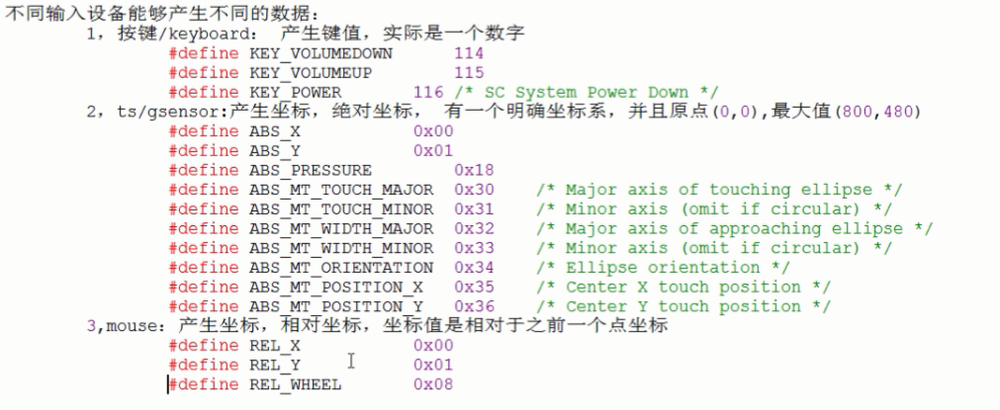
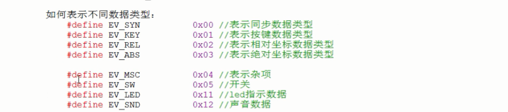
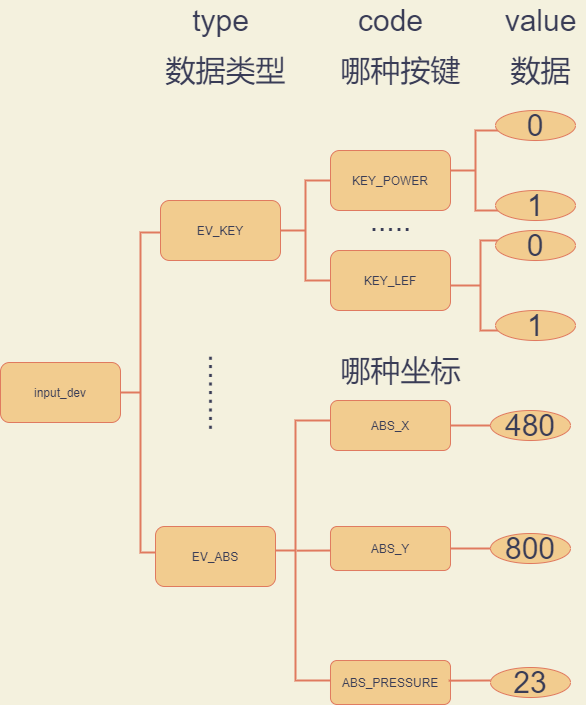
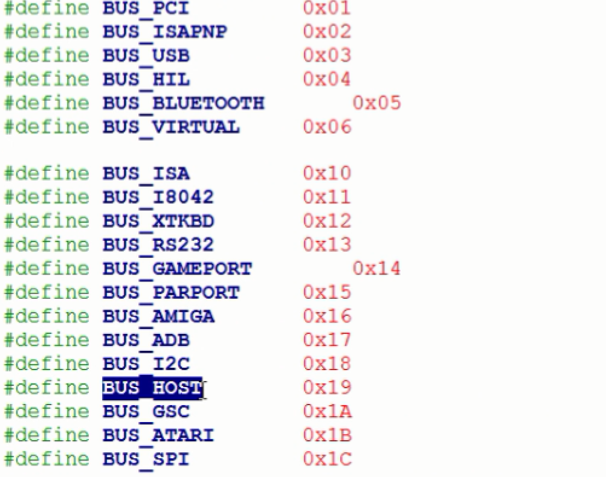

<!-- @import "[TOC]" {cmd="toc" depthFrom=1 depthTo=6 orderedList=false} -->

<!-- code_chunk_output -->

- [简介](#简介)
  - [输入设备](#输入设备)
    - [种类](#种类)
    - [共同点](#共同点)
  - [输入子系统](#输入子系统)
    - [目的](#目的)
    - [特点](#特点)
    - [三层框架](#三层框架)
      - [input_handler层](#input_handler层)
        - [作用](#作用)
      - [input_core层](#input_core层)
        - [作用](#作用-1)
      - [input_dev层](#input_dev层)
        - [作用](#作用-2)
- [相关函数结构体](#相关函数结构体)
  - [struct input_dev输入设备](#struct-input_dev输入设备)
    - [struct input_id id](#struct-input_id-id)
  - [input_allocate_device](#input_allocate_device)
  - [注册注销 input_dev](#注册注销-input_dev)
    - [注册](#注册)
    - [注销](#注销)
  - [上报数据](#上报数据)
  - [struct input_event上报数据包](#struct-input_event上报数据包)
- [实例](#实例)
  - [简单的输入子系统demo](#简单的输入子系统demo)
    - [驱动](#驱动)
    - [应用](#应用)
    - [效果](#效果)

<!-- /code_chunk_output -->

# 简介
input子系统也叫输入子系统
## 输入设备
### 种类
- key按键
- mouse
- touchscreen触摸屏
- joystick游戏摇杆
### 共同点
|差异化部分|通用部分|
|:----|:----|
|获取到数据(硬件信息)|上报给用户(xxx_read, copy_to_user, 阻塞)|
多个输入设备之间，有`差异化`的部分也有`通用`的部分。
linux内核就把`通用`的代码编写好，把`差异化`的代码留给驱动工程师。
于是就设计出了输入子系统
## 输入子系统
### 目的
为了让编程人员和驱动编程人员编程的时候简单统一
### 特点
- 兼容所有的输入设备
- 提供统一的编程驱动方法(实现差异化的硬件操作)
- 提供统一的应用操作接口: /dev/input/event0、event1
open("/dev/input/event0"), read(fd, strcut input_event):strcut input_event是一个`统一的数据包`
### 三层框架
#### input_handler层
数据处理者`(内核自带)`,内核代码实现:/drivers/input/evdev.c 
##### 作用
- 与应用层交互，实现设备操作接口
- 不知道如何从硬件中获取数据，但知道如何把数据传给应用层
#### input_core层
管理层`(内核自带)`,内核代码实现:/drivers/input/input.c
##### 作用
- 维护整个input子系统框架
- 为上下两层提供接口函数
- 申请设备号-------major=13，minor = 64开始
- 创建类
#### input_dev层
设备层`(自己编写)`,参考：Documentation/input/input-programming.txt
##### 作用
- 硬件初始化
- 知道如何获取硬件中的数据，但不知道如何把数据传给应用层
# 相关函数结构体
## struct input_dev输入设备
```c
struct input_dev {
  //辅助信息
  const char *name;   //sysfs中提供给用户查看的
  const char *phys;
  const char *uniq;
  struct input_id id;

  unsigned long propbit[BITS_TO_LONGS(INPUT_PROP_CNT)];

  //evbit是一个位表。
  unsigned long evbit[BITS_TO_LONGS(EV_CNT)];	//evbit: 设置当前设备类型: EV_KEY EV_REL EV_ABS

  //总共有768位由24个long数据组成的数组表示。每一位都有特定的含义。KEY_CNT = 768 所以最多能表示768种按键类型
  unsigned long keybit[BITS_TO_LONGS(KEY_CNT)];	//keybit: 设置能产生的数据的按键,如：KEY_DOWN
  unsigned long relbit[BITS_TO_LONGS(REL_CNT)];	//relbit: 设置能产生的数据的相对坐标,如：x坐标
  unsigned long absbit[BITS_TO_LONGS(ABS_CNT)];	//absbit: 设置能产生的数据的绝对坐标,如：x坐标
  unsigned long mscbit[BITS_TO_LONGS(MSC_CNT)];
  unsigned long ledbit[BITS_TO_LONGS(LED_CNT)];

  struct device dev;
}
```
<br>
<br>
<br>
<br>

我们可以在/dev/input/下看到很多输入设备
```shell
afa@ubuntu:~$ cd /dev/input/
afa@ubuntu:/dev/input$ ls
by-id  by-path  event0  event1  event2  event3  event4  mice  mouse0  mouse1  mouse2
afa@ubuntu:/dev/input$ 
```
如何知道这些输入设备表示什么?
```shell
afa@ubuntu:~$ cd /sys/class/input/
afa@ubuntu:/sys/class/input$ ls
event0  event2  event4  input1  input4  mice    mouse1
event1  event3  input0  input3  input5  mouse0  mouse2
```
```shell
afa@ubuntu:/sys/class/input$ cd event0
afa@ubuntu:/sys/class/input/event0$ ls
dev  device  power  subsystem  uevent
afa@ubuntu:/sys/class/input/event0$ cd device
afa@ubuntu:/sys/class/input/event0/device$ ls
capabilities  device  event0  id  modalias  name  phys  power  properties  subsystem  uevent  uniq
afa@ubuntu:/sys/class/input/event0/device$ cat name
Power Button
```
name 对应 struct input_dev中的name
```shell
afa@ubuntu:/sys/class/input/event0/device$ cd id
afa@ubuntu:/sys/class/input/event0/device/id$ ls
bustype  product  vendor  version
afa@ubuntu:/sys/class/input/event0/device/id$ cat product 
0001
afa@ubuntu:/sys/class/input/event0/device/id$ cat version 
0000
afa@ubuntu:/sys/class/input/event0/device/id$ cat bustype 
0019
afa@ubuntu:/sys/class/input/event0/device/id$ cat vendor 
0000
```
id文件夹对应 struct input_dev中的struct input_id id

### struct input_id id
```c
struct input_id {
  __u16 bustype;    //总线类型
  __u16 vendor;     //厂商号
  __u16 product;    //产品号
  __u16 version;    //版本号
};
```
<br><br>
GPIO控制一般选 BUS_HOST

## input_allocate_device
分配input_dev对象空间
```c
struct input_dev *input_allocate_device(void)
```
```c
ret = input_register_device(inputdev);
if(ret != 0){
    printk(KERN_ERR "input_register_device error \n");
    goto err_0;
}
```
## 注册注销 input_dev
### 注册
```c
int input_register_device(struct input_dev *dev)
```
```c
ret = input_register_device(inputdev);
if(ret != 0){
    printk(KERN_ERR "input_register_device error \n");
    goto err_0;
}
```
### 注销
```c
void input_unregister_device(struct input_dev *dev)
```

## 上报数据
一般写在中断里边
```c
  //功能：上报数据
  void input_event(struct input_dev *dev, unsigned int type, unsigned int code, int value)
  //参数1 ---- input_dev对象 
  //参数2 ---- 设备类型
  //参数3 ---- 上报的数据类型
  //参数4 ---- 数据的值
  
  //功能：上报按键数据
  static inline void input_report_key(struct input_dev *dev, unsigned int code, int value)
  //参数1 ---- input_dev对象 
  //参数2 ---- 上报的数据类型，KEY_DOWN KEY_UP等
  //参数3 ---- 数据的值
```
```c
static irqreturn_t key_irq_handler(int irq, void *dummy)
{
    int value;
  printk("------------^_^ %s---------------------\n",__FUNCTION__);
  value = gpio_get_value(S5PV210_GPH0(1));
    // 2,上报数据
  if(value){
    //松开
    input_event(inputdev,EV_KEY,KEY_DOWN,0);
    input_sync(inputdev);   //同步
  }else{
    //按下
    input_report_key(inputdev, KEY_DOWN, 1);
    input_sync(inputdev);   //同步
  }
    return IRQ_HANDLED;
}
```
## struct input_event上报数据包
```c
//上报的数据包
struct input_event {
  struct timeval time;
  __u16 type;		//设备类型
  __u16 code;		//数据类型
  __s32 value;	//数据的值
};
```

# 实例
## 简单的输入子系统demo
### 驱动
simple_input_drv.c
```c
#include <linux/input.h>
#include <linux/module.h>
#include <linux/init.h>
#include <linux/interrupt.h>
#include <linux/gpio.h>

struct input_dev *inputdev;
int irqno;

static irqreturn_t key_irq_handler(int irq, void *dummy)
{
  int value;
  printk("------------^_^ %s---------------------\n",__FUNCTION__);
  value = gpio_get_value(S5PV210_GPH0(1));

  // 2,上报数据
  if(value){
    //松开
    input_event(inputdev,EV_KEY,KEY_DOWN,0);
    input_sync(inputdev);
  }else{
    //按下
    input_report_key(inputdev, KEY_DOWN, 1);
    input_sync(inputdev);
  }

  return IRQ_HANDLED;
}

static int __init simple_input_init(void)
{
    int ret;
    printk("---------^_^ %s------------\n",__FUNCTION__);
    inputdev = input_allocate_device();

    if(inputdev == NULL){
        printk(KERN_ERR "input_allocate_device error \n");
        return -ENOMEM;
    }

    inputdev->name = "simple input key";

    //第一种设置位表数据
    // 当前设备能产生按键数据
    __set_bit(EV_KEY, inputdev->evbit);
    // 当前设备能够产生power按键
    __set_bit(KEY_DOWN, inputdev->keybit);

    //第二种设置位表数据
    //BIT_WORD是找到24个long组成的数组表示的位表中。KEY_DOWN的是在第几个long
    //inputdev->keybit[BIT_WORD(KEY_DOWN)] |= BIT_MASK(KEY_DOWN);     //KEY_DOWN =  108  
    //等价于 
    //inputdev->keybit[108/32] |= 1<< 108%32

    ret = input_register_device(inputdev);
    if(ret != 0){
        printk(KERN_ERR "input_register_device error \n");
        goto err_0;
    }

    // 申请中断
    irqno = IRQ_EINT(1);
    if (request_irq(irqno, key_irq_handler, IRQF_TRIGGER_FALLING |IRQF_TRIGGER_RISING, "eint1", NULL)) {
        printk(KERN_ERR "button.c: Can't allocate irq %d\n", irqno);
        ret =  -EBUSY;
        goto err_1;
    }
    return 0;
err_1:
   input_unregister_device(inputdev);
err_0:
    input_free_device(inputdev);
    return ret;
}

static void __exit simple_input_exit(void)
{
    printk("---------^_^ %s------------\n",__FUNCTION__);
    input_unregister_device(inputdev);
    input_free_device(inputdev);
    free_irq(irqno,NULL);
}


module_init(simple_input_init);
module_exit(simple_input_exit);
MODULE_LICENSE("GPL");
```
### 应用
simple_input_app.c
```c
#include <stdio.h>
#include <unistd.h>
#include <stdlib.h>
#include <sys/types.h>
#include <sys/stat.h>
#include <fcntl.h>
#include <linux/input.h>


int main(void)
{
    int fd;
    int ret;
    struct input_event event;

    if((fd = open("/dev/event0",O_RDWR)) < 0){
	perror("open");
	exit(1);
    }

    while(1){
	ret = read(fd,&event,sizeof(event));
	if(ret < 0){
	    perror("read");
	    exit(1);
	}

	if(event.type== EV_KEY){
	    if(event.code == KEY_DOWN){
		if(event.value)
		    printf("按下--->下键\n");
		else
		    printf("松开--->下键\n");
	    }
	}
    }

    close(fd);
    return 0;
}
```
### 效果
```shell
[root@farsight /drv_module]# insmod simple_input_drv.ko
---------^_^ simple_input_init------------
input: simple input key as /devices/virtual/input/input0
[root@farsight /drv_module]# ./simple_input_app
------------^_^ key_irq_handler---------------------
按下--->下键
------------^_^ key_irq_handler---------------------
松开--->下键
------------^_^ key_irq_handler---------------------
按下--->下键
------------^_^ key_irq_handler---------------------
松开--->下键
```