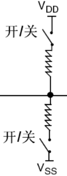

<!-- @import "[TOC]" {cmd="toc" depthFrom=1 depthTo=6 orderedList=false} -->

<!-- code_chunk_output -->

- [stm32GPIO图](#stm32gpio图)
- [模式](#模式)
  - [输入](#输入)
    - [1 输入浮空GPIO_Mode_IN_FLOATING](#1-输入浮空gpio_mode_in_floating)
    - [2 输入上拉GPIO_Mode_IPU](#2-输入上拉gpio_mode_ipu)
    - [3 输入下拉GPIO_Mode_IPD](#3-输入下拉gpio_mode_ipd)
    - [4 模拟输入GPIO_Mode_AIN](#4-模拟输入gpio_mode_ain)
  - [输出](#输出)
    - [1 开漏输出GPIO_Mode_Out_OD](#1-开漏输出gpio_mode_out_od)
    - [2 推挽式输出GPIO_Mode_Out_PP](#2-推挽式输出gpio_mode_out_pp)
    - [3 推挽式复用功能GPIO_Mode_AF_OD](#3-推挽式复用功能gpio_mode_af_od)
    - [4 开漏复用功能GPIO_Mode_AF_PP](#4-开漏复用功能gpio_mode_af_pp)
    - [5 总结](#5-总结)

<!-- /code_chunk_output -->

# stm32GPIO图
<br>
# 模式
## 输入
### 1 输入浮空GPIO_Mode_IN_FLOATING
如图所示
<br>
内部两个开关悬空。
### 2 输入上拉GPIO_Mode_IPU
```
默认高电平。可配合接地按键做按键触发检测。
```
### 3 输入下拉GPIO_Mode_IPD
```
默认低电平。
```
### 4 模拟输入GPIO_Mode_AIN
```
不经过施密特触发器（肖特基触发器）稳压。原始输入。
```
## 输出
### 1 开漏输出GPIO_Mode_Out_OD
一般只能输出低电平。
配合上拉电阻，可以实现不同电压芯片之间的通信。

### 2 推挽式输出GPIO_Mode_Out_PP
```
可以输出
高(P-MOS导通,N-MOS高阻)
低电平(P-MOS高阻,N-MOS导通)
```
### 3 推挽式复用功能GPIO_Mode_AF_OD
### 4 开漏复用功能GPIO_Mode_AF_PP
### 5 总结
```

开漏是
        0的时候接GND 
        1的时候高阻态
推挽是
        0的时候接GND 
        1的时候接VCC
```