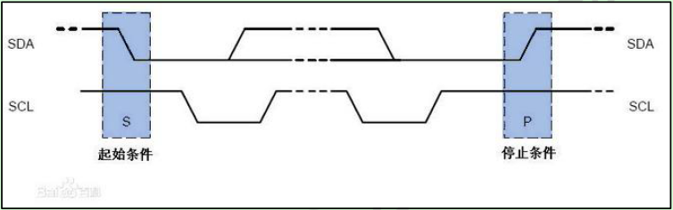
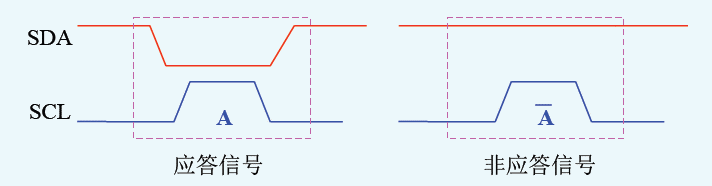
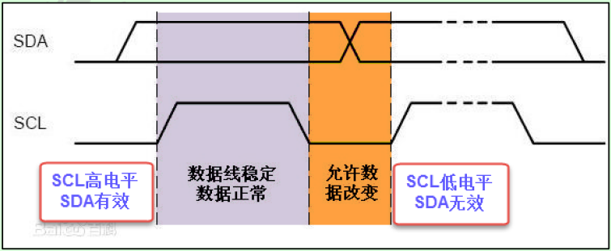
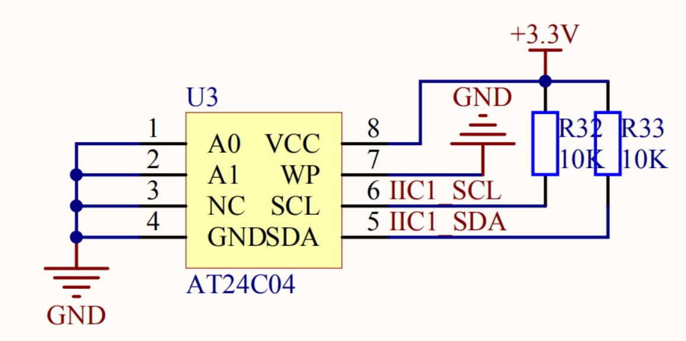
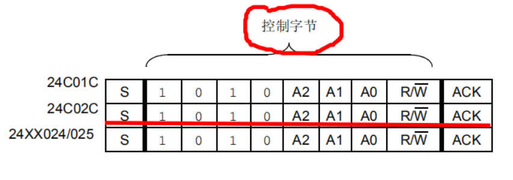

<!-- @import "[TOC]" {cmd="toc" depthFrom=1 depthTo=6 orderedList=false} -->

<!-- code_chunk_output -->

- [概述](#概述)
  - [基本操作](#基本操作)
    - [1 初始化](#1-初始化)
    - [2 起始结束信号](#2-起始结束信号)
    - [3 应答和非应答](#3-应答和非应答)
    - [4 从总线收发1字节数据](#4-从总线收发1字节数据)
      - [发](#发)
      - [收](#收)
  - [AT24c0x](#at24c0x)
    - [控制字节](#控制字节)
    - [写数据](#写数据)
    - [读数据](#读数据)

<!-- /code_chunk_output -->
# 概述
飞利浦公司开发，两根总线半双工。两根全都上拉。可多个主从设备。<br>SCL为高时,SDA数据有效（数据为1 或 0 传输数据时SDA状态不可改变，否则视为起始或结束）。<br>SCL为低时，SDA数据无效此时可改变数据（1 0之间变化）
## 基本操作

### 1 初始化
```c
#define  SDA_HIGH             GPIO_SetBits(GPIOB, GPIO_Pin_7)
#define  SDA_LOW              GPIO_ResetBits(GPIOB, GPIO_Pin_7)
#define  SDA_READ             GPIO_ReadInputDataBit(GPIOB, GPIO_Pin_7)

#define  SCL_HIGH             GPIO_SetBits(GPIOB, GPIO_Pin_6)
#define  SCL_LOW              GPIO_ResetBits(GPIOB, GPIO_Pin_6)

#define  noACK            1
#define  ACK              0

///PB6:时钟线；PB7:数据线 初始化GPIO端口
void IIC_Config(void)
{
	GPIO_InitTypeDef  GPIO_InitStruct;
	RCC_APB2PeriphClockCmd(RCC_APB2Periph_GPIOB,ENABLE);//打开GPIO的时钟(GPIOB)

	GPIO_InitStruct.GPIO_Mode   =GPIO_Mode_Out_OD;   //因为I2C总线上已经接了上拉电阻，所以IO口设置成开漏输出
	GPIO_InitStruct.GPIO_Pin    =GPIO_Pin_6|GPIO_Pin_7;//PB6:时钟线；PB7:数据线
	GPIO_InitStruct.GPIO_Speed  =GPIO_Speed_50MHz;//输出的速度
	GPIO_Init(GPIOB, &GPIO_InitStruct);//初始化GPIO
}
//将SDA/PB7设置成输出模式，输出速度50Mhz
void  IIC_Sdaout(void)
{
	GPIO_InitTypeDef  GPIO_InitStruct;
	GPIO_InitStruct.GPIO_Mode   =GPIO_Mode_Out_OD; //设置成开漏输出
	GPIO_InitStruct.GPIO_Pin    =GPIO_Pin_7;
	GPIO_InitStruct.GPIO_Speed  =GPIO_Speed_50MHz; //输出速度50Mhz
	GPIO_Init(GPIOB, &GPIO_InitStruct);
}
//将SDA/PB7设置成输入模式
void IIC_Sdain(void)
{
	GPIO_InitTypeDef  GPIO_InitStruct;
	GPIO_InitStruct.GPIO_Mode   =GPIO_Mode_IN_FLOATING;//设置成浮空输入
	GPIO_InitStruct.GPIO_Pin    =GPIO_Pin_7;
	GPIO_Init(GPIOB, &GPIO_InitStruct);
}
```
### 2 起始结束信号
<br>
SCL为1时SDA的状态改变就是起始和结束信号
`开始信号`:SCL 1、SDA 1 -> 0
`结束信号`:SCL 1、SDA 0 -> 1
```c
//IIC起始信号函数(SCL为高电平期间，SDA由高电平到低电平产生一个下降沿)
void IIC_start(void)
{
	SCL_LOW;      //SCL为低电平，SDA数据无效
	IIC_Sdaout();//将SDA设置成输出模式

	SDA_HIGH;     //SDA设置成高电平
	SCL_HIGH;	  //将SCL设置成高电平，使SDA上的数据有效
	SysTicks_DelayNus(5);//延时5us
	SDA_LOW;	           //SDA由高电平变成低电平产生一个下降沿
	SysTicks_DelayNus(5);//延时5us

	SCL_LOW;  //拉低时钟线
}
//IIC停止信号函数(SCL为高电平期间，SDA由低电平到高电平产生一个上升沿)
void IIC_stop(void)
{
	SCL_LOW;   //SCL为低电平，SDA数据无效
	IIC_Sdaout();//将SDA设置成输出模式	

	SDA_LOW;   //SDA设置成低电平
	SCL_HIGH;   //将SCL设置成高电平，使SDA上的数据有效
	SysTicks_DelayNus(5);//延时5us
	SDA_HIGH;              //SDA由低电平变成高电平产生一个上升沿
	SysTicks_DelayNus(5);//延时5us
}
```
### 3 应答和非应答
<br>
两种状态。
```c
//IIC发送应答信号(SCL在高电平期间，SDA为低电平)
void IIC_sendack(void)
{
	SCL_LOW;   //SCL为低电平，SDA数据无效
	IIC_Sdaout();	//将SDA设置成输出模式	

	SDA_LOW; //SDA设置成低电平
	SCL_HIGH;//将SCL设置成高电平，使SDA上的数据有效
	SysTicks_DelayNus(5);//延时5us	
	
	SCL_LOW; //拉低时钟线
}
//IIC发送非应答信号(SCL在高电平期间，SDA为高电平)
void IIC_sendNoack(void)
{
	SCL_LOW;  //SCL为低电平，SDA数据无效
	IIC_Sdaout();	//将SDA设置成输出模式	

	SDA_HIGH;//SDA设置成高电平
	SCL_HIGH;//将SCL设置成高电平，使SDA上的数据有效
	SysTicks_DelayNus(5);//延时5us		
	
	SCL_LOW;//拉低时钟线	
}
//IIC等待接收方应答(SCL在高电平期间，SDA读到低电平为应答)
uint8_t  IIC_waitACK(void)
{
	uint8_t count=0;  //计数器，用来做超时等待
	SCL_LOW; //SCL为低电平，SDA数据无效
	IIC_Sdain();//将SDA设置成输入模式	，这里需要读SDA线的电平

	SCL_HIGH;  //SDA设置成高电平，使SDA线上的数据有效
	SysTicks_DelayNus(5);//延时5us	
	while(SDA_READ)//等待SDA线上的低电平，由接收方发送
	{
		count++;   
		if(count>250)
		{
			IIC_stop();  //等待超时，结束IIC通信
			return noACK;//返回NOACK
		}
	}
	SCL_LOW;    //拉低时钟线	
	return  ACK;//等待低电平，返回ACK
}
```
### 4 从总线收发1字节数据
<br>
#### 发
```c
//IIC发送一个字节的数据。
void  IIC_SendByteData(uint8_t data)
{
	uint8_t i;  
	SCL_LOW;   //SCL为低电平，SDA数据无效
	IIC_Sdaout();//将SDA设置成输出模式	

	for(i=0;i<8;i++)   //一个字节的数据，因为IIC是串行通信的，只能一个一个位的数据发，所以一个字节的数据需要八次才能发完
	{
		if(data&0X80)//判断需要发的数据最高位是0还是1，是0，SDA=0,是1，SDA=1；
		{
			SDA_HIGH;
		}
		else
		{
			SDA_LOW;
		}
		SCL_HIGH;    //使SDA上的数据有效
		SysTicks_DelayNus(5);//延时5us		
		data=data<<1;   //左移一位
		SCL_LOW;   //拉低SCL，使SDA上的数据无效，然后再去改变SDA
		SysTicks_DelayNus(5);//延时5us			
	}
	SCL_LOW;  //拉低时钟线
}
```
#### 收
```c
uint8_t  IIC_RxByteData(uint8_t ackflag)
{
	uint8_t i,data;
	SCL_LOW;
	IIC_Sdain();

	for(i=0;i<8;i++)
	{
		data=data<<1;
		SCL_HIGH;
		if(SDA_READ)
		{
			data=data|0x01;
		}
		SysTicks_DelayNus(5);
		SCL_LOW;
		SysTicks_DelayNus(5);
	}
	SCL_LOW;	
	if(ackflag==ACK)
	{
		IIC_sendack();
	}
	else
	{
		IIC_sendNoack();
	}
	return  data;
}
```
## AT24c0x
<br>
A2 = NC管脚
### 控制字节
<br>
根据原理图A2 A1 A0均为0
0xA0为读操作 10100000
0xA1为写操作 10100001

### 写数据
```c
void At24c02_WriteByteData(uint8_t addr,uint8_t data)
{
	IIC_start();    //起始信号

	IIC_SendByteData(0XA0);  //发送设备地址
	if(ACK !=IIC_waitACK())  //等待接收方回应
	{
		IIC_stop();         //反应非应答＃，停止IIC
		return;             //跳出循环
	}

	IIC_SendByteData(addr);  //发送要在设备中写入的内存单元地址
	if(ACK !=IIC_waitACK())   //等待接收方回应
	{
		IIC_stop();
		return;
	}
	
	IIC_SendByteData(data);  //发送要写入内存单元的数据
	if(ACK !=IIC_waitACK())   //等待接收方回应
	{
		IIC_stop();
		return;
	}
	IIC_stop();               //停止IIC
}
```
### 读数据
```c
uint8_t  IIC_RxByteData(uint8_t ackflag)
{
	uint8_t i,data;
	SCL_LOW;  //SCL为低电平，SDA数据无效
	IIC_Sdain();//将SDA设置成输入模式	，这里需要读SDA线的电平

	for(i=0;i<8;i++) //一个字节的数据，因为IIC是串行通信的，只能一个一个位的数据接收，所以一个字节的数据需要八次才能接收完
	{
		data=data<<1;  //首先左移，如果放在后面，最后接收的数据会整体左移，所以要放前面
		SCL_HIGH;      //SCL为高，使SDA上的数据有效
		if(SDA_READ)   //读SDA的数据，如果为高，则或0x01
		{
			data=data|0x01;
		}
		SysTicks_DelayNus(5);//延时5us	
		SCL_LOW; //拉低SCL，使SDA上的数据无效，然后再去改变SDA
		SysTicks_DelayNus(5);
	}
	SCL_LOW;	
	if(ackflag==ACK)    //判断发送非应答信号，还是应答信号
	{
		IIC_sendack();
	}
	else
	{
		IIC_sendNoack();
	}
	return  data;   //接收到的数据返回
}

```