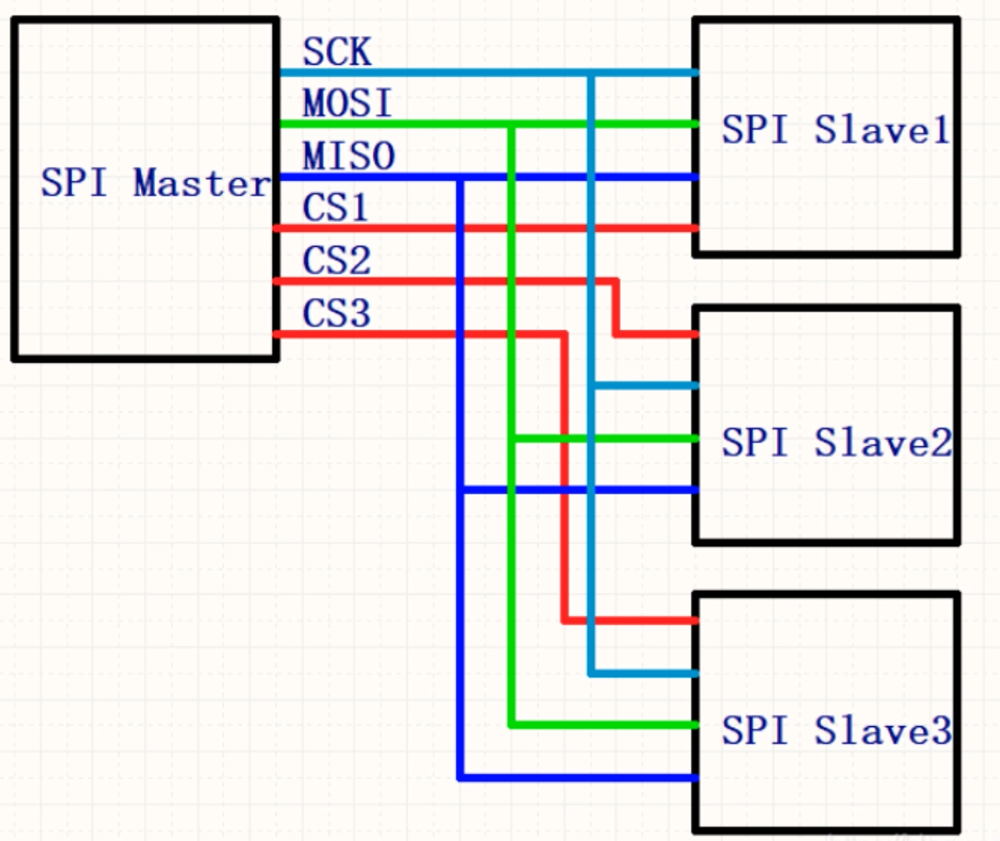
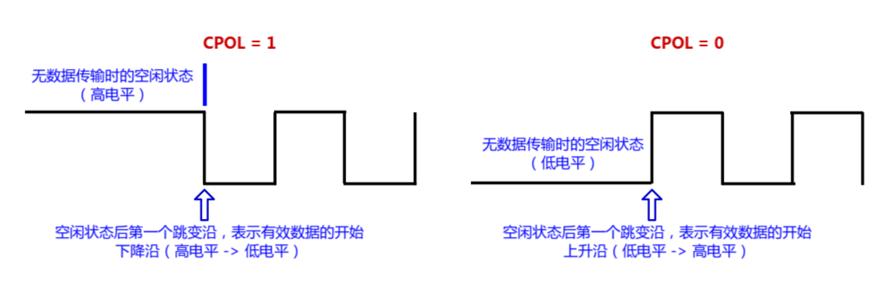
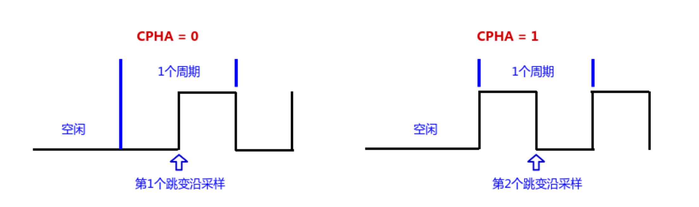
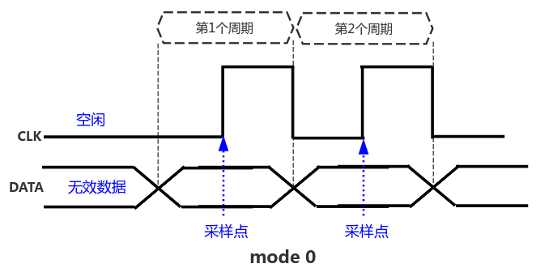
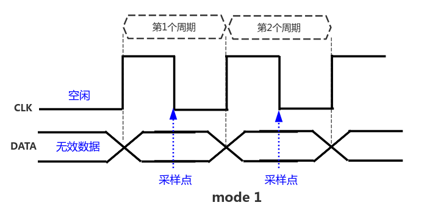
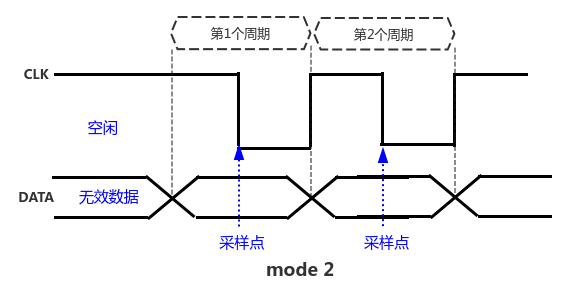
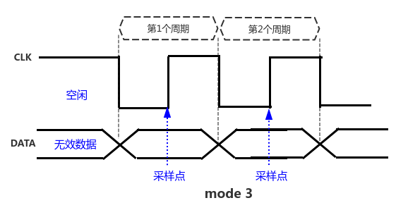

<!-- @import "[TOC]" {cmd="toc" depthFrom=1 depthTo=6 orderedList=false} -->

<!-- code_chunk_output -->

- [概述](#概述)
  - [通讯线](#通讯线)
  - [SPI中断](#spi中断)
  - [单主多从](#单主多从)
  - [四种模式](#四种模式)
    - [模式0 (CPOL=0; CPHA=0)](#模式0-cpol0-cpha0)
    - [模式1 (CPOL=0; CPHA=1)](#模式1-cpol0-cpha1)
    - [模式2 (CPOL=1; CPHA=0)](#模式2-cpol1-cpha0)
    - [模式3 (CPOL=1; CPHA=1)](#模式3-cpol1-cpha1)
- [来源](#来源)

<!-- /code_chunk_output -->

# 概述
摩托罗拉开发的全双工同步通信协议。<br>stm32中高低位先行可自定义，字长可选（8、16）。<br>四线通信，多主。
## 通讯线
SCK: Serial Clock 串行时钟（主机发出）<br>
MOSI : Master Output, Slave Input 主发从收<br>
MISO : Master Input, Slave Output 主收从发<br>
NSS ： 可选硬件控制或者软件控制 控制从设备使能。

## SPI中断
|中断事件|事件标志|使能控制位|
|:----|:----|:----|
|发送缓冲器空标志| TXE| TXEIE |
|接收缓冲器非空标志| RXNE| RXNEIE |
|主模式错误事件 |MODF |ERRIE|
|溢出错误| OVR |ERRIE|
|CRC错误标志| CRCERR |ERRIE|
## 单主多从
<br>
## 四种模式

CPOL配置SPI总线的极性
CPHA配置SPI总线的相位

极性
```
CPOL = 1：表示空闲时是高电平
CPOL = 0：表示空闲时是低电平
```
<br>
相位
```
CPHA = 0：表示从第一个跳变沿开始采样
CPHA = 1：表示从第二个跳变沿开始采样
```
<br>
|mode	|CPOL	|CPHA|
|:----|:----|:----|
 0|	0|	0|
 1|	0|	1|
 2|	1|	0|
 3|	1|	1|
### 模式0 (CPOL=0; CPHA=0)
特性：
```
CPOL = 0：空闲时是低电平，第1个跳变沿是上升沿，第2个跳变沿是下降沿
CPHA = 0：数据在第1个跳变沿（上升沿）采样
```
效果图：
<br>
### 模式1 (CPOL=0; CPHA=1)
特性:
```
CPOL = 0：空闲时是低电平，第1个跳变沿是上升沿，第2个跳变沿是下降沿
CPHA = 1：数据在第2个跳变沿（下降沿）采样
```
效果图:
<br>
### 模式2 (CPOL=1; CPHA=0)
特性:
```
CPOL = 1：空闲时是高电平，第1个跳变沿是下降沿，第2个跳变沿是上升沿
CPHA = 0：数据在第1个跳变沿（下降沿）采样
```
效果图:
<br>
### 模式3 (CPOL=1; CPHA=1)
特性:
```
CPOL = 1：空闲时是高电平，第1个跳变沿是下降沿，第2个跳变沿是上升沿
CPHA = 1：数据在第2个跳变沿（上升沿）采样
```
效果图：
<br>

# 来源
作者： 广漠飘羽
出处：https://www.cnblogs.com/gmpy/p/12461461.html