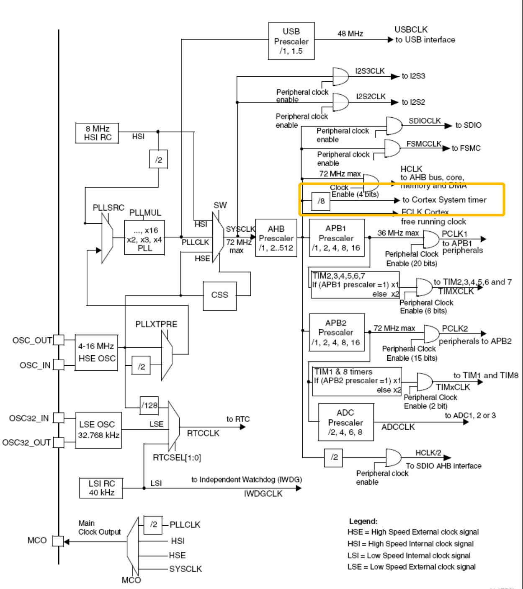

<!-- @import "[TOC]" {cmd="toc" depthFrom=1 depthTo=6 orderedList=false} -->

<!-- code_chunk_output -->

- [Cortex核内系统定时器（SysTick)](#cortex核内系统定时器systick)
  - [作用](#作用)
  - [寄存器操作](#寄存器操作)
    - [drv_systick.h](#drv_systickh)
    - [drv_systick.c](#drv_systickc)

<!-- /code_chunk_output -->
# Cortex核内系统定时器（SysTick)
<br>
## 作用
用于实现精准的定时
## 寄存器操作
### drv_systick.h
```c
#ifndef DRV_SYSTICK_H
#define DRV_SYSTICK_H

#include "stm32f10x.h"

void systick_config(uint8_t sysclk);
void systick_delayNms(uint32_t Nms);
void systick_delayNus(uint32_t Nus);

#endif

```
### drv_systick.c
```c
#include "drv_systick.h"

static uint32_t fu_ms;
static uint32_t fu_us;

void systick_config(uint8_t sysclk)
{
    //设置systick为8分频    并关闭定时器
    SysTick->CTRL &= ~0x05;

    fu_us = sysclk / 8;     //1us的次数
    fu_ms = fu_us * 1000;   //1ms的次数

}

void systick_delayNms(uint32_t Nms)
{
    uint32_t i;
    uint32_t temp;

    SysTick->LOAD =  fu_ms;                 //导入1ms计数次数
    SysTick->VAL = 0;                       //清空当前值
    SysTick->CTRL |= 0x01;                  //打开定时器

    for (i = 0; i < Nms; i++)               //for循环防止溢出
    {
        do
        {
            temp = SysTick->CTRL;
        } while ( !(temp&(1<<16)) && (temp&1) );        //判断向下计数到0了
    }
    //清空计数值
    SysTick->VAL = 0;
    //关闭定时器
    SysTick->CTRL &=~0x01;
    

}
void systick_delayNus(uint32_t Nus)
{
    uint32_t i;
    uint32_t temp;
    
    SysTick->LOAD =  fu_us;             //导入1us计数次数
    SysTick->VAL = 0;                   //清空当前值
    SysTick->CTRL |= 0x01;              //打开定时器

    for (i = 0; i < Nus; i++)           //for循环防止溢出
    {
        do
        {
            temp = SysTick->CTRL;
        } while ( !(temp&(1<<16)) && (temp&1) );        //判断向下计数到0了
    }
    
    //清空计数值
    SysTick->VAL = 0;
    //关闭定时器
    SysTick->CTRL &=~0x01;
}

```
