<!-- @import "[TOC]" {cmd="toc" depthFrom=1 depthTo=6 orderedList=false} -->

<!-- code_chunk_output -->

- [计算机中数的表示](#计算机中数的表示)
  - [无符号数和有符号数](#无符号数和有符号数)
    - [一.无符号](#一无符号)
    - [二.有符号](#二有符号)
      - [1.机器数](#1机器数)
      - [2. 原码表示法](#2-原码表示法)
      - [3. 补码表示法](#3-补码表示法)
      - [4.反码表示法](#4反码表示法)
      - [5.移码表示法](#5移码表示法)
  - [数的定点表示和浮点表示](#数的定点表示和浮点表示)
    - [一.数的定点表示](#一数的定点表示)
    - [二.数的浮点表示](#二数的浮点表示)
    - [三.例子](#三例子)
  - [定点运算](#定点运算)
  - [浮点运算](#浮点运算)
  - [算术逻辑单元](#算术逻辑单元)

<!-- /code_chunk_output -->

# 计算机中数的表示
## 无符号数和有符号数
### 一.无符号
寄存器位数反映无符号数的表示范围
### 二.有符号
#### 1.机器数
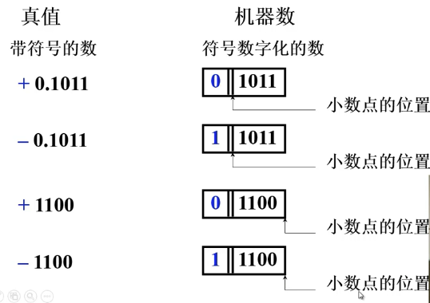 
#### 2. 原码表示法
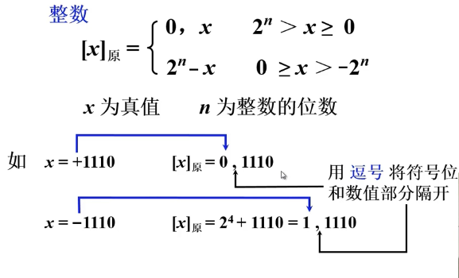 
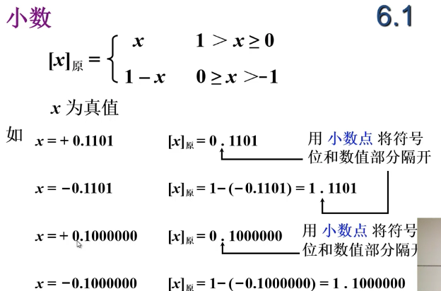 
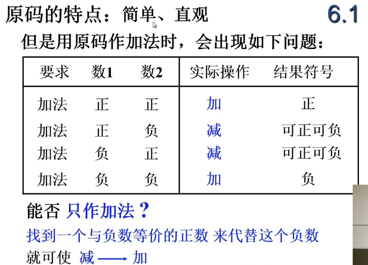 
#### 3. 补码表示法
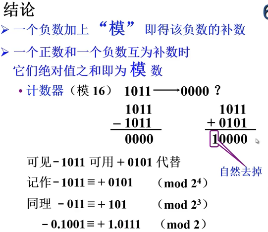 
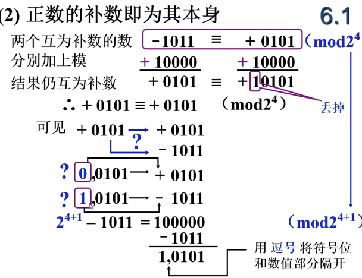 
`运算过程中为了带上符号位，因此我们将模选用2的5次方`
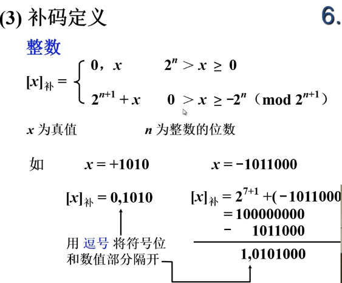 
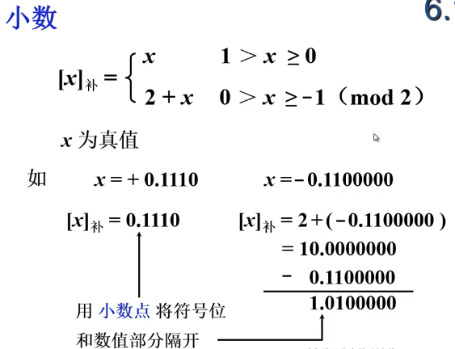 
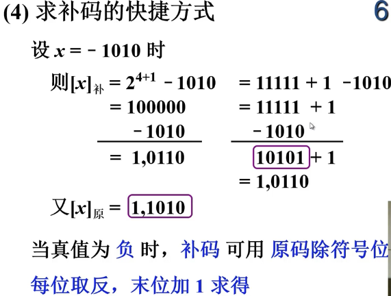 
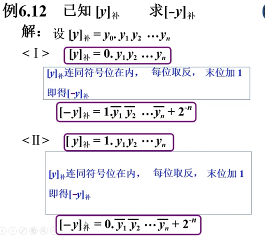 
`补码的补码是原码`
#### 4.反码表示法
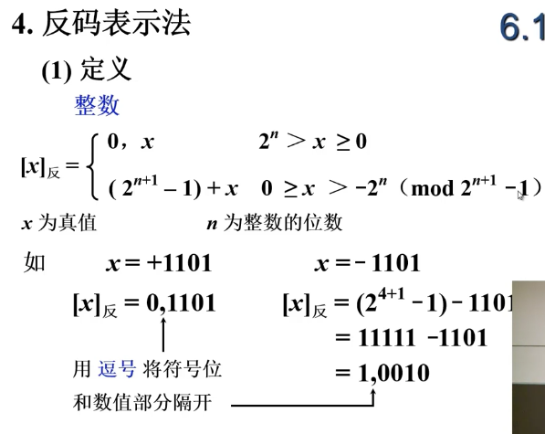 
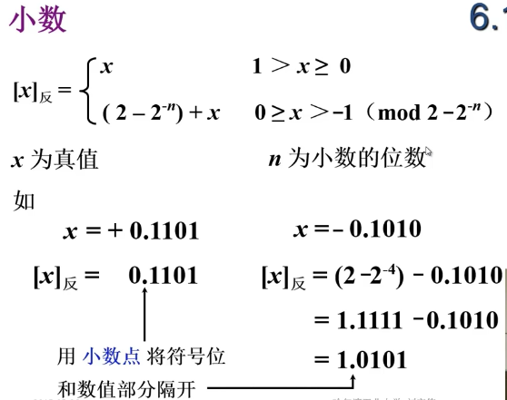 
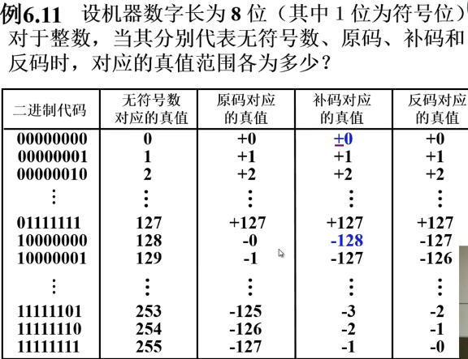 
#### 5.移码表示法
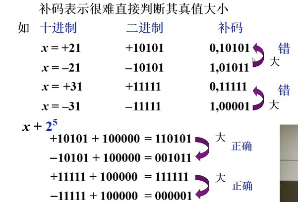 
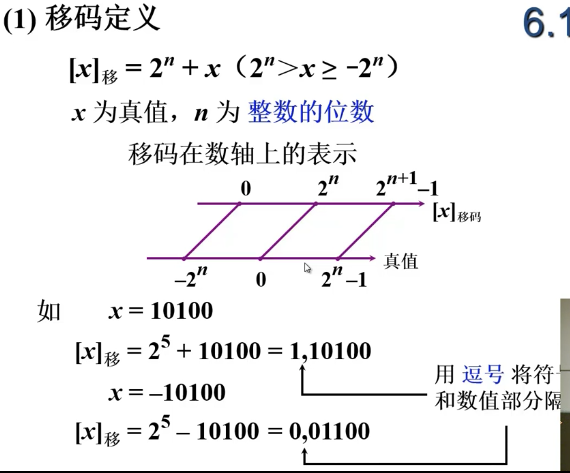 
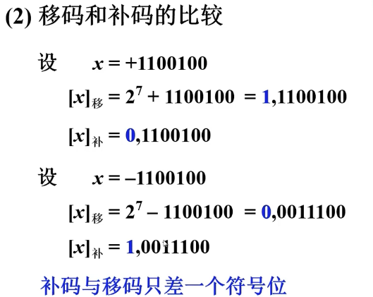 
`补码正负数大小不好比较，因此将补码符号为取反变成移码，谁的移码大谁就大`
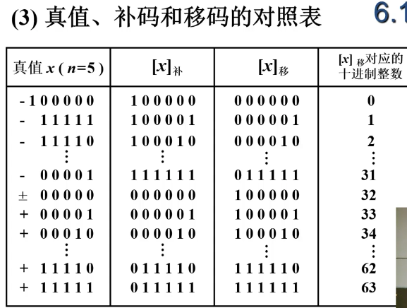 
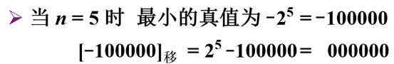 
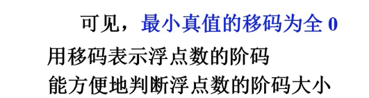 
## 数的定点表示和浮点表示
### 一.数的定点表示
### 二.数的浮点表示
### 三.例子
### 四.IEEE754标准
## 定点运算

## 浮点运算

## 算术逻辑单元