<!-- @import "[TOC]" {cmd="toc" depthFrom=1 depthTo=6 orderedList=false} -->

<!-- code_chunk_output -->

- [计算机中数的表示](#计算机中数的表示)
  - [无符号数和有符号数](#无符号数和有符号数)
    - [一.无符号](#一无符号)
    - [二.有符号](#二有符号)
      - [1.机器数](#1机器数)
      - [2. 原码表示法](#2-原码表示法)
      - [3. 补码表示法](#3-补码表示法)
      - [4.反码表示法](#4反码表示法)
      - [5.移码表示法](#5移码表示法)
  - [数的定点表示和浮点表示](#数的定点表示和浮点表示)
    - [一.数的定点表示](#一数的定点表示)
    - [二.数的浮点表示](#二数的浮点表示)
    - [三.例子](#三例子)
    - [四.IEEE754标准](#四ieee754标准)
  - [定点运算](#定点运算)
  - [浮点运算](#浮点运算)
  - [算术逻辑单元](#算术逻辑单元)

<!-- /code_chunk_output -->

# 计算机中数的表示
## 无符号数和有符号数
### 一.无符号
寄存器位数反映无符号数的表示范围
### 二.有符号
#### 1.机器数
<br>
#### 2. 原码表示法
<br>
<br>
<br>
#### 3. 补码表示法
<br>
<br>
`运算过程中为了带上符号位，因此我们将模选用2的5次方`<br>
<br>
<br>
<br>
<br>
`补码的补码是原码`<br>
#### 4.反码表示法
<br>
<br>
<br>
#### 5.移码表示法
<br>
<br>
<br>
`补码正负数大小不好比较，因此将补码符号为取反变成移码，谁的移码大谁就大`<br>
<br>
<br>
<br>
## 数的定点表示和浮点表示
### 一.数的定点表示
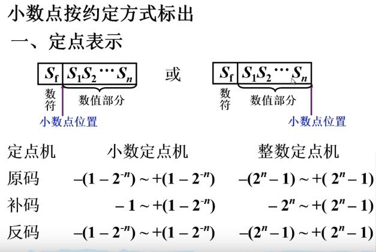<br>
1.00的补码是 -（1.00）= -1<br>
### 二.数的浮点表示
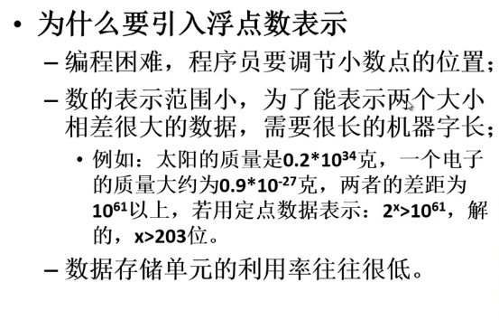<br>
__浮点表示__<br>
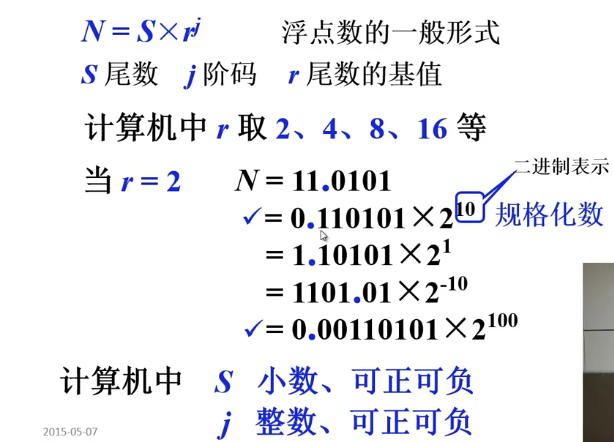<br>
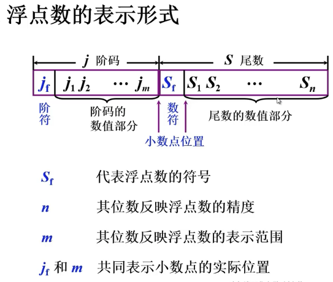<br>
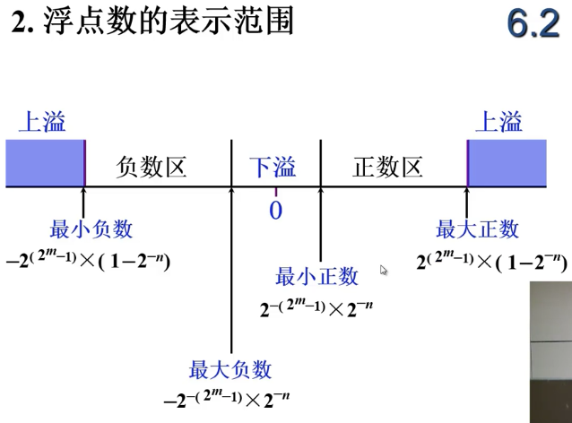<br>
m为阶码值的位数（不包含符号位）  n为尾数值的位数（不包含符号位）<br>
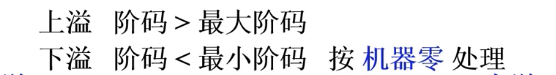<br>
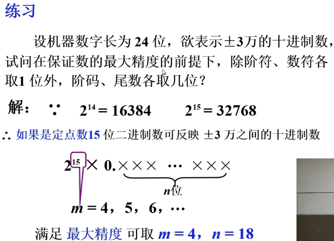<br>
阶符数符各占一位总共24位<br>
浮点数规格化的形式<br>
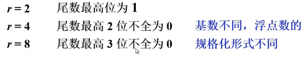<br>
基数r越大精度越低，表示范围越大<br>
浮点数的规格化<br>
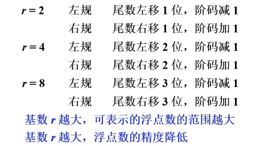<br>
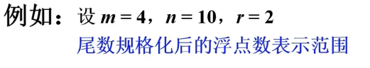<br>
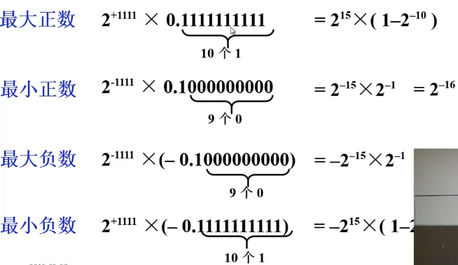<br>
### 三.例子
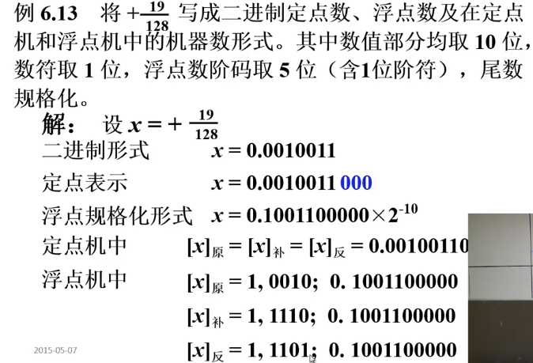<br>
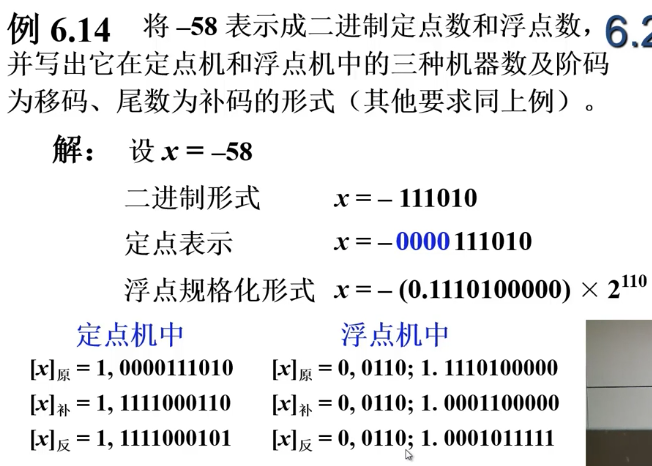<br>
浮点数机器零<br>
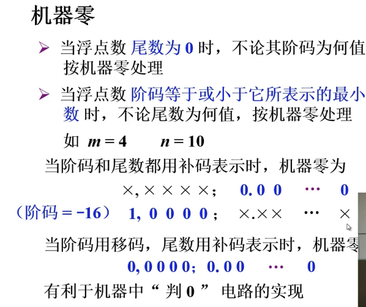<br>
### 四.IEEE754标准
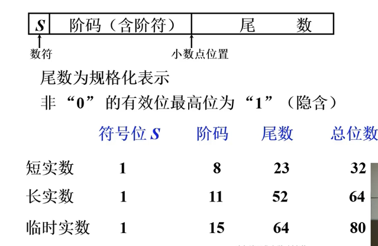<br>
__阶码=阶值原码按位取反阶符也取反，尾数为原码__
```
IEEE754标准中单精度表示阶码的偏移值是127（双精度是1023），而移码表示阶码时偏移值是128
其次为什么是127：
当阶码E为全0且尾数M也为全0时，表示的真值X为零，结合符号位S为0或1，有正零和负零之分。
当阶码E为全1且尾数M也为全0时，表示的真值X为无穷大（∞），结合符号位S为0或1，有+∞和-∞之分。
这样，在32位浮点数表示中，要除去E用全0和全1（255）表示零和无穷大的特殊情况，
因此，阶码E的取值范围变为1～254，指数的偏移量不选128（10000000B），而选127（01111111B）。
对于32位规格化浮点数，真正的指数值e为-126～+127，因此，数的绝对值的范围是2-126～2127≈10-38～1038。
```
## 定点运算

## 浮点运算

## 算术逻辑单元